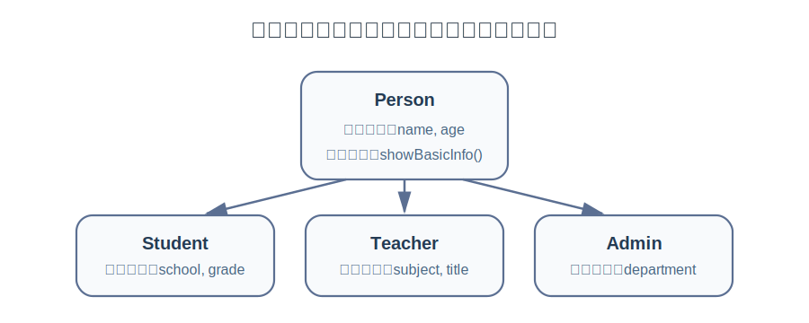
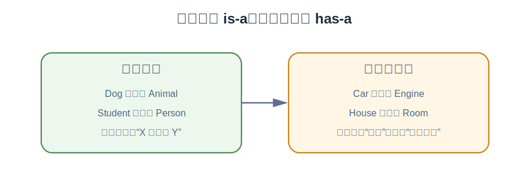
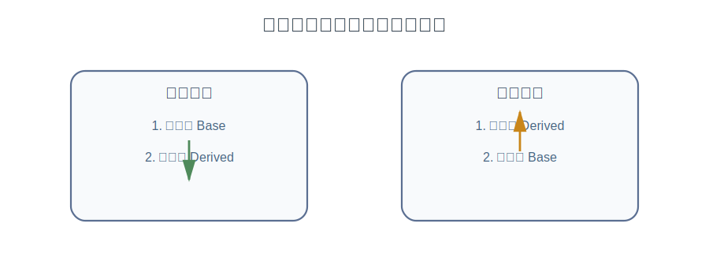

上一章，我们已经弄明白了：

- 对象在“复制”时，拷贝构造函数和赋值运算符不是一回事
- 如果类自己管理原始资源，就要警惕浅拷贝
- 析构函数、拷贝构造函数、拷贝赋值运算符之间往往是连着考虑的

但新的问题又来了。

如果我已经写好了一个 `Person` 类，里面有姓名、年龄、显示信息这些功能。  
现在我还想写：

- `Student`
- `Teacher`
- `Admin`

它们都“像人”，都需要姓名、年龄、基本介绍。  
难道每个类都从头再写一遍吗？

这时候，C++ 里一个非常重要的机制就要登场了：**继承（inheritance）**。

:::tip
如果说前几章是在学习“一个类怎么把自己定义完整”，那么这一章就是在学习：多个类之间，如何建立一种有层次的关系，让已有代码可以被复用。
:::

## 为什么需要继承

先看一个很直观的例子。

```cpp
#include <iostream>
#include <string>
using namespace std;

class Student {
private:
    string name;
    int age;
    string school;

public:
    Student(string n, int a, string s) : name(n), age(a), school(s) {}

    void introduce() const {
        cout << "学生: " << name << "，年龄: " << age << "，学校: " << school << endl;
    }
};

class Teacher {
private:
    string name;
    int age;
    string subject;

public:
    Teacher(string n, int a, string sub) : name(n), age(a), subject(sub) {}

    void introduce() const {
        cout << "老师: " << name << "，年龄: " << age << "，科目: " << subject << endl;
    }
};
```

这两个类都能工作，但你会明显感觉到：

- `name`、`age` 重复了
- `introduce()` 的一部分逻辑也重复了
- 以后如果“人的基础信息”要改，多个类都得跟着改

这类重复在代码量小时还不明显，一旦项目变大，就会越来越难维护。

所以我们自然会想：

能不能先定义一个更通用的 `Person`，把“人”的共性先写好；然后再让 `Student`、`Teacher` 在它的基础上继续扩展？

这就是继承的核心动机。



## 什么是继承

继承可以先粗略理解成：

**先定义一个更一般的类，再定义一个更具体的类，让后者自动拥有前者的一部分成员。**

其中：

- 被继承的类，叫**基类**（base class）
- 在它基础上扩展出来的类，叫**派生类**（derived class）

最常见的写法是：

```cpp
class Derived : public Base {
    // 派生类自己的内容
};
```

比如：

```cpp
class Person {
public:
    void sayHello() const {
        cout << "你好，我是一个人" << endl;
    }
};

class Student : public Person {
public:
    void study() const {
        cout << "学生正在学习" << endl;
    }
};
```

这里：

- `Person` 是基类
- `Student` 是派生类
- `Student` 自动拥有了 `sayHello()`
- 同时也有自己额外的 `study()`

测试一下：

```cpp
int main() {
    Student s;
    s.sayHello();
    s.study();
    return 0;
}
```

输出：

```cpp
你好，我是一个人
学生正在学习
```

这就是继承最基本的效果：

**把共性的部分放到基类，把特殊的部分放到派生类。**

## 一个更完整的例子

现在把上面的想法写得更像真实代码一点。

```cpp
#include <iostream>
#include <string>
using namespace std;

class Person {
private:
    string name;
    int age;

public:
    Person(string n, int a) : name(n), age(a) {}

    void showBasicInfo() const {
        cout << "姓名: " << name << "，年龄: " << age << endl;
    }
};

class Student : public Person {
private:
    string school;

public:
    Student(string n, int a, string s)
        : Person(n, a), school(s) {}

    void showStudentInfo() const {
        showBasicInfo();
        cout << "学校: " << school << endl;
    }
};

int main() {
    Student s("Alice", 18, "No.1 High School");
    s.showStudentInfo();
    return 0;
}
```

这个例子里，`Student` 并没有重复定义 `name` 和 `age`。  
它通过继承，直接把 `Person` 的那一部分“接”过来了。

这里有两个非常关键的点。

### 1）派生类对象里，真的包含一个“基类部分”

`Student` 对象不是凭空获得 `Person` 的能力。  
更准确地说，一个 `Student` 对象内部，包含了属于 `Person` 的那一部分子对象。

可以先把它理解成：

- `Student` 里有“人”的那一层
- 同时还多了自己的 `school`

这能帮助理解后面的构造顺序、析构顺序，以及为什么派生类能调用基类成员函数。

### 2）派生类构造函数要先把基类部分建好

注意这里：

```cpp
Student(string n, int a, string s)
    : Person(n, a), school(s) {}
```

`Person(n, a)` 写在初始化列表里，不是装饰品。  
它的作用是：**先用 `n` 和 `a` 去构造 `Student` 里的那一部分 `Person`。**

这件事非常重要，因为派生类对象要先有基类那一层，自己才能继续往上长。

## 继承里的访问控制

先回忆类本身的访问权限：

- `public`：类外可以访问
- `private`：只有类内部可以访问
- `protected`：先记成“类内部和派生类内部可以访问，类外不行”

### `private` 成员不能被派生类直接用

看这个例子：

```cpp
#include <iostream>
#include <string>
using namespace std;

class Person {
private:
    string name;

public:
    Person(string n) : name(n) {}
};

class Student : public Person {
public:
    Student(string n) : Person(n) {}

    void test() {
        // cout << name << endl;  // 错误：不能直接访问基类的 private 成员
    }
};
```

很多人第一次学继承时会误以为：

“既然 `Student` 继承了 `Person`，那 `Person` 的成员是不是都能直接拿来用？”

不是。

**基类的 `private` 成员仍然是基类自己内部的细节。**  
它们虽然存在于派生对象里，但派生类不能直接碰。

这是一个非常值得建立起来的直觉：

**继承不等于把基类内部所有细节都完全暴露给派生类。**

### 派生类怎么用基类里的数据

通常有两种常见做法。

**做法一：基类提供 `public` 或 `protected` 成员函数**

这是更常见、也更稳妥的方式。

```cpp
#include <iostream>
#include <string>
using namespace std;

class Person {
private:
    string name;
    int age;

public:
    Person(string n, int a) : name(n), age(a) {}

    string getName() const {
        return name;
    }

    int getAge() const {
        return age;
    }
};

class Student : public Person {
private:
    string school;

public:
    Student(string n, int a, string s)
        : Person(n, a), school(s) {}

    void introduce() const {
        cout << "学生: " << getName()
             << "，年龄: " << getAge()
             << "，学校: " << school << endl;
    }
};
```

这种方式的好处是：

- `Person` 仍然保留了对自己数据的控制权
- `Student` 不需要知道 `Person` 内部是怎么存这些数据的
- 后期如果 `Person` 内部实现变了，只要接口不变，派生类通常就不用跟着大改

这也是更符合封装思想的写法。

**做法二：把部分成员写成 `protected`**

```cpp
class Person {
protected:
    string name;
    int age;

public:
    Person(string n, int a) : name(n), age(a) {}
};
```

这样一来，派生类就可以直接用 `name` 和 `age`。

```cpp
class Student : public Person {
private:
    string school;

public:
    Student(string n, int a, string s)
        : Person(n, a), school(s) {}

    void introduce() const {
        cout << "学生: " << name << "，年龄: " << age << "，学校: " << school << endl;
    }
};
```

### `protected`该怎么理解

可以先把它理解成：

- 对类外部，它仍然是隐藏的
- 但对派生类，它是开放的

所以 `protected` 很像一种“对子类开放、对外部封闭”的权限。

:::note
初学阶段可以先知道 `protected` 的用途，但写代码时不要一上来就把成员全改成 `protected`。很多时候，仍然是“数据保持 `private`，通过函数暴露能力”更稳。
:::

## `public` 继承是什么意思

这一章我们只重点讲最常见的 `public` 继承。

```cpp
class Student : public Person
```

它表达的直觉是：

**Student 是一种 Person。**

也就是常说的 **is-a** 关系。

比如：

- `Student` 是一种 `Person`
- `Teacher` 是一种 `Person`
- `Dog` 是一种 `Animal`

但下面这种通常就不合适：

- `Car` 继承 `Engine`

因为“汽车不是一种发动机”，它只是“有一个发动机”。这类关系更像 **has-a**，更适合组合，而不是继承。



很多初学者一看到“想复用代码”，就想上继承。其实不对。

一个判断标准是：

**只有当你真能说出“X 是一种 Y”时，继承才通常比较顺。**

## 派生类对象是怎么构造出来的

继承里另一个特别重要的问题是：

一个派生类对象在创建时，先构造谁？后构造谁？

答案是：

**先构造基类部分，再构造派生类部分。**

来看代码。

```cpp
#include <iostream>
using namespace std;

class Base {
public:
    Base() {
        cout << "Base 构造函数" << endl;
    }

    ~Base() {
        cout << "Base 析构函数" << endl;
    }
};

class Derived : public Base {
public:
    Derived() {
        cout << "Derived 构造函数" << endl;
    }

    ~Derived() {
        cout << "Derived 析构函数" << endl;
    }
};

int main() {
    Derived d;
    return 0;
}
```

输出顺序通常是：

```cpp
Base 构造函数
Derived 构造函数
Derived 析构函数
Base 析构函数
```

也就是说：

- 构造时：**先基类，后派生类**
- 析构时：**先派生类，后基类**


你可以把它想成盖楼：

- 先把地基打好，再往上盖
- 拆的时候先拆上面，再回收地基



## 为什么派生类初始化列表里要写基类构造

再看一遍：

```cpp
Student(string n, int a, string s)
    : Person(n, a), school(s) {}
```

很多初学者会问：

“我能不能不写 `Person(n, a)`，然后在函数体里再处理？”

大多数时候不行，或者说不规范。

因为基类部分不是等派生类函数体开始以后才创建的。  
**在进入派生类构造函数体之前，基类那一层就已经必须先构造完成。**

所以，真正决定“基类怎么构造”的地方，是初始化列表。

如果基类没有默认构造函数，而你又没在初始化列表里明确调用它，编译器往往就会报错。

例如：

```cpp
class Person {
public:
    Person(string n, int a) {}
};

class Student : public Person {
public:
    Student(string n, int a) {
        // 错误思路：这里已经来不及决定基类怎么构造了
    }
};
```

这里 `Person` 没有无参构造函数，而 `Student` 又没有在初始化列表里指定 `Person(n, a)`，于是就会出问题。

## 同名成员函数：到底覆盖了什么

继承里还有一个常见现象：派生类里写了一个和基类同名的函数。

```cpp
#include <iostream>
using namespace std;

class Person {
public:
    void introduce() const {
        cout << "我是一个人" << endl;
    }
};

class Student : public Person {
public:
    void introduce() const {
        cout << "我是一个学生" << endl;
    }
};

int main() {
    Student s;
    s.introduce();
    return 0;
}
```

这里直接调用 `s.introduce()`，显然会执行 `Student` 自己的版本。

但有一点你最好现在就建立意识：

这里先把它理解成“派生类写了同名函数后，自己的版本会把基类那个名字挡住”。

如果你确实还想在派生类对象上调用基类版本，可以写：

```cpp
s.Person::introduce();
```

或者在派生类成员函数里写：

```cpp
Person::introduce();
```

例如：

```cpp
class Student : public Person {
public:
    void introduce() const {
        Person::introduce();
        cout << "我还是一个学生" << endl;
    }
};
```

这样输出就会变成：

```cpp
我是一个人
我还是一个学生
```

:::tip
先别急着把“同名函数”完全等同于“多态”。真正的运行时多态，要等下一章的 `virtual` 才会完整展开。
:::

## 一个综合例子

下面写一个更完整一点的小例子，把这一章几个核心点连起来。

```cpp
#include <iostream>
#include <string>
using namespace std;

class Person {
private:
    string name;
    int age;

public:
    Person(string n, int a) : name(n), age(a) {
        cout << "Person 构造" << endl;
    }

    void showBasicInfo() const {
        cout << "姓名: " << name << "，年龄: " << age << endl;
    }

    string getName() const {
        return name;
    }

    ~Person() {
        cout << "Person 析构" << endl;
    }
};

class Student : public Person {
private:
    string school;
    int grade;

public:
    Student(string n, int a, string s, int g)
        : Person(n, a), school(s), grade(g) {
        cout << "Student 构造" << endl;
    }

    void showInfo() const {
        showBasicInfo();
        cout << "学校: " << school << "，年级: " << grade << endl;
    }

    void introduce() const {
        cout << getName() << " 正在上学" << endl;
    }

    ~Student() {
        cout << "Student 析构" << endl;
    }
};

int main() {
    Student s("Alice", 18, "No.1 High School", 3);
    s.showInfo();
    s.introduce();
    return 0;
}
```

这个例子体现了几件事：

- `Student` 通过 `public` 继承复用了 `Person` 的基础能力
- `Person` 的 `private` 数据没有直接暴露给 `Student`
- `Student` 通过基类提供的成员函数拿到需要的信息
- 构造时先 `Person`，后 `Student`
- 析构时先 `Student`，后 `Person`

**继承不是简单的“复制代码”，而是在表达类之间的层次关系；派生类是在基类的基础上继续扩展。**

## 初学者最容易踩的坑

**1）把“想复用代码”直接等同于“应该用继承”。**

不是所有复用都靠继承。  
如果只是“对象内部有另一个对象”，通常更像组合。

**2）误以为派生类可以随便直接访问基类的 `private` 成员。**

不能。`private` 仍然只属于基类自己。

**3）忘了在派生类初始化列表里构造基类。**

尤其当基类没有默认构造函数时，这个问题会直接导致编译错误。

**4）搞反构造和析构顺序。**

记住一句话就够：

- 构造：先基类，后派生类
- 析构：先派生类，后基类

**5）把同名函数挡住基类版本这件事，误当成“已经完全理解多态”。**

还没有。  
这只是你刚走到多态门口，下一章才是真正的重点。

## 几个小练习

练习一。

定义一个 `Animal` 类，包含 `name` 和 `age`，再定义一个 `Dog` 类继承它，并新增 `breed` 成员。  
要求：

- 基类负责保存共性信息
- 派生类负责保存自己的额外信息
- 输出一只狗的完整信息

```cpp
#include <string>
#include <iostream>
using namespace std;

class Animal{
private:
    string name;
    int age;

public:
    Animal(string n, int a) : name(n), age(a) {} 
    string getName() const {
        return name;
    }

    int getAge() const {
        return age;
    }
};

class Dog : public Animal {
private:
    string breed;
public:
    Dog(string n, int a, string b) : Animal(n, a), breed(b) {}
    void introduce() {
        cout << "Name: " << getName()
            << ", Age: " << getAge()
            << ", Breed: " << breed << endl;
    }
};

int main() {
    Dog d("Kitty", 1, "xuenarui");
    d.introduce();

    return 0;
}
```
练习二。

定义一个 `Employee` 类，再定义 `Manager` 类继承它。  
让你自己实验：

- 哪些成员适合放在基类
- 哪些成员只属于派生类
- 基类数据写成 `private` 和 `protected` 时，派生类写法有什么差异

练习三。

手写一个程序，观察构造和析构顺序。  
要求：

- 基类和派生类都打印构造、析构信息
- 在 `main()` 里创建一个派生类对象
- 写出你预测的输出顺序，再运行验证

练习四。

思考题：

为什么“学生是人”适合继承，而“汽车有发动机”通常不适合写成继承？  
尝试用你自己的话解释 **is-a** 和 **has-a** 的区别。

## 本章小结

- **继承的目的，是把共性放到基类，把差异放到派生类。**
- **最常见的写法是 `class Derived : public Base`。**
- **`public` 继承表达的是一种 is-a 关系。**
- **基类的 `private` 成员不能被派生类直接访问。**
- **`protected` 表示对子类开放、对类外封闭。**
- **派生类对象构造时，先构造基类部分，再构造派生类部分。**
- **析构顺序和构造顺序相反。**
- **继承是在表达层次关系，不只是为了少写几行代码。**

## 参考内容

