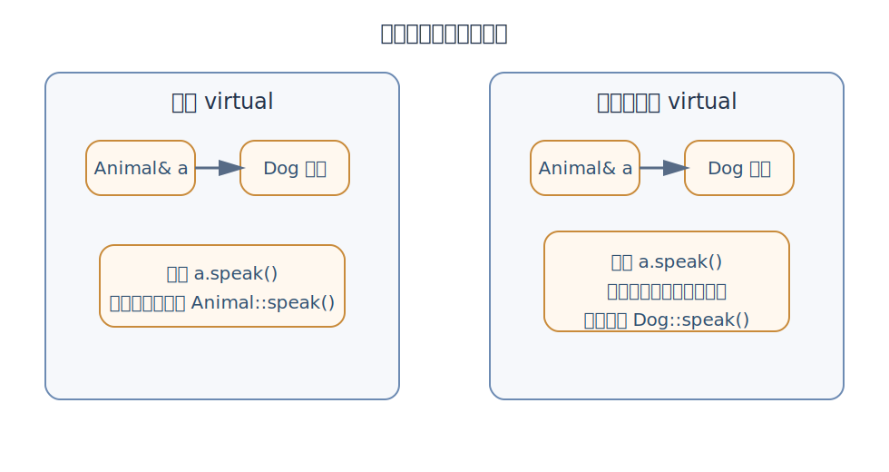
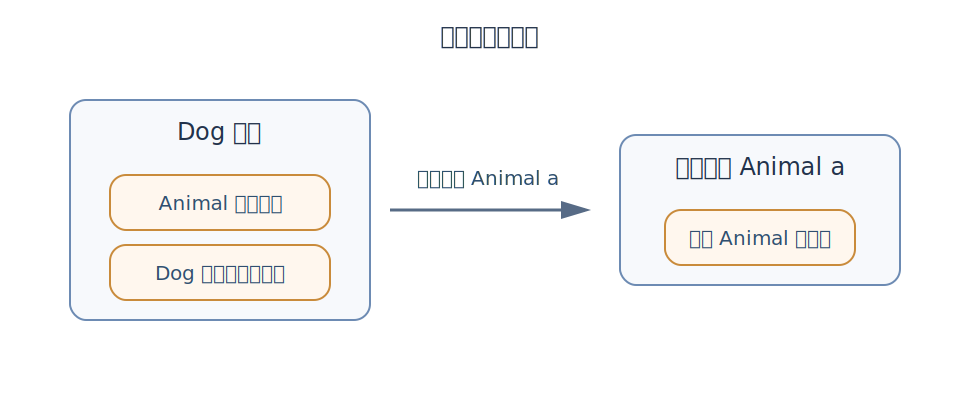
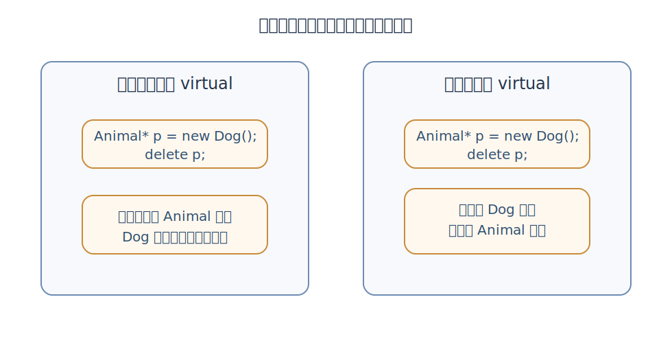

上一章，我们已经弄明白了：

- 派生类是在基类的基础上继续扩展
- `public` 继承表达的是一种 **is-a** 关系
- 构造时先基类、后派生类，析构顺序正好相反
- 派生类里写同名函数，会把基类那个名字“挡住”

但真正关键的问题，现在才开始。

假如我写了一个统一的函数：

```cpp
void makeItSpeak(Animal& a) {
    a.speak();
}
```

然后我把 `Dog`、`Cat`、`Bird` 都传进去。  
这个函数到底该调用谁的 `speak()`？

- 是只看参数类型，永远调用 `Animal::speak()`？
- 还是根据传进来的真实对象，在运行时自动选对版本？

这件事，正是 C++ 面向对象里最有代表性的能力之一：**多态（polymorphism）**。

:::tip
如果说第九章是在建立“类之间的层次”，那么这一章就是在学习：
如何站在“基类视角”写代码，却在运行时表现出“不同派生类各自的行为”。
:::

## 为什么需要多态

先看一个最典型的例子。

```cpp
#include <iostream>
using namespace std;

class Animal {
public:
    void speak() const {
        cout << "动物发出声音" << endl;
    }
};

class Dog : public Animal {
public:
    void speak() const {
        cout << "汪汪" << endl;
    }
};

class Cat : public Animal {
public:
    void speak() const {
        cout << "喵喵" << endl;
    }
};

void makeItSpeak(Animal& a) {
    a.speak();
}

int main() {
    Dog d;
    Cat c;

    makeItSpeak(d);
    makeItSpeak(c);
    return 0;
}
```

很多初学者看到这段代码，第一反应会是：

- 传进去的是 `Dog`，那就输出 `汪汪`
- 传进去的是 `Cat`，那就输出 `喵喵`

但如果 `Animal::speak()` **不是虚函数**，这个程序实际输出通常是：

```cpp
动物发出声音
动物发出声音
```

为什么？

因为 `makeItSpeak()` 里参数的类型写的是 `Animal&`。  
如果没有额外机制，编译器在处理 `a.speak()` 时，优先根据“它现在被看成什么类型”来决定要调哪个函数。

而这显然不是我们最想要的效果。

我们真正想要的是：

- 同样一段调用代码 `a.speak()`
- 面对不同的真实对象
- 在运行时自动表现出不同版本

这就是多态最直观的动机。



## 什么叫多态

你可以先把多态理解成一句很接地气的话：

**同一个接口，面对不同对象，表现出不同结果。**

在 C++ 里，最常见的是这种场景：

- 用**基类指针**或**基类引用**，统一接收不同派生类对象
- 调用同名成员函数
- 程序在运行时，根据对象真实类型，自动选择正确版本

例如：

- `Animal&` 既可以引用 `Dog`，也可以引用 `Cat`
- 都调用 `speak()`
- 但输出不一样

注意，这里的关键不是“函数名字一样”这么简单。  
真正关键的是：**程序不是只看变量声明类型，而是能在运行时识别实际对象。**

## 声明类型和真实类型

看下面这行：

```cpp
Animal* p = new Dog();
```

这里其实同时存在两层信息。

### 1）声明类型（静态类型）

从变量定义角度看，`p` 的类型是 `Animal*`。  
也就是说，编译器最先知道的是：

“这是一个指向 `Animal` 的指针。”

### 2）真实类型（动态类型）

但 `p` 实际指向的对象，却是 `Dog`。

也就是说，运行时它真正对应的对象是派生类对象。

这两层信息，在继承体系里经常同时存在。  
而多态的核心，就是让程序在某些调用场景下，别只盯着“声明类型”，而是能进一步根据“真实类型”选函数。

你现在可以先记住这句话：

- **不使用虚函数时，函数调用更偏向静态绑定**
- **使用虚函数后，程序才可能在运行时动态决定该调谁**

## `virtual` 解决了什么

要让上面的 `makeItSpeak()` 真正表现出多态，最关键的一步，就是把基类里的函数声明成 **虚函数（virtual function）**。

```cpp
#include <iostream>
using namespace std;

class Animal {
public:
    virtual void speak() const {
        cout << "动物发出声音" << endl;
    }
};

class Dog : public Animal {
public:
    void speak() const {
        cout << "汪汪" << endl;
    }
};

class Cat : public Animal {
public:
    void speak() const {
        cout << "喵喵" << endl;
    }
};

void makeItSpeak(Animal& a) {
    a.speak();
}

int main() {
    Dog d;
    Cat c;

    makeItSpeak(d);
    makeItSpeak(c);
    return 0;
}
```

这时输出就会变成：

```cpp
汪汪
喵喵
```

也就是说，`virtual` 给了程序一种能力：

**当你通过基类接口调用函数时，不再只看“现在手里是 `Animal&`”，而是进一步看“它实际绑定的是 `Dog` 还是 `Cat`”。**

这就叫**动态绑定（dynamic binding）**，也常被称为**运行时多态**。

:::note
含虚函数的类，会让编译器为“运行时选函数”准备一套额外机制。很多资料里会把这套机制概括成“虚函数表”。
:::

## 多态通常要满足什么条件

想让你写的代码真正表现出“运行时多态”，通常至少有下面几个条件。

### 1）基类函数要声明为 `virtual`

这是入口。

如果基类函数不是虚函数，那么即使派生类写了一个同名版本，很多通过基类接口发起的调用，仍然不会走到你想要的派生类版本。

### 2）要通过基类指针或基类引用来调用

例如：

```cpp
Animal* p = &dog;
p->speak();

Animal& r = dog;
r.speak();
```

这类写法，才是多态最典型的发生场景。

### 3）实际绑定的对象要确实是派生类对象

比如：

```cpp
Dog dog;
Animal& a = dog;
a.speak();
```

这里 `a` 虽然被声明成 `Animal&`，但它实际引用的对象是 `Dog`。  
所以当 `speak()` 是虚函数时，程序就能在运行时转去调 `Dog::speak()`。

## 同名函数不等于多态

这一点特别容易和第九章混在一起。

上章我们讲过：

- 派生类写同名函数
- 会把基类那个名字挡住

但那件事，和这一章的“运行时多态”，不是一回事。

看这段代码：

```cpp
class Animal {
public:
    void speak() const {
        cout << "动物发出声音" << endl;
    }
};

class Dog : public Animal {
public:
    void speak() const {
        cout << "汪汪" << endl;
    }
};
```

下面这句：

```cpp
Dog d;
d.speak();
```

当然会调用 `Dog::speak()`。  
因为你手里拿着的本来就是 `Dog` 对象，名字查找直接就落到派生类版本上了。

但这还不算我们这一章真正想强调的东西。

真正关键的是下面这种：

```cpp
Animal& a = d;
a.speak();
```

这时你是用“基类视角”在看对象。  
没有 `virtual` 和动态绑定，就不会自动转到派生类版本。

所以一定要把这两层区分开：

- **同名函数挡住基类版本**：偏“名字查找”问题
- **通过基类接口在运行时选对版本**：才是多态问题

## 引用/指针的重要性

一旦你**按值传递**，情况就变了。

看代码：

```cpp
#include <iostream>
using namespace std;

class Animal {
public:
    virtual void speak() const {
        cout << "动物发出声音" << endl;
    }
};

class Dog : public Animal {
public:
    void speak() const override {
        cout << "汪汪" << endl;
    }
};

void test(Animal a) {
    a.speak();
}

int main() {
    Dog d;
    test(d);
    return 0;
}
```

很多人会以为这里既然 `speak()` 是虚函数，那就应该输出 `汪汪`。  
但通常输出仍然是：

```cpp
动物发出声音
```

为什么？

因为参数 `Animal a` 是**按值传递**。  
当你把 `Dog` 传进去时，函数形参 `a` 会变成一个新的 `Animal` 对象。派生类那一层信息被“切掉”了。

这就叫 **对象切片（object slicing）**。

你可以把它先粗略理解成：

- 原对象本来是“基类部分 + 派生类部分”
- 一旦按值接成一个基类对象
- 只保留基类那一层
- 派生类特有部分不再跟着过去



所以，想让多态正常发生，特别常见的写法是：

```cpp
void test(const Animal& a)
void test(Animal& a)
void test(Animal* a)
```

而不是：

```cpp
void test(Animal a)
```

这也是为什么，很多和继承体系有关的函数参数，都会优先写成**引用**或**指针**。

## `override`

从语法上说，派生类重写虚函数时，`override` 不是强制必须写。  
但从实际开发习惯看，它非常值得你现在就养成。

先看一个很容易埋坑的例子。

```cpp
#include <iostream>
using namespace std;

class Animal {
public:
    virtual void speak() const {
        cout << "动物发出声音" << endl;
    }
};

class Dog : public Animal {
public:
    void speak() {
        cout << "汪汪" << endl;
    }
};
```

你以为自己“重写”了 `speak()`，但其实没有。  
因为基类是：

```cpp
void speak() const
```

而派生类写成了：

```cpp
void speak()
```

少了 `const`，函数签名就已经不同了。  
这时候它更像是在派生类里定义了一个新的同名函数，而不是正确覆盖基类虚函数。

如果你再写：

```cpp
Animal& a = dog;
a.speak();
```

结果很可能还是走 `Animal::speak()`，而不是你以为的派生类版本。

这时 `override` 的价值就体现出来了。

```cpp
class Dog : public Animal {
public:
    void speak() override {
        cout << "汪汪" << endl;
    }
};
```

编译器会直接报错，提醒你：

“这个函数并没有真正 override 基类里的虚函数。”

所以，`override` 的最大价值，不是“好看”，而是**帮你尽早揪出签名不匹配的问题**。

:::tip
只要是“想覆盖基类虚函数”，就尽量把 `override` 写上。
:::

## 一个最能看出多态价值的写法

多态真正好用的地方，在于可以把“同一类操作”统一起来。

比如：

```cpp
#include <iostream>
using namespace std;

class Animal {
public:
    virtual void speak() const {
        cout << "动物发出声音" << endl;
    }
};

class Dog : public Animal {
public:
    void speak() const override {
        cout << "汪汪" << endl;
    }
};

class Cat : public Animal {
public:
    void speak() const override {
        cout << "喵喵" << endl;
    }
};

class Bird : public Animal {
public:
    void speak() const override {
        cout << "啾啾" << endl;
    }
};

int main() {
    Dog d;
    Cat c;
    Bird b;

    Animal* animals[3] = {&d, &c, &b};

    for (int i = 0; i < 3; i++) {
        animals[i]->speak();
    }

    return 0;
}
```

输出：

```cpp
汪汪
喵喵
啾啾
```

这段代码很能说明多态的实用价值。

你写循环时，根本不需要在外面判断：

- 这个是不是狗
- 那个是不是猫
- 另一个是不是鸟

你只需要说一句：

**“这里我统一把它们都当 `Animal` 看待，但每个对象要自己对 `speak()` 负责。”**

这就是多态把“统一接口”和“具体实现”分开的力量。

## 析构函数为什么要写成 `virtual`

看下面这个例子。

```cpp
#include <iostream>
using namespace std;

class Animal {
public:
    ~Animal() {
        cout << "Animal 析构" << endl;
    }
};

class Dog : public Animal {
public:
    ~Dog() {
        cout << "Dog 析构" << endl;
    }
};

int main() {
    Animal* p = new Dog();
    delete p;
    return 0;
}
```

很多初学者会觉得：

- `p` 实际指向 `Dog`
- `delete p` 的时候，应该先析构 `Dog`，再析构 `Animal`

但如果基类析构函数**不是虚函数**，结果可能只调用 `Animal` 的析构函数。  
这会带来很严重的问题：

- 派生类自己的清理逻辑没执行
- 资源可能泄漏
- 程序行为可能不完整，甚至不安全

正确的做法通常是：

```cpp
class Animal {
public:
    virtual ~Animal() {
        cout << "Animal 析构" << endl;
    }
};
```

这样当你通过基类指针删除派生类对象时，析构就会按正确顺序发生：

- 先 `Dog` 析构
- 再 `Animal` 析构



这条经验非常重要，你最好现在就记住：

**只要一个类打算被当作基类使用，并且可能通过基类指针删除对象，它的析构函数通常就应该是 `virtual`。**

:::note
构造函数不能声明为 `virtual`，但析构函数可以，而且在多态基类里往往很有必要。
:::

## 纯虚函数

有时候，基类能提供一个“默认版本”。

例如：

```cpp
virtual void speak() const {
    cout << "动物发出声音" << endl;
}
```

但有时候，基类根本不知道一个合理的默认实现应该是什么。  
这时就可以把函数写成**纯虚函数（pure virtual function）**。

写法是：

```cpp
virtual void speak() const = 0;
```

注意最后那个 `= 0`。  
它的意思不是“等于零”，而是告诉编译器：

**这个函数在基类里只定义接口，不给出普通实现；派生类应该自己实现。**

看例子：

```cpp
#include <iostream>
using namespace std;

class Animal {
public:
    virtual void speak() const = 0;
    virtual ~Animal() {}
};

class Dog : public Animal {
public:
    void speak() const override {
        cout << "汪汪" << endl;
    }
};

class Cat : public Animal {
public:
    void speak() const override {
        cout << "喵喵" << endl;
    }
};
```

这里的 `Animal` 更像是在规定：

- “凡是动物，就必须会 `speak()`”
- 但“怎么叫”，由具体派生类自己决定

这类设计，在面向对象里很常见。

## 什么是抽象类

只要一个类里含有纯虚函数，这个类通常就是**抽象类（abstract class）**。

抽象类有一个非常重要的特点：

**不能直接创建对象。**

也就是说，下面这种写法会出错：

```cpp
Animal a;
```

为什么？

因为抽象类更像一张“接口说明书”或者一份“共同约定”。  
它负责告诉派生类：

- 你们属于同一体系
- 你们都要提供这些能力
- 但具体实现细节由你们自己完成

可以先把抽象类理解成：

**不拿来直接创建对象，而是专门用来当“统一父类接口”的类。**

## 一个综合例子

下面写一个稍微完整一点的例子，把“虚函数”“抽象类”“override”“基类引用多态”串起来。    
图形面积计算

```cpp
#include <iostream>
using namespace std;

class Shape {
public:
    virtual double area() const = 0;
    virtual const char* name() const = 0;

    virtual ~Shape() {}
};

class Rectangle : public Shape {
private:
    double width;
    double height;

public:
    Rectangle(double w, double h) : width(w), height(h) {}

    double area() const override {
        return width * height;
    }

    const char* name() const override {
        return "Rectangle";
    }
};

class Circle : public Shape {
private:
    double radius;

public:
    Circle(double r) : radius(r) {}

    double area() const override {
        return 3.1415926 * radius * radius;
    }

    const char* name() const override {
        return "Circle";
    }
};

void showShapeInfo(const Shape& s) {
    cout << s.name() << " 的面积是: " << s.area() << endl;
}

int main() {
    Rectangle rect(4.0, 5.0);
    Circle cir(3.0);

    showShapeInfo(rect);
    showShapeInfo(cir);
    return 0;
}
```

这里有几个特别值得你抓住的点。

**1）`Shape` 不负责“具体面积怎么算”**

它只规定：

- 所有图形都应该能算面积
- 所有图形都应该能返回自己的名字

但矩形怎么算、圆怎么算，不在基类里硬写死。

**2）`showShapeInfo()` 完全站在基类视角写**

它只知道参数是 `const Shape&`，并不知道具体传进来的是矩形还是圆。  
但它照样可以正确工作。

这正是多态最迷人的地方之一：

**调用者只面向统一接口写代码，具体行为交给对象自己决定。**

**3）扩展新类型时，外部代码常常不用改**

以后你再加一个 `Triangle`：

```cpp
class Triangle : public Shape {
    // 自己实现 area() 和 name()
};
```

只要它遵守 `Shape` 的接口约定，`showShapeInfo()` 这种基于基类接口写的代码，通常就还能继续直接用。

这就是多态非常实用的地方：**更方便扩展，更少改旧代码。**

## 多态的价值

学到这里，你可以先把多态的价值总结成三句话。

### 1）统一调用方式

外部代码不需要为每种派生类写一套分支逻辑。

### 2）把“做什么”和“怎么做”分开

调用方只说：

- 去 `speak()`
- 去 `area()`
- 去 `draw()`

至于具体怎么做，让对象自己负责。

### 3）更容易扩展

增加新的派生类时，很多旧代码不用改，或者只需要很少改动。

这也是为什么多态在 GUI、游戏对象系统、图形系统、插件系统等很多场景里都很常见。

## 初学者最容易踩的坑

**1）只在派生类里写同名函数，却忘了基类要加 `virtual`。**

多态的入口在基类，不在派生类单方面“自说自话”。

**2）把参数写成按值传递，导致对象切片。**

一旦切片，派生类那层信息就没了，多态也就发挥不出来。

**3）重写时函数签名不一致。**

少一个 `const`，参数类型不一样，返回类型不匹配，都会导致你以为“重写了”，其实没有。

**4）不写 `override`，把隐藏问题拖到运行时才发现。**

`override` 本质上是让编译器提前帮你做核对。

**5）通过基类指针删除对象，却没把基类析构函数写成 `virtual`。**

这不是小瑕疵，而是非常实在的资源管理风险。

**6）以为“有继承就一定有多态”。**

不是。继承只是层次关系；能否在运行时通过基类接口选对函数，还要看虚函数等条件。

**7）误以为构造函数也能写成 `virtual`。**

构造函数不能是虚函数；析构函数才是这里真正需要重点关注的那个。

## 几个小练习

练习一。

基于 `Animal`、`Dog`、`Cat` 自己写一遍最基础的多态例子。  
要求：

- 基类函数写成 `virtual`
- 派生类用 `override`
- 写一个 `makeItSpeak(const Animal& a)` 函数
- 分别传入狗和猫，观察输出

```cpp
#include <iostream>
using namespace std;

class Animal {
public:
    virtual void speak() const {
        cout << "动物的叫声" << endl;
    }    
};

class Dog : public Animal {
    void speak() const override {
        cout << "汪汪" << endl;
    }
};

class Cat : public Animal {
    void speak() const override {
        cout << "喵喵" << endl;
    }
};

void makeItSpeak(const Animal& a){
    a.speak();
}

int main() {
    Dog d;
    Cat c;
    makeItSpeak(d);
    makeItSpeak(c);

    return 0;
}
```


练习二。

把 `makeItSpeak(const Animal& a)` 改成：

```cpp
void makeItSpeak(Animal a)
```

然后重新运行，观察发生了什么。  
尝试用你自己的话解释“对象切片”到底切掉了什么。

练习三。

定义一个抽象基类 `Shape`，包含纯虚函数：

- `area()`
- `name()`

再定义两个派生类，例如：

- `Rectangle`
- `Triangle`

写一个统一函数打印它们的名称和面积。

练习四。

自己手写一个“析构实验”：

- 基类析构函数先不写 `virtual`
- 通过基类指针删除派生类对象
- 观察输出
- 再加上 `virtual`
- 对比前后差别

练习五。

故意把派生类某个重写函数的签名写错，比如漏掉 `const`，同时加上 `override`。  
观察编译器会给出什么提示。

## 本章小结

- **多态的核心，是同一接口面对不同对象时表现出不同结果。**
- **运行时多态最常见的基础，是继承 + 虚函数 + 基类指针或引用。**
- **`virtual` 让程序在运行时根据真实对象类型决定调用哪个函数。**
- **同名函数不等于多态，名字遮蔽和动态绑定不是一回事。**
- **按值传递会导致对象切片，常常会破坏多态。**
- **`override` 能帮助你及时发现“以为自己重写了，其实没有”的问题。**
- **多态基类的析构函数通常应该写成 `virtual`。**
- **纯虚函数用来规定接口，含纯虚函数的类通常是抽象类，不能直接实例化。**

## 参考内容

- 本章示例以教学演示为主，默认基于 C++11 及以上常见写法。
- 本章建议优先养成的两个习惯：需要重写时写 `override`，需要多态删除时检查基类析构是否为 `virtual`。
