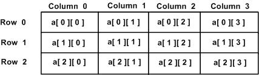

## 数组与字符串

如果说一个`变量`像一个小盒子，那么`数组`就是一排编号整齐的小抽屉。你可以把很多同类型的数据放进去，然后按位置一个一个取出来。而`字符串`，则像一串排着队的字符。它让程序终于能不只处理数字，还能处理名字、句子、密码、口令、文件名这些更像“人话”的内容。

:::tip
学数组和字符串时，最重要的不是把语法死记住，而是建立一个画面感。
数组要想到“连续的一排位置”。字符串要想到“一个个字符连成的序列”。
:::

## 什么是数组

先来看一个很现实的问题。如果你要存 5 个学生的成绩，你当然可以这样写。

```cpp
int score1 = 88;
int score2 = 91;
int score3 = 76;
int score4 = 95;
int score5 = 84;
```
这样写的问题很明显。变量太多，不方便统一处理。如果你想把这 5 个成绩全部输出、求和、找最大值，就得一行一行地写，非常笨重。这时候，数组就登场了。

**数组可以把一组相同类型的数据放在一起统一管理**。

```cpp
int scores[5] = {88, 91, 76, 95, 84};
```

这就表示，我们定义了一个名为 `scores` 的整型数组，它里面有 5 个元素。你可以把它想成这样。

- `scores[0]` 是第 1 个位置。
- `scores[1]` 是第 2 个位置。
- `scores[2]` 是第 3 个位置。

以此类推。

:::note
C++ 的数组下标是从 0 开始的，不是从 1 开始。
:::

### 定义与初始化

数组的基本写法是这样的。

```cpp
类型名 数组名[元素个数];
```

比如。

```cpp
int numbers[5];
```

这表示定义了一个可以存放 5 个整数的数组，但这时数组里的值还没有被明确初始化。

更常见的写法是边定义边初始化。

```cpp
int numbers[5] = {10, 20, 30, 40, 50};
```

也可以省略元素个数，让编译器自己数。

```cpp
int numbers[] = {10, 20, 30, 40, 50};
```

这时编译器会自动判断数组长度是 5。

还可以只给一部分初值。

```cpp
int numbers[5] = {1, 2};
```

这表示前两个元素分别是 `1` 和 `2`，剩下的元素会被补成 `0`。

### 访问元素

数组最重要的操作，就是通过下标访问元素。

```cpp
#include <iostream>
using namespace std;

int main() {
    int scores[5] = {88, 91, 76, 95, 84};

    cout << scores[0] << endl;
    cout << scores[3] << endl;

    return 0;
}
```

这段代码会输出第 1 个成绩和第 4 个成绩。

你也可以修改数组里的值。

```cpp
#include <iostream>
using namespace std;

int main() {
    int scores[5] = {88, 91, 76, 95, 84};

    scores[2] = 80;
    cout << scores[2] << endl;

    return 0;
}
```

这里把原来的 `76` 改成了 `80`。

## 数组和循环

数组一旦和循环配合起来，就会非常顺手。比如，输出数组中的所有元素。

```cpp
#include <iostream>
using namespace std;

int main() {
    int scores[5] = {88, 91, 76, 95, 84};

    for (int i = 0; i < 5; i++) {
        cout << "scores[" << i << "] = " << scores[i] << endl;
    }

    return 0;
}
```

这里的 `i` 就像一个不断移动的位置指针。当 `i` 从 `0` 变到 `4` 时，我们就依次访问了数组中的每一个元素。

:::tip
看到 `for (int i = 0; i < 5; i++)` 时，可以在脑子里自动翻译成一句话：
让 `i` 从第一个位置走到最后一个位置，每次往后挪一格。
:::

### 例子一：求数组元素之和

下面来做一个经典小题。

```cpp
#include <iostream>
using namespace std;

int main() {
    int numbers[5] = {10, 20, 30, 40, 50};
    int sum = 0;

    for (int i = 0; i < 5; i++) {
        sum += numbers[i];
    }

    cout << "sum = " << sum << endl;

    return 0;
}
```

这里的思路很简单。先准备一个变量 `sum`，初始值为 `0`。然后用循环把数组里的每个元素依次加到 `sum` 上。最后，`sum` 就是总和。

### 例子二：找数组中的最大值

```cpp
#include <iostream>
using namespace std;

int main() {
    int numbers[5] = {10, 87, 35, 99, 42};
    int maxValue = numbers[0];

    for (int i = 1; i < 5; i++) {
        if (numbers[i] > maxValue) {
            maxValue = numbers[i];
        }
    }

    cout << "max = " << maxValue << endl;

    return 0;
}
```

这个程序的关键思想是，先假设第一个元素就是最大值。然后从第二个元素开始，逐个比较。如果发现更大的，就更新 `maxValue`。这类“先假设一个答案，再不断修正”的思路，在编程里特别常见。

:::caution
数组很强，但也很“较真”。如果你定义的是 `int numbers[5];`，那么合法下标只有 `0` 到 `4`。如果你去访问 `numbers[5]`、`numbers[6]`，那就越界了。
数组越界是 C++ 初学阶段必须重视的问题。很多“莫名其妙的错误”，最后追根溯源，都是越界访问惹的祸。
:::

## 二维数组



一维数组像一排抽屉。二维数组就像一个表格。比如，下面这个二维数组有 2 行 3 列。

```cpp
int table[2][3] = {
    {1, 2, 3},
    {4, 5, 6}
};
```

访问方式是 `数组名[行下标][列下标]`。

```cpp
#include <iostream>
using namespace std;

int main() {
    int table[2][3] = {
        {1, 2, 3},
        {4, 5, 6}
    };

    cout << table[0][1] << endl;
    cout << table[1][2] << endl;

    return 0;
}
```

这里会输出 `2` 和 `6`。

如果要遍历整个二维数组，通常要用嵌套循环。

```cpp
#include <iostream>
using namespace std;

int main() {
    int table[2][3] = {
        {1, 2, 3},
        {4, 5, 6}
    };

    for (int i = 0; i < 2; i++) {
        for (int j = 0; j < 3; j++) {
            cout << table[i][j] << " ";
        }
        cout << endl;
    }

    return 0;
}
```

## 什么是字符串

数组解决的是“一组同类型数据”的问题。那如果我要存一个名字，比如 `Alice` 呢。如果只靠前面学过的基本类型，是不够的。这时就要用字符串。在现代 C++ 里，我们最常用的是 `std::string`。它本质上就是一个专门用来处理文本的类型，比早期的字符数组好用得多，也安全得多。

```cpp
#include <iostream>
#include <string>
using namespace std;

int main() {
    string name = "Alice";
    cout << name << endl;

    return 0;
}
```

这里的 `name` 就是一个字符串变量。

:::note
想使用 `string`，别忘了写 `#include <string>`。
虽然有些环境里不写也可能碰巧能用，但规范写法是要加上的。
:::

### 定义与基本操作

字符串最基础的操作包括定义、赋值、拼接和获取长度。

先看一个例子。

```cpp
#include <iostream>
#include <string>
using namespace std;

int main() {
    string firstName = "Zhengxi";
    string lastName = "Liu";
    string fullName = firstName + " " + lastName;

    cout << fullName << endl;
    cout << fullName.size() << endl;

    return 0;
}
```

这里有两个很重要的点。

- 字符串可以用 `+` 拼接。
- `size()` 可以得到字符串长度。

比如 `"hello"` 的长度就是 `5`。

### 访问字符串中的字符

字符串里的每个字符也有位置，也可以通过下标访问。

```cpp
#include <iostream>
#include <string>
using namespace std;

int main() {
    string word = "hello";

    cout << word[0] << endl;
    cout << word[1] << endl;
    cout << word[4] << endl;

    return 0;
}
```

输出会是。

```shell
h
e
o
```

因为字符串本质上也像一个字符序列，所以 `word[0]` 表示第一个字符，`word[1]` 表示第二个字符。

你也可以修改某个字符。

```cpp
#include <iostream>
#include <string>
using namespace std;

int main() {
    string word = "hello";
    word[0] = 'H';

    cout << word << endl;

    return 0;
}
```

运行后会输出 `Hello`。

:::caution
字符要用单引号，比如 `'A'`。
字符串要用双引号，比如 `"Alice"`。
这是两个不同的概念。
:::

## 字符串输入

**如果你只是输入一个不带空格的单词，那么用 `cin` 就够了**。

```cpp
#include <iostream>
#include <string>
using namespace std;

int main() {
    string name;
    cin >> name;
    cout << name << endl;

    return 0;
}
```

如果输入的是 `Alice`，没有问题。但如果你输入的是 `Alice Bob`，`cin` 只会读到前面的 `Alice`。因为 `cin` 遇到空格就停。**如果你想读一整行，就要用 `getline`**。

```cpp
#include <iostream>
#include <string>
using namespace std;

int main() {
    string sentence;
    getline(cin, sentence);
    cout << sentence << endl;

    return 0;
}
```

这样输入 `Alice Bob`，整个字符串都会被读进来。

### getline 读到空行

很多初学者都会遇到这种情况。前面刚用过 `cin >>`，后面马上接 `getline`，结果 `getline` 什么都没读到。这是因为前面的 `cin` 读完内容后，输入缓冲区里还留着一个换行符。`getline` 一看到这个换行符，就以为这一行结束了。

看下面这个例子。

```cpp
#include <iostream>
#include <string>
using namespace std;

int main() {
    int age;
    string name;

    cin >> age;
    getline(cin, name);

    cout << age << endl;
    cout << name << endl;

    return 0;
}
```

这里的 `name` 很可能会变成空字符串。

解决办法之一，是在 `getline` 前先吃掉那个残留的换行。

```cpp
#include <iostream>
#include <string>
using namespace std;

int main() {
    int age;
    string name;

    cin >> age;
    cin.ignore();
    getline(cin, name);

    cout << age << endl;
    cout << name << endl;

    return 0;
}
```

:::tip
只要看到“前面用 `cin`，后面用 `getline`”，你就要下意识想到：要不要处理缓冲区里的换行符。
:::

## 字符串与循环

因为字符串可以按下标访问字符，所以它和循环也是天然搭档。

比如，逐个输出字符串中的字符。

```cpp
#include <iostream>
#include <string>
using namespace std;

int main() {
    string word = "hello";

    for (int i = 0; i < word.size(); i++) {
        cout << word[i] << endl;
    }

    return 0;
}
```

这段代码会把 `h`、`e`、`l`、`l`、`o` 一行一个地输出。

### 例子一：统计元音字母个数

```cpp
#include <iostream>
#include <string>
using namespace std;

int main() {
    string s;
    getline(cin, s);

    int count = 0;

    for (int i = 0; i < s.size(); i++) {
        char ch = s[i];
        if (ch == 'a' || ch == 'e' || ch == 'i' || ch == 'o' || ch == 'u' ||
            ch == 'A' || ch == 'E' || ch == 'I' || ch == 'O' || ch == 'U') {
            count++;
        }
    }

    cout << "vowel count = " << count << endl;

    return 0;
}
```

### 例子二：把字符串反过来输出

```cpp
#include <iostream>
#include <string>
using namespace std;

int main() {
    string s = "hello";

    for (int i = s.size() - 1; i >= 0; i--) {
        cout << s[i];
    }

    cout << endl;

    return 0;
}
```

运行结果是。

```shell
olleh
```

这说明字符串不只是能从前往后遍历，也可以从后往前遍历。

## 字符数组和 C 风格字符串

在现代 C++ 中，更推荐使用 `std::string`。但还是应该知道，C++ 也支持更古老的写法，也就是字符数组。

```cpp
char name[] = "Alice";
```

这也是一个字符串，只不过它的底层形式是字符数组。

初学阶段，先了解 `std::string` 就够了。它更自然，也更安全。以后接触 C 语言风格接口、底层代码、老项目时，再去深入理解字符数组和 C 风格字符串，会更轻松。

:::note
学到这里，你可能已经发现了。数组和字符串其实有一点像。

- 数组是一组同类型元素按顺序排在一起。
- 字符串则可以看作是一组字符按顺序排在一起。

所以很多处理数组的方法，也能迁移到字符串上。比如：遍历、按下标访问、逐个统计、查找某类元素。
:::

## 综合例子

### 例子一：录入 5 个成绩并判断优秀人数

下面我们把数组、循环和条件判断拼起来。

```cpp
#include <iostream>
using namespace std;

int main() {
    int scores[5];
    int excellentCount = 0;

    for (int i = 0; i < 5; i++) {
        cin >> scores[i];
    }

    for (int i = 0; i < 5; i++) {
        if (scores[i] >= 90) {
            excellentCount++;
        }
    }

    cout << "excellent count = " << excellentCount << endl;

    return 0;
}
```

这个程序的逻辑是。先输入 5 个成绩。再遍历数组，统计有多少个成绩不小于 90。最后输出优秀人数。

你会发现，数组一旦出现，循环几乎总会跟着出现。

### 例子二：统计一句话里有多少个数字字符

下面这个程序会统计字符串中数字字符的个数。

```cpp
#include <iostream>
#include <string>
using namespace std;

int main() {
    string s;
    getline(cin, s);

    int digitCount = 0;

    for (int i = 0; i < s.size(); i++) {
        if (s[i] >= '0' && s[i] <= '9') {
            digitCount++;
        }
    }

    cout << "digit count = " << digitCount << endl;

    return 0;
}
```

如果输入的是。

```shell
room 404 on floor 7
```

那么输出就是。

```shell
digit count = 4
```

因为其中有 `4`、`0`、`4`、`7` 这 4 个数字字符。

## 初学者容易犯的错

1) 下标从 1 开始写。

比如把第一个元素写成 `arr[1]`。这在 C++ 里是错位的，真正的第一个元素是 `arr[0]`。

2) 数组越界。

明明数组长度是 5，却访问了 `arr[5]`。

3) 把字符和字符串混了。

`'A'` 是一个字符，`"A"` 是一个字符串。

4) 字符串输入时忘记 `cin` 和 `getline` 的区别。

5) 循环边界写错。

比如数组长度是 5，却把循环写成 `i <= 5`，这样最后一次就越界了。正确写法通常是 `i < 5`。

:::caution
很多 bug 不是因为算法太难，而是因为边界条件写错了一点点。
尤其是在数组和字符串这里，边界意识特别重要。
:::

## 小练习

练习一，输入 5 个整数，输出其中的最小值。

练习二，输入一个字符串，统计其中大写字母的个数。

练习三，输入一个字符串，把其中所有小写字母改成大写字母后输出。

练习四，定义一个 3 行 3 列的二维数组，输出主对角线元素之和。

练习五，输入一个单词，判断它是不是回文串。比如 `level` 是回文串，正着读和反着读都一样。

:::note[confident]
一旦你真正理解了数组和字符串，后面学指针、函数传参、结构体、类、STL 容器，都会轻松很多。
:::

## 本章小结

- 数组是一组相同类型的数据，按顺序存放，可以通过下标访问。
- 数组下标从 `0` 开始，访问时一定要防止越界。
- 数组和循环经常一起出现。
- 字符串在现代 C++ 中通常使用 `std::string`。
- 字符串可以拼接、求长度、按下标访问字符，也可以配合 `getline` 读取一整行。
- 数组和字符串虽然形式不同，但处理思路很像，都是对一个“有顺序的序列”做遍历和操作。

## 参考资料