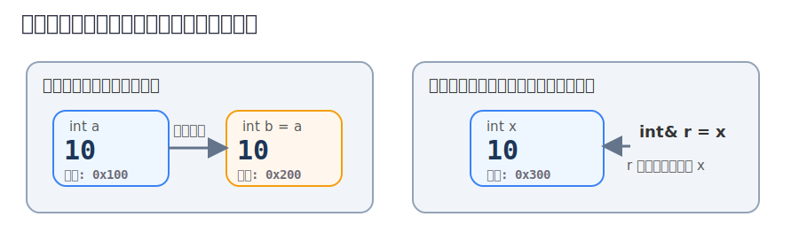
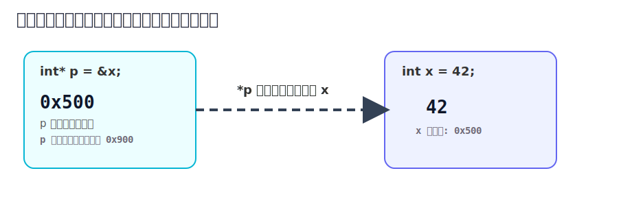
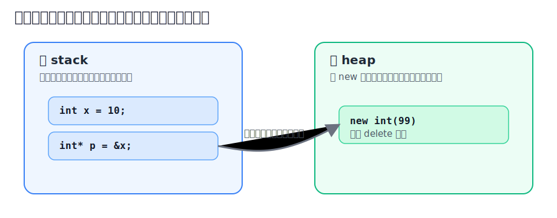

前面我们学了变量、类型、表达式、函数、条件判断、循环、数组和字符串。那些内容像是在学习怎么和程序说话。而这一章开始，我们要慢慢接触 C++ 很有代表性的能力：它不仅让你使用数据，还允许你更直接地“接近数据所在的位置”。说得更形象一点。

`普通变量`像你手里拿着一杯奶茶。
`引用`像这杯奶茶多了一个昵称，你喊哪个名字，拿到的都是同一杯。
`指针`则更像一张写着地址的小纸条，上面告诉你：奶茶放在桌子的哪个位置。

:::note
引用通常比较友好，指针一开始会让人皱眉，内存又会让人有点抽象。
:::

## 提问

假设你写了一个交换两个数字的函数。

```cpp
#include <iostream>
using namespace std;

void swapValue(int a, int b) {
    int temp = a;
    a = b;
    b = temp;
}

int main() {
    int x = 10;
    int y = 20;

    swapValue(x, y);

    cout << x << " " << y << endl;
    return 0;
}
```

你可能以为输出会变成 `20 10`，但实际还是：

```cpp
10 20
```

Why ? 因为这个函数拿到的是 `x` 和 `y` 的副本。你在函数里改的是副本，不是原来的变量。

那如果我们希望函数内部真的改到原变量，该怎么办。

答案有两条路。

- 一条是引用。
- 一条是指针。

## 什么是引用

引用可以理解成一个已经存在变量的别名。最基本的写法是：

```cpp
int x = 10;
int& r = x;
```

这里的 `r` 不是一个新的独立整数变量，而是 `x` 的另一个名字。

也就是说：

```cpp
cout << x << endl;  // 10
cout << r << endl;  // 10

r = 99;
cout << x << endl;  // 99
```

你改 `r`，本质上就是在改 `x`。



:::tip
把引用理解成“外号”很有帮助。
张三有个外号叫老张，别人叫张三，或者叫老张，指的都是同一个人。
:::

### 引用的语法规则

引用有几个非常重要的规则。

1) **引用在定义时必须初始化**

```cpp
int x = 10;
int& r = x;
```

下面这样不行：

```cpp
int& r;   // 错误，引用必须立刻绑定对象
```

2) **引用一旦绑定到某个变量，通常就不能再改绑到别的变量**

```cpp
int a = 10;
int b = 20;
int& r = a;

r = b;   // 这不是让 r 改绑到 b，而是把 b 的值赋给 a
```

执行后：

```cpp
a == 20
b == 20
```

3) **引用本身一般没有“空引用”这种正常用法。它应该始终代表一个`合法对象`**

:::caution
- `引用`更像一个已经绑定好的别名，使用起来接近普通变量。
- `指针`则是一个真正的变量，里面存的是地址，因此更灵活，也更容易出错。
:::

### 通过引用修改原变量

我们把前面的交换函数改成引用版。

```cpp
#include <iostream>
using namespace std;

void swapRef(int& a, int& b) {
    int temp = a;
    a = b;
    b = temp;
}

int main() {
    int x = 10;
    int y = 20;

    swapRef(x, y);

    cout << x << " " << y << endl;
    return 0;
}
```

这次输出就是：

```cpp
20 10
```

因为 `a` 是 `x` 的别名，`b` 是 `y` 的别名。
函数里面改 `a` 和 `b`，就是真正在改 `x` 和 `y`。

## 为什么函数参数经常用引用

你以后会经常看到这样的函数：

```cpp
void printString(const string& s) {
    cout << s << endl;
}
```

这里使用引用通常有两个原因。

- 避免复制，提高效率。如果字符串很长，直接按值传参会复制一份，比较浪费。
- 配合 `const`，表示函数只读，不修改原对象。

```cpp
const string& s
```

意思是：
我不想复制这份字符串，但我也保证不改它。

:::tip
- 小类型，比如 `int`、`double`、`char`，按值传递通常没问题。
- 大对象，比如 `string`、`vector`，常常会用 `const 引用` 传递。
:::

## 什么是指针

如果说引用是“别名”，那么指针就是“地址记录员”。`指针变量`里存放的不是普通值，而是另一个对象在`内存中的地址`。

先看最基本的例子：

```cpp
int x = 42;
int* p = &x;
```

这段代码可以拆成两部分理解。

`&x` 表示取出 `x` 的地址。
`int* p` 表示 `p` 是一个“指向 int 的指针”。

合起来就是：把 `x` 的地址保存到指针 `p` 里。



### `&` 和 `*` 到底是什么意思

先看 `&`。

**当它出现在变量前面时，通常表示“取地址”。**

```cpp
int x = 10;
cout << &x << endl;
```
这会输出 `x` 的地址。

**当它出现在类型后面时，表示“引用”。**

```cpp
int& r = x;
```

再看 `*`。

**当它出现在类型后面时，表示“指针类型”。**

```cpp
int* p;
```

**当它出现在指针变量前面时，表示“解引用”，也就是顺着地址找到那个对象。**

```cpp
int x = 42;
int* p = &x;

cout << *p << endl;  // 输出 42
```

这里的 `*p` 意思是：
去 `p` 里存的那个地址，找到对应的整数值。

### 通过指针修改变量

既然 `p` 保存了 `x` 的地址，那么我们也可以通过 `p` 改 `x`。

```cpp
#include <iostream>
using namespace std;

int main() {
    int x = 42;
    int* p = &x;

    cout << x << endl;   // 42
    cout << *p << endl;  // 42

    *p = 100;

    cout << x << endl;   // 100
    cout << *p << endl;  // 100
    return 0;
}
```

这里的 `*p = 100;` 不是在改指针本身，而是在改 `p` 指向的那个整数。

### 通过指针实现交换

和引用一样，指针也可以让函数修改外部变量。

```cpp
#include <iostream>
using namespace std;

void swapPointer(int* a, int* b) {
    int temp = *a;
    *a = *b;
    *b = temp;
}

int main() {
    int x = 10;
    int y = 20;

    swapPointer(&x, &y);

    cout << x << " " << y << endl;
    return 0;
}
```

这里要特别注意两层关系。

1) 调用时传的是地址：

```cpp
swapPointer(&x, &y);
```

2) 函数内部通过解引用拿到原变量：

```cpp
*a
*b
```
所以指针的思维方式经常是：
先找到地址，再顺着地址找到值。

## 引用和指针有什么区别

- 引用更像“已经绑定好的别名”，写起来更自然。
- 指针更像“手里拿着地址”，能力更灵活，但心智负担更重。

你可以先这样理解。

```cpp
int x = 10;
int& r = x;   // r 像 x 的另一个名字
int* p = &x;  // p 里装的是 x 的地址
```

使用时的感觉也不一样。

```cpp
r = 20;   // 很像普通变量
*p = 30;  // 先通过指针找到对象，再修改
```

再总结几条常见区别。

1. 引用定义时必须绑定对象，指针可以先不指向任何对象
2. 引用使用时像普通变量，指针要经常配合 `*` 和 `&`
3. 指针可以为空，引用通常应始终有效
4. 指针可以改为指向别处，引用一般不能重新绑定

:::note
- 如果你只是想让函数修改参数，引用往往更直观。
- 如果你需要表达“可能没有对象”或者需要更灵活的地址操作，才更常用指针。
:::

## 什么是空指针

指针可以不指向任何对象，这时常常写成空指针。

```cpp
int* p = nullptr;
```

`nullptr` 是现代 C++ 里专门表示空指针的关键字。它的意思大致是：这里现在没有合法地址。

为什么空指针有用。

因为有时候我们要明确表达：“现在还没有指向任何对象。”

例如：

```cpp
int* p = nullptr;

if (p != nullptr) {
    cout << *p << endl;
}
```

## 野指针为什么危险

野指针通常指的是：指针里有一个无效地址，但你还把它当成有效对象去访问。

比如下面这种情况就非常危险：

```cpp
int* p;
cout << *p << endl;  // 危险，p 没初始化
```

因为 `p` 没有初始化，它里面可能是乱七八糟的地址。你去解引用它，就相当于闭着眼冲进一栋根本不属于你的房子。

再比如：

```cpp
int* p = nullptr;
cout << *p << endl;  // 也危险，空指针不能解引用
```

:::caution
只要一个指针还没有明确指向合法对象，就不要解引用它。
这条规则请牢牢记住。
:::

## 初识内存：变量到底住在哪里

我们经常说变量存放在内存里，但“内存”不是一个单一抽象盒子。初学阶段你可以先粗略地区分两个区域。

- 一个叫栈 stack。
- 一个叫堆 heap。



### 什么是栈 (stack)

你可以先把栈理解成：函数执行时临时工作的地方。

例如：

```cpp
int main() {
    int x = 10;
    int y = 20;
    return 0;
}
```

像这种普通局部变量，通常都可以先理解为在栈上。

它们的特点是：函数开始时创建，函数结束时自动销毁。

所以**栈上的对象，通常不需要你手动释放**。

### 什么是堆 (heap)

堆可以先理解成：由程序员主动申请的一块动态内存区域。

例如：

```cpp
int* p = new int(99);
```

这句代码的意思是：在堆上创建一个 `int`，初值为 `99`，然后把它的地址交给指针 `p`。

访问它的方法：

```cpp
cout << *p << endl;
```

释放它的方法：

```cpp
delete p;
p = nullptr;
```

完整示例：

```cpp
#include <iostream>
using namespace std;

int main() {
    int* p = new int(99);

    cout << *p << endl;

    delete p;
    p = nullptr;
    return 0;
}
```

#### `new` 和 `delete`

只要你手动管理内存，就有可能忘记释放、重复释放，或者释放之后还继续使用。

例如下面这些情况都很危险。

```cpp
int* p = new int(99);
// 忘记 delete，可能造成内存泄漏
```

```cpp
int* p = new int(99);
delete p;
delete p;   // 重复释放，危险
```

```cpp
int* p = new int(99);
delete p;
cout << *p << endl;   // 释放后继续使用，危险
```

这就是为什么现代 C++ 更推荐你优先使用：

- `string`
- `vector`
- `array`
- 智能指针

而不是一上来就沉迷手写 `new` 和 `delete`。

:::tip
入门阶段可以了解 `new` 和 `delete` 的原理，但写实际代码时，优先使用标准库容器通常更安全。
:::

## 一个坑：不要返回局部变量的地址

看这段代码：

```cpp
int* badFunction() {
    int x = 10;
    return &x;
}
```

这段代码很危险。

因为 `x` 是局部变量，函数结束后它就被销毁了。但你却把它的地址返回出去了。于是外面拿到的是一个已经失效的地址。

这就是经典错误之一。

正确思路通常是：

1. 返回值本身
2. 让调用者传引用或指针进来
3. 用更安全的标准库类型

## 另一个坑：`cin`、数组、指针不是一回事

初学者在前几章接触数组和字符串之后，容易产生一种误解：“凡是和内存有关的东西，是不是都得靠指针硬扛。”

不是。

C++ 里很多高频任务你都不需要手写裸指针。

例如：

- 读入一行文本，用 `string`
- 保存一组元素，用 `vector`
- 交换两个整数参数，很多时候直接用引用

你学习指针，不是为了以后所有代码都写成指针风暴，而是为了真正理解数据、地址、对象和内存之间的关系。

## 案例练习
### 例子一：用引用让函数返回两个结果

有时候一个函数不只想返回一个值。我们可以用引用参数把结果带出去。

```cpp
#include <iostream>
using namespace std;

void divide(int a, int b, int& quotient, int& remainder) {
    quotient = a / b;
    remainder = a % b;
}

int main() {
    int q, r;
    divide(17, 5, q, r);

    cout << "商: " << q << endl;
    cout << "余数: " << r << endl;
    return 0;
}
```

输出：

```cpp
商: 3
余数: 2
```
这个例子展示了引用参数的一个典型用途：不仅能修改原变量，还能让函数“带回多个结果”。

### 例子二：用指针遍历数组

前面我们学过数组，这里可以用指针重新看一遍数组。

```cpp
#include <iostream>
using namespace std;

int main() {
    int arr[5] = {10, 20, 30, 40, 50};
    int* p = arr;

    for (int i = 0; i < 5; i++) {
        cout << *(p + i) << " ";
    }
    cout << endl;
    return 0;
}
```

这里的 `p` 指向数组首元素。

```cpp
p == &arr[0]
```

所以：

```cpp
*(p + 0)  // arr[0]
*(p + 1)  // arr[1]
*(p + 2)  // arr[2]
```

数组和指针关系密切，但它们不是同一个东西。

### 例子三：观察值传递、引用传递、指针传递

```cpp
#include <iostream>
using namespace std;

void addValue(int x) {
    x++;
}

void addRef(int& x) {
    x++;
}

void addPointer(int* x) {
    (*x)++;
}

int main() {
    int a = 5;
    int b = 5;
    int c = 5;

    addValue(a);
    addRef(b);
    addPointer(&c);

    cout << a << endl;
    cout << b << endl;
    cout << c << endl;
    return 0;
}
```

输出：

```cpp
5
6
6
```

这个例子很适合反复看几遍。

它会帮你彻底理解三件事。

- 按值传递改的是副本。
- 按引用传递改的是原对象。
- 按指针传递本质上也是通过地址改原对象。

## 初学者最容易犯的错误

1) **引用没有初始化**

```cpp
int& r;   // 错误
```

2) **忘了给指针合法地址**

```cpp
int* p;
*p = 10;   // 危险
```

3) **把普通值误当地址**

```cpp
int x = 10;
int* p = x;   // 错误，x 是值，不是地址
```

4) **忘记解引用**

```cpp
int x = 10;
int* p = &x;
cout << p << endl;   // 输出地址，不是 10
cout << *p << endl;  // 才是 10
```

5) **把 `=` 和 `==` 混淆之后，又在指针判断里踩坑**

```cpp
if (p = nullptr) {
    // 这是赋值，不是比较
}
```

正确写法：

```cpp
if (p == nullptr) {
}
```

6) **释放后不置空**

```cpp
delete p;
p = nullptr;
```

这不是万能保险，但至少能让你更容易避免后续误用。

### 小练习：你能猜出输出吗

```cpp
#include <iostream>
using namespace std;

void change1(int x) {
    x = 100;
}

void change2(int& x) {
    x = 200;
}

void change3(int* x) {
    *x = 300;
}

int main() {
    int a = 10;
    int b = 10;
    int c = 10;

    change1(a);
    change2(b);
    change3(&c);

    cout << a << " " << b << " " << c << endl;
    return 0;
}
```

答案是：

```cpp
10 200 300
```

### 小练习：下面哪一行危险

```cpp
int x = 10;
int* p1 = &x;
int* p2 = nullptr;
int* p3;
```

答案是：

- `p1` 安全，指向合法对象
- `p2` 可以，空指针本身不危险，乱解引用才危险
- `p3` 最危险，因为它未初始化

## 练习题

```cpp
1. 写一个函数，使用引用参数交换两个 double 类型变量
2. 写一个函数，接收 int* 指针，如果指针不为空，就把它指向的值乘以 2
3. 写一个程序，定义一个整型数组，分别用下标和指针两种方式输出数组内容
4. 写一个函数，接收一个 string 的 const 引用，输出它的长度
5. 尝试写出一个会产生野指针风险的例子，并说明为什么危险
```

## 本章小结

:::tip
- 引用让你明白，变量不一定只能有一个名字。
- 指针让你明白，程序不仅能处理值，还能处理地址。
- 内存初步让你开始意识到，变量的生命周期和存放位置并不是随便的。
:::

1. 引用像别名，使用自然，常用于函数参数
2. 指针保存地址，解引用后才能访问对象
3. `nullptr` 表示空指针
4. 未初始化指针和非法解引用非常危险
5. 栈上对象通常自动管理，堆上对象需要更小心
6. 现代 C++ 中，优先使用标准库和更安全的写法

:::note
如果你学完这一章后仍然觉得指针有点“滑”，这是正常现象。
指针真正变得顺手，通常要靠你多画图、多写代码、多调试。
只要别急着炫技，先把“地址”和“值”的关系想明白，后面会越来越顺。
:::

## 参考资料
