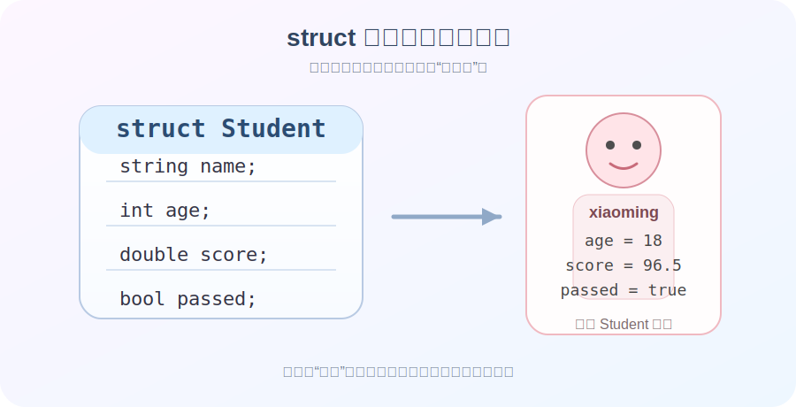
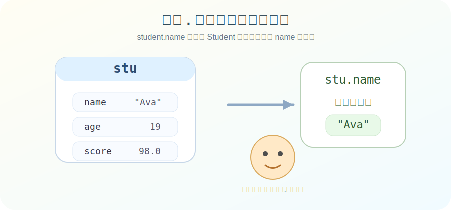
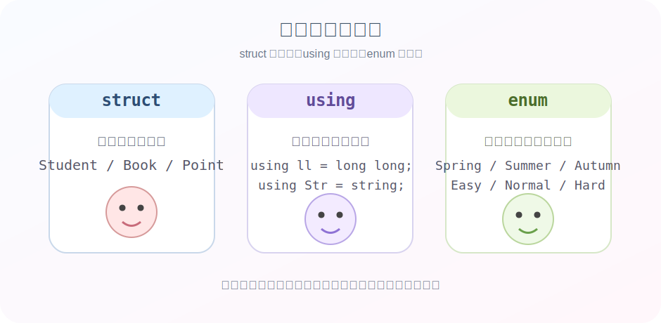

前面我们学过变量、函数、数组、字符串、引用和指针。到这里，你会慢慢发现一个问题。现实世界里的数据，往往不是单独一个 `int`、一个 `double`、一个 `string` 就能说清楚的。比如一个学生，至少会有姓名、年龄、成绩。比如一本书，至少会有书名、作者、价格。比如游戏里的角色，至少会有名字、血量、攻击力和坐标。这时候，如果还把这些信息拆成一堆零散变量，代码就会越来越乱。于是 C++ 说，别急，我们可以自己“造类型”。

这就是这一章的主角。

- `struct` 让你把多个相关数据打包在一起。
- `using` 让你给类型起一个更顺手的名字。
- `enum` 让你优雅地表示有限个状态或选项。

换句话说，这一章开始，你写的代码不只是“在用类型”，而是开始“设计类型”了。

:::tip
从这一章开始，思维要慢慢从“我有几个变量”转成“我在描述一个对象”。
:::

## 为什么需要结构体

先看一个很常见的场景。
我们要记录一个学生的信息。
如果不用结构体，可能会这样写。

```cpp
#include <iostream>
#include <string>
using namespace std;

int main() {
    string studentName = "Alice";
    int studentAge = 18;
    double studentScore = 95.5;

    cout << studentName << " " << studentAge << " " << studentScore << endl;
    return 0;
}
```

这段代码现在看起来还好，但如果学生变成 30 个、300 个，或者还要记录班级、手机号、是否及格，变量会很快多到你自己都看不下去。
所以我们需要一个“盒子”，把属于同一个对象的数据装到一起。

这个盒子，就是结构体。



## 什么是 struct

`struct` 是 structure 的缩写，可以理解成“结构”或者“组合好的数据类型”。
它允许你把多个成员变量放在一起，组成一个新的类型。
最基础的写法如下。

```cpp
#include <iostream>
#include <string>
using namespace std;

struct Student {
    string name;
    int age;
    double score;
};
```

这里有几个关键点。

- `Student` 是你自己定义出来的新类型。
- 花括号里面的 `name`、`age`、`score` 是这个类型的成员。
- 最后别忘了分号。

:::caution
`struct` 定义结束后，右花括号后面要有分号。
这个分号不是可有可无的装饰品，少了编译器会直接皱眉。
:::

## 结构体变量
### 结构体变量的创建和使用

定义好类型之后，就可以像使用普通变量那样，创建结构体变量。

```cpp
#include <iostream>
#include <string>
using namespace std;

struct Student {
    string name;
    int age;
    double score;
};

int main() {
    Student s1;

    s1.name = "Alice";
    s1.age = 18;
    s1.score = 95.5;

    cout << s1.name << endl;
    cout << s1.age << endl;
    cout << s1.score << endl;

    return 0;
}
```

这里的 `s1` 就是一个 `Student` 类型的变量。
访问结构体成员时，要使用点号 `.`。
格式就是：

```cpp
变量名.成员名
```

比如 `s1.name`、`s1.age`、`s1.score`。



:::note
点号可以理解成“从这个对象里，找到它的某个部分”。
`s1.name` 的意思就是，从 `s1` 这个学生对象里拿出 `name`。
:::

### 用初始化的方式创建结构体变量

除了先创建再赋值，还可以在创建的时候直接给出初始值。

```cpp
#include <iostream>
#include <string>
using namespace std;

struct Student {
    string name;
    int age;
    double score;
};

int main() {
    Student s1 = {"Alice", 18, 95.5};
    Student s2 = {"Bob", 19, 88.0};

    cout << s1.name << " " << s1.score << endl;
    cout << s2.name << " " << s2.score << endl;

    return 0;
}
```

这种写法很适合快速创建对象。
不过要注意，花括号里的顺序，要和结构体成员声明的顺序一致。
如果你把顺序写乱了，程序未必报错，但含义可能已经悄悄跑偏了。

:::caution
结构体初始化时，值的顺序通常要和成员声明顺序一致。
别把 `age` 的位置塞成 `score`，不然 95.5 岁的学生就出现了。
:::

### 来一个更完整的例子

我们写一个学生信息展示程序。

```cpp
#include <iostream>
#include <string>
using namespace std;

struct Student {
    string name;
    int age;
    double score;
};

int main() {
    Student stu = {"Luna", 18, 97.5};

    cout << "学生姓名: " << stu.name << endl;
    cout << "年龄: " << stu.age << endl;
    cout << "成绩: " << stu.score << endl;

    if (stu.score >= 60) {
        cout << "结果: 及格" << endl;
    } else {
        cout << "结果: 不及格" << endl;
    }

    return 0;
}
```

这个例子说明了一件事。
结构体不是拿来“替代变量”的，它是帮你把数据组织得更清楚。真正用起来时，它仍然会和 `if`、`for`、函数这些知识一起配合。

## 结构体数组

前面学过数组。现在把数组和结构体结合起来，代码立刻变得实用了很多。

```cpp
#include <iostream>
#include <string>
using namespace std;

struct Student {
    string name;
    int age;
    double score;
};

int main() {
    Student students[3] = {
        {"Alice", 18, 95.5},
        {"Bob", 19, 88.0},
        {"Cindy", 18, 91.0}
    };

    for (int i = 0; i < 3; i++) {
        cout << students[i].name << " "
             << students[i].age << " "
             << students[i].score << endl;
    }

    return 0;
}
```

这里的 `students` 是一个数组，数组里的每个元素都是 `Student` 类型。
所以 `students[i].name` 的意思就是：
先取出第 `i` 个学生，再访问这个学生的 `name` 成员。
这已经非常接近很多真实程序的数据组织方式了。

:::tip
结构体解决的是“一个对象里有哪些信息”，数组解决的是“有多少个这样的对象”。
两个东西一组合，威力就上来了。
:::

## 结构体与函数
### 结构体也可以作为函数参数

结构体最大的价值之一，就是**可以被函数直接拿来传递**。
比如我们写一个专门打印学生信息的函数。

```cpp
#include <iostream>
#include <string>
using namespace std;

struct Student {
    string name;
    int age;
    double score;
};

void printStudent(Student s) {
    cout << "姓名: " << s.name << endl;
    cout << "年龄: " << s.age << endl;
    cout << "成绩: " << s.score << endl;
}

int main() {
    Student stu = {"Mika", 20, 93.5};
    printStudent(stu);
    return 0;
}
```

这样做的好处很明显。
你不需要把 `name`、`age`、`score` 一项一项传进去，直接把整个学生对象交给函数就行。
这会让函数的接口更清晰，也更贴近现实含义。

### 引用传递结构体

上面的写法虽然直观，但它会把整个结构体复制一份给函数。
当结构体很大时，这样会有额外开销。于是我们通常会用引用来传递。

```cpp
#include <iostream>
#include <string>
using namespace std;

struct Student {
    string name;
    int age;
    double score;
};

void printStudent(const Student& s) {
    cout << "姓名: " << s.name << endl;
    cout << "年龄: " << s.age << endl;
    cout << "成绩: " << s.score << endl;
}

int main() {
    Student stu = {"Nora", 19, 90.0};
    printStudent(stu);
    return 0;
}
```

这里的 `const Student& s` 可以拆开理解。
- `Student&` 表示按引用传递，不复制整个对象。
- `const` 表示这个函数只读，不会修改它。

这是一种非常常见、也非常推荐的写法。

:::note
如果函数只是读取结构体内容，常写成 `const 类型名& 变量名`。
:::

### 函数也可以返回结构体

不仅可以传进去，还可以返回出来。

```cpp
#include <iostream>
#include <string>
using namespace std;

struct Point {
    int x;
    int y;
};

Point createPoint(int a, int b) {
    Point p;
    p.x = a;
    p.y = b;
    return p;
}

int main() {
    Point p1 = createPoint(3, 5);
    cout << p1.x << ", " << p1.y << endl;
    return 0;
}
```

这就像函数帮你“生产”了一个对象，再把它交回来。
很多程序都会这样组织数据。

## 结构体里可以放什么成员

结构体成员可以是各种类型。
你已经学过的大部分基础类型，都可以放进去。

```cpp
struct Player {
    string name;
    int hp;
    double attack;
    bool alive;
};
```

甚至结构体成员还可以是数组。

```cpp
struct Team {
    string name;
    int scores[3];
};
```

以后你还会学到，结构体里甚至可以放更复杂的类型，比如别的结构体、类、容器等等。

## 结构体嵌套结构体

这是非常实用的一个技巧。

比如一个学生不仅有自己的信息，还有地址信息。那地址本身也可以定义成一个结构体。

```cpp
#include <iostream>
#include <string>
using namespace std;

struct Address {
    string city;
    string street;
};

struct Student {
    string name;
    int age;
    Address addr;
};

int main() {
    Student stu = {"Alice", 18, {"Shanghai", "Nanjing Road"}};

    cout << stu.name << endl;
    cout << stu.addr.city << endl;
    cout << stu.addr.street << endl;

    return 0;
}
```

这里 `stu.addr.city` 读起来其实很自然。
先找到学生的地址，再找到地址里的城市。
这说明点号不仅能用一次，还能一层一层往下走。

:::tip
当你看到 `a.b.c` 这种写法时，不要慌。
它本质上就是一步一步进入更里面的成员。
:::

## struct 和 class

后面会学到 `class`。很多人到这里都会问，那 `struct` 和 `class` 到底啥关系。

先给你一个初学者阶段完全够用的理解。

- 它们都能定义自定义类型。
- 它们都能有成员。

在当前阶段，可以先把 `struct` 看成更适合入门的数据打包工具。

等后面学面向对象时，再系统进入 `class` 的世界。
现在不需要把它们的所有差异一次性吃透，先会用 `struct` 才是关键。

## 自定义类型不只有 struct

到了这里，C++ 会很认真地对你说一句。
你不只能用系统给你的类型，你也可以给自己造顺手的名字，造更贴合场景的表达方式。
这就轮到 `using` 和 `enum` 出场了。



### using，给类型起别名

有些类型名字很长，或者你想让代码更符合业务语义，这时可以使用 `using`。

```cpp
#include <iostream>
#include <string>
using namespace std;

using ll = long long;
using Str = string;

int main() {
    ll a = 123456789;
    Str name = "C++ Learner";

    cout << a << endl;
    cout << name << endl;
    return 0;
}
```

这里的意思是：
以后看到 `ll`，就把它理解成 `long long`。
看到 `Str`，就把它理解成 `string`。
这不会创造一个全新的底层类型，它只是给原来的类型起了一个别名。就和python中的`import numpy as np`的效果差不多。

:::note
`using` 更像给类型贴标签，而不是重新发明一种新材料。
:::

#### 为什么 using 有用

先看一个没有别名的版本。

```cpp
long long totalScore = 0;
long long maxValue = 1000000000;
```

再看用了别名之后。

```cpp
using ll = long long;

ll totalScore = 0;
ll maxValue = 1000000000;
```

这段代码是不是更干净了。
在复杂项目里，别名不仅能让代码更短，还能让含义更清楚。

比如：

```cpp
using StudentCount = int;
using Price = double;
using Name = string;
```

虽然底层还是原来的类型，但读代码的人会更容易明白这个变量在扮演什么角色。

### enum，有限个选项

有些数据不是任意变化的，而是只能从几个固定值里选。
比如星期、季节、游戏难度、红绿灯状态。
这种场景下，`enum` 就很合适。

```cpp
#include <iostream>
using namespace std;

enum Color {
    RED,
    YELLOW,
    GREEN
};

int main() {
    Color light = GREEN;

    if (light == GREEN) {
        cout << "可以通行" << endl;
    }

    return 0;
}
```

这里的 `Color` 是一个枚举类型。
它的可选值有 `RED`、`YELLOW`、`GREEN`。
这样写的好处是，程序含义很直观。你不会拿一个神秘的数字 2 去猜它到底代表什么状态。

:::tip
当一个变量只允许在几个固定状态里变化时，`枚举`往往比裸数字更优雅。
:::

#### 用枚举写一个游戏难度例子

```cpp
#include <iostream>
using namespace std;

enum Difficulty {
    EASY,
    NORMAL,
    HARD
};

int main() {
    Difficulty level = HARD;

    if (level == EASY) {
        cout << "简单模式" << endl;
    } else if (level == NORMAL) {
        cout << "普通模式" << endl;
    } else {
        cout << "困难模式" << endl;
    }

    return 0;
}
```

这段代码的重点不是功能有多复杂，而是表达更清晰了。

`level = HARD` 一眼就知道意思。
要是写成 `level = 2`，你还得先回忆 2 到底对应谁。

### struct、using、enum 怎么一起配合

它们经常不是单独使用，而是一起出现。
比如写一个游戏角色结构体。

```cpp
#include <iostream>
#include <string>
using namespace std;

using Str = string;

enum RoleType {
    WARRIOR,
    MAGE,
    ARCHER
};

struct Player {
    Str name;
    int hp;
    RoleType role;
};

int main() {
    Player p = {"Aria", 100, MAGE};

    cout << "名字: " << p.name << endl;
    cout << "血量: " << p.hp << endl;

    if (p.role == WARRIOR) {
        cout << "职业: 战士" << endl;
    } else if (p.role == MAGE) {
        cout << "职业: 法师" << endl;
    } else {
        cout << "职业: 弓箭手" << endl;
    }

    return 0;
}
```

这里很典型。
`using` 让类型名更简洁。
`enum` 让职业状态更清楚。
`struct` 把一个玩家需要的信息打包起来。

这就是“自定义类型”的真正魅力。你开始不是在凑语法，而是在设计程序里的世界。

## 一个综合例子

下面写一个更完整的综合小例子，把这一章的内容串起来。

```cpp
#include <iostream>
#include <string>
using namespace std;

using Price = double;

enum BookStatus {
    IN_STOCK,
    SOLD_OUT
};

struct Book {
    string title;
    string author;
    Price price;
    BookStatus status;
};

void printBook(const Book& b) {
    cout << "书名: " << b.title << endl;
    cout << "作者: " << b.author << endl;
    cout << "价格: " << b.price << endl;

    if (b.status == IN_STOCK) {
        cout << "状态: 有货" << endl;
    } else {
        cout << "状态: 缺货" << endl;
    }
}

int main() {
    Book book1 = {"C++ Primer Journey", "Liu", 79.9, IN_STOCK};
    printBook(book1);
    return 0;
}
```

你可以感受一下，这段代码已经比“只用基础变量硬凑”自然很多了。
这就是结构化思维的开始。

## 初学者最容易踩的坑

**1) 忘记 `struct` 定义后面的分号**

```cpp
struct Student {
    string name;
    int age;
}
```

这段就是错的，后面少了分号。

**2) 成员访问时忘了用点号**

```cpp
Student s;
s.name = "Alice";
```

这里必须是 `s.name`，不能只写 `name`。

**3) 初始化顺序写乱**

```cpp
Student s = {18, "Alice", 95.5};
```

如果成员顺序本来是 `name`、`age`、`score`，那这样写就不对。

**4) 把 `using` 误解成创建了新底层类型**

```cpp
using Score = int;
```

这里的 `Score` 本质上还是 `int`，只是名字更有语义感。

**5) 枚举值和普通整数混着想，导致语义混乱**

能写清楚状态时，尽量别拿裸数字硬撑。

:::caution
能把代码写得“人一眼就懂”，通常就不要写成“编译器勉强能懂”。
初学阶段尤其要养成这个习惯。
:::

## 几个小练习

练习一。
定义一个 `Book` 结构体，包含书名、作者、价格三个成员，创建两个变量并输出内容。
```cpp
#include <iostream>
#include <string>
using namespace std;

int main() {
    struct Book{
        string name;
        string author;
        double price;
    };

    Book book[2] = {
        {"xiyou", "bob", 19}, 
        {"shuihu", "canlon", 20}
    };

    for (int i = 0; i < 2; i++){
        cout << book[i].name << " "
             << book[i].author << " "
             << book[i].price << endl;
    }

    return 0;
}
```
练习二。
定义一个 `Point` 结构体，包含 `x` 和 `y`，写一个函数打印坐标。
```cpp
#include <iostream>
using namespace std;

struct Point{
    double x;
    double y;
};

Point createPoint(double a, double b){
    Point p;
    p.x = a;
    p.y = b;
    return p;
}

int main(){
    Point p1 = createPoint(3.1, 5.1);
    cout << p1.x << ", " << p1.y << endl;
    return 0;
}
```
练习三。
定义一个 `enum Weekday`，包含周一到周日，然后定义一个变量表示今天是星期几，并输出一句描述。
```cpp
#include <iostream>
#include <sting>
using namespace std;

enum Weekday{
    Monday,
    Tuesday,
    Wednesday,
    Thursday,
    Friday,
    Saturday,
    Sunday
};

int main(){
    Weekday day = Monday;

    string names[] = {
        "Monday","Tuesday","Wednesday",
        "Thursday","Friday","Saturday","Sunday"
    };

    cout << "Today is " << names[day] << endl;

    return 0;
}
```
练习四。
定义一个 `Player` 结构体，包含名字、血量、职业，其中职业使用枚举表示。
```cpp
#include <iostream>
#include <string>
using namespace std;

enum RoleType {
    WARRIOR,
    MAGE,
    AGCHER
};

struct Player {
    string name;
    int blood;
    RoleType role;
};

int main() {
    Player p = {"Aric", 100, MAGE};

    cout << "名字: " << p.name << endl;
    cout << "血量: " << p.blood << endl;

    if (p.role == WARRIOR) {
        cout << "职业: 战士" << endl;
    } else if (p.role == MAGE) {
        cout << "职业: 法师" << endl;
    } else {
        cout << "职业: 弓箭手" << endl;
    }

    return 0;
}
```
练习五。
定义一个结构体数组，存 3 个学生，遍历输出平均成绩。
```cpp
#include <iostream>
#include <string>
using namespace std;

struct Student {
    string name;
    int score;
};

int main() {
    Student s[3] = {
        {"Alice", 90},
        {"Bob", 60},
        {"Alex", 80}
    };
    
    int sum = 0;
    for (int i = 0; i < 3; i++){
        cout << "姓名: " << s[i].name
             << "成绩: " << s[i].score << endl;
        
        sum += s[i].score;
    }

    int avg = sum / 3;

    cout << "平均成绩为：" << avg << endl; 

    return 0;
}
```
## 本章小结

- 当一组数据属于同一个对象时，用 `struct` 把它们装起来。
- 当类型名字太长，或者你想让代码含义更清楚时，用 `using` 起别名。
- 当一个变量只能取若干固定状态时，用 `enum` 表示会更自然。
- 结构体会和数组、函数、条件判断一起配合，它不是孤立知识点。

你会发现，学到这里，C++ 已经不像刚开始那样只是“几个变量、几条语句”了。它开始变得更像搭积木。你在定义自己的零件，然后用这些零件构建更清楚的程序。

:::tip
写代码这件事，真正优雅的地方，不只是程序跑出来了，而是你能把现实世界里的对象、状态和关系，准确地翻译进代码里。
:::

## 参考内容
