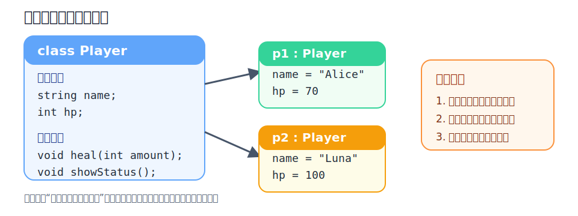
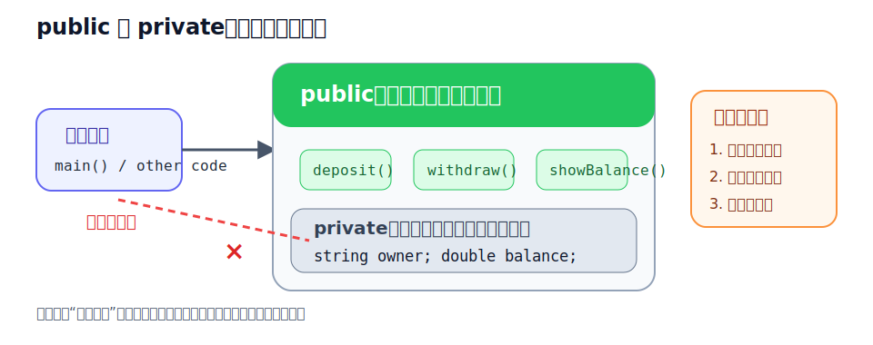
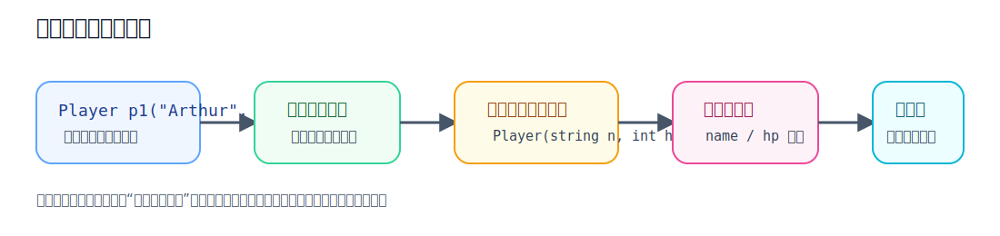

上一章，我们学会了用 `struct` 把多个变量打包，造出了属于自己的数据类型。比如一个 `Player` 结构体里，有名字、血量、攻击力。这看起来已经很棒了。

但你慢慢会发现一个新的问题。现实世界里的事物，不仅有“属性”（它有什么），还有“行为”（它能干什么）。
- 比如一个游戏角色，他不仅有血量，他还能“攻击”，能“喝药回血”。
- 比如一个银行账户，它不仅有余额，它还能“存钱”和“取钱”。

如果只用 `struct` 加上一堆零散的函数，数据和操作数据的方法依然是分离的。于是 C++ 说，既然你要描述一个完整的对象，不如把数据和动作全都打包进同一个盒子里！这就是这一章的主角，也是 C++ 最核心的灵魂：**面向对象编程（OOP）**。

- `class` 让你把属性和动作完美结合。
- `public` 和 `private` 帮你保护那些不能被随便篡改的数据。
- `构造函数` 保证你的对象一出生就是完整的状态。

:::tip
从这一章开始，你的代码不再只是静态的数据了。你要开始创造“会自己行动”的对象。
:::

## 为什么需要类（Class）

先来看一个没用类的场景。我们要写一个游戏角色的回血功能。
```cpp
#include <iostream>
#include <string>
using namespace std;

struct Player {
    string name;
    int hp;
};

void heal(Player& p, int amount) {
    p.hp += amount;
    cout << p.name << " 恢复了 " << amount << " 点血量，当前血量: " << p.hp << endl;
}

int main() {
    Player p1 = {"Alice", 50};
    heal(p1, 20);
    return 0;
}
```
这能运行，但有点别扭。`heal`（回血）明明是 `Player` 自己的行为，但在代码里，它却像是一个外人，把 `Player` 抓过来强行加血。

在面向对象的世界里，我们更希望这样表达：
“Alice，请你自己回个血。”

这就是 `class` 要做的事情。

## 什么是 class
`class`（类）就像一张设计图纸。通过图纸，我们可以造出实实在在的物品，这叫**对象**（Object）。

我们把刚刚的代码用 `class` 改造一下。
```cpp
#include <iostream>
#include <string>
using namespace std;

class Player {
public: // 注意这个词，马上会讲
    string name;
    int hp;

    // 我们把函数直接写在类里面！这叫“成员函数”
    void heal(int amount){
        hp += amount;
        cout << name << " 恢复了 " << amount << " 点血量，当前血量: " << hp << endl;
    }
};

int main() {
    Player p1;
    p1.name = "Alice";
    p1.hp=50;
    
    // 让 p1 自己执行回血动作
    hl.heal(20);

    return 0;
}
```
看懂了吗？

函数 `heal` 变成了 `Player` 的一部分。调用的时候，我们写的是 `p1.heal(20)`。这感觉就像在对 `p1` 下达指令。

这里的 `.` 叫**点号运算符**，意思是：让这个对象访问自己的公开成员。



:::note
把函数写在类里面，这个函数就可以直接使用类里面的变量（比如 `hp` 和 `name`），再也不需要把对象当成参数传进去了。
:::

### public 和 private：保护你的数据

上一段代码里，有个关键单词 `public:`。

如果不写它会怎样？编译器会直接报错，不让你用 `p1.name`，也不让你用 `p1.heal()`。

这就是面向对象里的一个重要概念：**封装**。

现实中，你用一台自动售货机。你能接触到的是按键和投币口；你接触不到的是机器内部的钱箱和电路板。

- 能给外部用的接口，是 `public`
- 不希望外部随便乱碰的内部状态，是 `private`

写代码也是一样。
```cpp
#include <iostream>
#include <string>
using namespace std;

class BankAccount {
private:
    double balance; // 余额是私有的，外部不能直接碰

public:
    string owner;   // 名字是公开的

    // 给外部留一个“存钱口”
    void deposit(double amount) {
        if (amount > 0) {
            balance += amount;
            cout << "存入成功，余额: " << balance << endl;
        }
    }

    // 给外部留一个“查余额”的方法
    void showBalance() {
        cout << owner << " 的余额是: " << balance << endl;
    }
};

int main() {
    BankAccount account;
    account.owner = "Bob";
    
    // account.balance = 1000000; // 错误！balance 是私有的，编译器会拦住你！

    // 只能通过公开的方法来操作
    account.deposit(500);
    account.showBalance();

    return 0;
}
```


把关键数据设为 `private`，把操作数据的方法设为 `public`。
这样，你就能在方法里加上各种检查（比如存钱不能存负数），防止数据被瞎改。

- 存钱不能存负数
- 取钱不能超过余额
- 血量不能小于 0
- 成绩不能大于 100

这才是“保护数据”的真正含义。

:::tip
初学者通常觉得全写 public 方便。
但真正的老手知道，尽量把变量藏在 `private` 里，只暴露必要的 `public` 函数，代码才会安全、不容易出 Bug。
:::

### 构造函数：对象出生的那一刻
仔细回想一下，之前我们创建对象后，总是要手动给它赋值：
```cpp
Player p1;
p1.name = "Alice";
p1.hp = 100;
```
万一你忘了写 `p1.hp = 100`，`hp` 里就会是一个随机的垃圾数字。Alice 一出生就暴毙了。
为了解决这个问题，C++ 提供了一种特殊的函数：**构造函数（Constructor）**。

构造函数的特点是：
- 名字必须和类的名字**一模一样**。
- **没有返回值**（连 `void` 都不写）。
- 在对象被创建的瞬间，**自动被调用**。

```cpp
#include <iostream>
#include <string>
using namespace std;

class Player {
private:
    string name;
    int hp;

public:
    // 这就是构造函数
    Player(string n, int h) {
        name = n;
        hp = h;
        cout << name << " 降生到了这个世界！" << endl;
    }

    void showStatus() {
        cout << "玩家: " << name << ", 血量: " << hp << endl;
    }
};

int main() {
    // 创建对象的同时，必须把名字和血量传进去！
    Player p1("Arthur", 100);
    Player p2("Luna", 80);

    p1.showStatus();
    p2.showStatus();

    return 0;
}
```
有了构造函数，你就再也不怕忘记初始化变量了。
编译器会逼着你在创建对象时，老老实实地交出必要的数据。


### 构造函数可以有多个（重载）
有时候，我们想提供多种创建对象的方式。

比如，既可以指定名字和血量，也可以只指定名字，血量默认给 100。

```cpp
class Player {
private:
    string name;
    int hp;

public:
    // 第一个构造函数：全量指定
    Player(string n, int h) {
        name = n;
        hp = h;
    }

    // 第二个构造函数：只给名字，血量默认
    Player(string n) {
        name = n;
        hp = 100; // 默认值
    }
};

int main() {
    Player p1("Arthur", 150); // 调用第一个
    Player p2("Luna");        // 调用第二个，血量自动是 100
    return 0;
}
```
C++ 很聪明，它会根据你括号里传的参数，自动去挑对应的那一个构造函数。

### 成员初始化列表

上面的构造函数已经够用，但在 C++ 里，更常见也更推荐的写法是**成员初始化列表**。
```cpp
#include <iostream>
#include <string>
using namespace std;

class Player {
private:
    string name;
    int hp;

public:
    Player(string n, int h) : name(n), hp(h) {}

    void showStatus() const {
        cout << "玩家: " << name << "，血量: " << hp << endl;
    }
};
```
`:` 后面那一段，就是成员初始化列表。

这类写法更推荐，原因很简单：

- 成员在对象创建时就直接被初始化
- 语义更清晰
- 以后遇到 `const` 成员、引用成员时，它几乎是必须的

这一章先记住“看得懂”就够了，后面会继续用到。

## 成员函数也可以写在类外面

教程里为了直观，我们一直把函数写在类体里面。但真实项目里，通常不会把所有实现都塞在类定义中，而是会把“声明”和“实现”分开。

```cpp
#include <iostream>
#include <string>
using namespace std;

class Player {
private:
    string name;
    int hp;

public:
    Player(string n, int h);
    void showStatus() const;
};

Player::Player(string n, int h) : name(n), hp(h) {}

void Player::showStatus() const {
    cout << "玩家: " << name << "，血量: " << hp << endl;
}

int main() {
    Player p1("Arthur", 100);
    p1.showStatus();
    return 0;
}
```

这里的 `Player::showStatus()` 中，`::` 叫**作用域解析运算符**。它表示：这个函数属于 `Player` 这个类。

:::note
先把这个形式认识一下就行。等你后面开始写 `.h` 和 `.cpp` 分文件项目时，这种写法会非常常见。
:::

## struct 和 class 到底有什么区别
学到这里，你肯定会问：
“既然 `class` 能放函数，那上一章学的 `struct` 还能放函数吗？”

答案是：能！ 

在 C++ 里，`struct` 几乎能干 `class` 能干的所有事情。
- 写成员变量
- 写成员函数
- 写构造函数
- 写 `public` / `private`


它们真正最核心的区别只有一个：

- `struct` 默认是 `public`
- `class` 默认是 `private`
```cpp
struct A {
    int x; // 默认是 public
};

class B {
    int y; // 默认是 private
};
```

在实际开发中的常见习惯是：
- 如果只是装一组公开数据，比如坐标、配置项、简单记录，用 `struct`
- 如果这个类型有自己的规则、状态保护和行为逻辑，用 `class`

所以，差别不只是语法，而是**表达意图**。

## 一个综合例子：怪兽战斗模拟
让我们把这一章的知识串起来，写一个简单但有意思的小例子。
```cpp
#include <iostream>
#include <string>
using namespace std;

class Monster {
private:
    string name;
    int hp;
    int attackPower;

public:
    // 构造函数
    Monster(string n, int h, int a) {
        name = n;
        hp = h;
        attackPower = a;
    }

    // 判断是否存活
    bool isAlive() {
        return hp > 0;
    }

    // 受伤的方法
    void takeDamage(int damage) {
        hp -= damage;
        if (hp < 0) hp = 0; // 血量不能是负数
        cout << name << " 受到了 " << damage << " 点伤害，剩余血量: " << hp << endl;
    }

    // 攻击另一个怪兽的方法
    void attack(Monster& target) {
        cout << name << " 发起了攻击！" << endl;
        // 调用目标怪兽的受伤方法
        target.takeDamage(attackPower); 
    }
};

int main() {
    // 创造两只怪兽
    Monster m1("喷火龙", 100, 25);
    Monster m2("水箭龟", 120, 15);

    cout << "--- 战斗开始 ---" << endl;

    // 喷火龙攻击水箭龟
    m1.attack(m2);

    // 水箭龟反击
    m2.attack(m1);

    return 0;
}
```

在这个例子里，怪兽不是一堆被动的数据，而是“会行动的对象”。
- 它们有自己的状态：名字、血量、攻击力
- 它们有自己的行为：攻击、受伤、判断是否存活
- 它们还会互相调用对方的方法

这就是面向对象的魅力！

## 初学者最容易踩的坑
**!) class 定义结束后的分号又忘了！**

```cpp
class Dog {
    // ...
} // <--- 这里必须要分号！
```

**2) 忘记写 `public:`。**

初学者经常写完类，在 `main` 里面一调，满屏红线，报错写着 `is private within this context`。

检查一下，你是不是忘了加 `public:`。

**3) 给构造函数写了返回值。**

```cpp
class Player {
public:
    void Player(string n) { ... } // 错误！构造函数绝对不能有返回值，连 void 都不行。
};
```
**4) 滥用公开数据。**

能写在 `private` 里的数据，千万别随手扔在 `public` 里。养成用函数去修改数据的习惯，这叫“高内聚低耦合”。

:::caution
面向对象并不是魔法，它只是一种思考代码的方式。
不要为了用类而用类。如果是非常简单的一个临时坐标，直接用 `struct` 甚至普通变量也是可以的。
:::

## 几个小练习
练习一。

定义一个 Car 类。包含私有属性：品牌、油量。
提供构造函数初始化它们。
提供一个公开方法 drive()，每次调用消耗 10 点油量，并打印“汽车行驶中，剩余油量: X”。如果油量不足 10，打印“油量不足，无法行驶”。

练习二。

定义一个 Circle 类。包含私有属性：半径（double）。
提供一个构造函数。
提供两个公开方法：getArea() 返回面积，getPerimeter() 返回周长。（圆周率可以用 3.14）。

练习三。

创建一个 Student 类，私有属性包含名字和一门课的成绩。
提供一个公开的方法 setScore(int s)。在这个方法里做一个判断：如果传入的成绩小于 0 或大于 100，提示“成绩无效”，否则才存入私有属性。这正是体会 private 保护数据作用的好机会。

## 本章小结

- **类（Class）是图纸，对象（Object）是实物**。 我们写类，就是为了创建拥有相同属性和行为的对象。
- **数据和方法在一起**。 对象不仅拥有数据，还能自己执行属于自己的函数。
- **封装思维**。 内部细节用 `private` 藏起来，对外交互用 `public` 敞开。这让代码更安全、更好维护。
- **构造函数保证初始状态**。 永远不要让一个对象处于未初始化的危险状态中。

学到这里，你的程序视角已经完成了从“上帝视角（操纵一切变量）”到“导演视角（安排各个对象自己去行动）”的转变。

## 参考内容