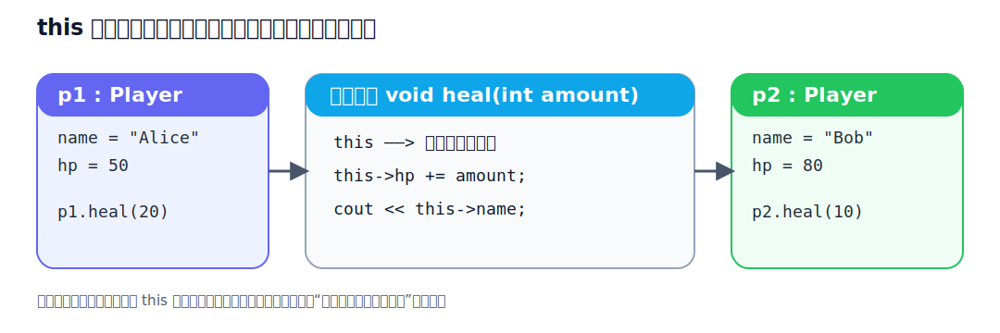

上一章，我们第一次真正接触了 `class`。你已经知道：
- 类是图纸，对象是实例。
- `public` 用来暴露接口，`private` 用来隐藏内部状态。
- 构造函数可以保证对象一出生就是完整的。

但新的问题马上又来了。

- 成员函数明明没有写“当前对象”这个参数，它是怎么知道自己该操作哪一个对象的？
- 为什么有的函数后面会跟一个 `const`？
- 对象什么时候出生，什么时候销毁？
- 一个对象离开作用域之后，内部资源是谁来收尾的？

这些问题，决定了你究竟是“会写类”，还是“真的理解对象”。

这一章，我们就把这些关键点彻底打通：

- `this`：成员函数为什么知道自己正在操作谁
- `const` 成员函数：哪些函数只是“查看对象”，不该偷偷改对象
- `析构函数`：对象离开时，谁来负责收尾
- `对象生命周期`：对象从创建到销毁，到底发生了什么

:::tip
如果说上一章是在“造对象”，那么这一章就是在理解对象“怎么活、怎么死、怎么保证行为可靠”。
:::

## 成员函数的操作逻辑

先看一个最简单的例子。

```cpp
#include <iostream>
#include <string>
using namespace std;

class Player {
private:
    string name;
    int hp;

public:
    Player(string n, int h) : name(n), hp(h) {}

    void heal(int amount) {
        hp += amount;
        cout << name << " 恢复了 " << amount << " 点血量，当前血量: " << hp << endl;
    }
};

int main() {
    Player p1("Alice", 50);
    Player p2("Bob", 80);

    p1.heal(20);
    p2.heal(10);

    return 0;
}
```

你会发现一件很神奇的事：`heal()` 这个函数明明只收了一个 `amount` 参数，但当你写 `p1.heal(20)` 和 `p2.heal(10)` 时，它却能准确知道到底该给谁加血。

原因就在于：**每个非静态成员函数内部，都有一个隐藏的指针 `this`。**

`this` 指向“当前正在调用这个成员函数的对象”。

也就是说：

- 当你写 `p1.heal(20)` 时，函数里的 `this` 指向 `p1`
- 当你写 `p2.heal(10)` 时，函数里的 `this` 指向 `p2`



## 什么是 this

`this` 本质上是一个指针，保存着当前对象的地址。

在成员函数内部，你其实可以把成员变量写得更完整一点：

```cpp
hp += amount;
```

等价于：

```cpp
this->hp += amount;
```

这里的 `->` 是“通过指针访问成员”的写法。

所以，下面这两种写法在成员函数里意思是一样的：

```cpp
hp = 100;
this->hp = 100;
```

绝大多数时候，你可以直接写 `hp`，代码更简洁。但在一些场景下，`this` 会非常有用。

### 典型场景：成员变量和参数重名

```cpp
#include <iostream>
#include <string>
using namespace std;

class Student {
private:
    string name;
    int score;

public:
    Student(string name, int score) {
        this->name = name;
        this->score = score;
    }

    void show() const {
        cout << "姓名: " << name << "，成绩: " << score << endl;
    }
};

int main() {
    Student s("Tom", 95);
    s.show();
    return 0;
}
```

注意这段代码里，构造函数的参数也叫 `name` 和 `score`，而成员变量也叫 `name` 和 `score`。

这时：

- `name` 指的是参数
- `this->name` 指的是当前对象的成员变量

如果你写成：

```cpp
name = name;
score = score;
```

那其实是把参数赋值给参数自己，成员变量根本没被改到。

所以，`this->成员名` 的一个重要用途，就是**明确地区分“当前对象的成员”和“外部传进来的参数”**。

:::note
在构造函数里，更推荐使用成员初始化列表，而不是在函数体内反复赋值。不过为了帮你看清 `this` 的作用，这里故意用了更直观的写法。
:::

## this 可以理解成“当前对象本人”

你完全可以把下面两种写法，从语义上这样理解：

```cpp
p1.heal(20);
```

相当于：

“让 `p1` 自己执行 `heal` 这个动作。”

而函数内部的 `this`，就像一句隐藏的自我介绍：

“我就是这次正在执行动作的那个对象。”

这也是面向对象和普通函数的一个关键区别：

- 普通函数通常需要你显式把数据传进去
- 成员函数会自动拿到“调用它的那个对象”

## const 成员函数：承诺“我只看，不改”

上一章我们写过这样的函数：

```cpp
void showBalance() {
    cout << balance << endl;
}
```

它的功能只是“显示余额”，并不会修改对象状态。

这时，更规范的写法应该是：

```cpp
void showBalance() const {
    cout << balance << endl;
}
```

函数后面的 `const` 表示：

**这个成员函数承诺不会修改当前对象的成员变量。**

来看完整例子。

```cpp
#include <iostream>
#include <string>
using namespace std;

class BankAccount {
private:
    string owner;
    double balance;

public:
    BankAccount(string o, double b) : owner(o), balance(b) {}

    void deposit(double amount) {
        if (amount > 0) {
            balance += amount;
        }
    }

    void showBalance() const {
        cout << owner << " 的余额是: " << balance << endl;
    }
};

int main() {
    BankAccount acc("Bob", 500);
    acc.showBalance();
    acc.deposit(200);
    acc.showBalance();
    return 0;
}
```

这里：

- `deposit()` 会修改余额，所以不能加 `const`
- `showBalance()` 只是读取信息，所以应该加 `const`


> 图：普通对象可以调用普通成员函数和 `const` 成员函数；`const` 对象只能调用 `const` 成员函数。

### 为什么要写 const

很多初学者会觉得：能跑就行，为什么非要多写一个 `const`？

原因很实际，主要有三点。

**第一，它能防止你手滑改数据。**

比如你本来只想打印信息，却不小心写了：

```cpp
void showBalance() const {
    balance += 100; // 错误
}
```

编译器会立刻拦住你。  
这相当于你提前给函数加了一层“只读保险”。

**第二，它能让代码语义更清楚。**

别人一看 `showBalance() const`，就知道这个函数只是查看对象，不会偷偷修改状态。

**第三，它能让 `const` 对象也能正常工作。**

来看下面这段代码：

```cpp
#include <iostream>
#include <string>
using namespace std;

class Book {
private:
    string title;
    double price;

public:
    Book(string t, double p) : title(t), price(p) {}

    void showInfo() const {
        cout << "书名: " << title << "，价格: " << price << endl;
    }
};

int main() {
    const Book b("C++ Primer", 88.0);
    b.showInfo();
    return 0;
}
```

这里 `b` 是一个 `const` 对象，表示它不应该被修改。  
因此，编译器只允许它调用那些也承诺“不修改对象”的函数，也就是 `const` 成员函数。

如果 `showInfo()` 后面没写 `const`，这段代码就会报错。

### 更深入一点：const 成员函数里的 this 也变了

这是一个很重要但不难理解的细节。

普通成员函数里，`this` 大致可以理解成：

```cpp
ClassName* const this
```

而在 `const` 成员函数里，`this` 更像是：

```cpp
const ClassName* const this
```

意思就是：`this` 仍然指向当前对象，但它指向的是“只读对象”。

所以在 `const` 成员函数里，你不能通过 `this` 去修改成员变量。

你现在不用死记这个类型写法，只要记住一句话就够了：

**函数后面加了 `const`，就等于告诉编译器：这个函数里的当前对象是只读的。**

## 析构函数：对象离开时谁来收尾

我们已经知道，对象创建时会自动调用构造函数。  
那对象销毁时呢？

答案是：会自动调用**析构函数**（destructor）。

析构函数的特点是：

- 名字是在类名前面加一个 `~`
- 没有返回值
- 没有参数
- 一个类只能有一个析构函数
- 对象销毁时会自动调用

来看例子。

```cpp
#include <iostream>
#include <string>
using namespace std;

class Player {
private:
    string name;

public:
    Player(string n) : name(n) {
        cout << name << " 被创建了" << endl;
    }

    ~Player() {
        cout << name << " 被销毁了" << endl;
    }
};

int main() {
    Player p1("Arthur");
    return 0;
}
```

运行时你会看到：

```cpp
Arthur 被创建了
Arthur 被销毁了
```

也就是说：

- 进入 `main()` 后创建对象，调用构造函数
- `main()` 结束时对象离开作用域，自动调用析构函数

### 析构函数是干什么的

初学阶段，你最容易把析构函数误解成“只是打印一句告别信息”。

这不是重点。  
真正的重点是：**析构函数用来做清理工作。**

比如以后你学到这些内容时，析构函数就会很重要：

- 动态申请的内存要释放
- 打开的文件要关闭
- 占用的锁要解开
- 临时资源要归还

也就是说：

- 构造函数负责“拿到资源、建立状态”
- 析构函数负责“释放资源、善后收尾”

这是一对天然搭档。

:::caution
正常情况下，不要手动去调用析构函数。对于初学者来说，把它理解成“对象生命周期结束时，编译器自动帮你调用的收尾函数”就够了。
:::

## 对象生命周期：对象什么时候活着，什么时候死去

我们来看一个稍微完整一点的例子。

```cpp
#include <iostream>
using namespace std;

class Demo {
public:
    Demo() {
        cout << "构造函数：对象出生" << endl;
    }

    ~Demo() {
        cout << "析构函数：对象销毁" << endl;
    }
};

int main() {
    cout << "程序开始" << endl;

    {
        Demo d;
        cout << "对象正在作用域内部工作" << endl;
    }

    cout << "对象已经离开作用域" << endl;
    return 0;
}
```

运行顺序会是：

```cpp
程序开始
构造函数：对象出生
对象正在作用域内部工作
析构函数：对象销毁
对象已经离开作用域
```

这说明一件很关键的事：

**局部对象的生命周期，通常和它所在的作用域绑定。**

- 进入作用域时创建
- 离开作用域时销毁


> 图：局部对象通常随着作用域进入而出生，随着作用域结束而销毁。

### 多个对象时，构造和析构顺序是什么

```cpp
#include <iostream>
using namespace std;

class Demo {
private:
    int id;

public:
    Demo(int i) : id(i) {
        cout << "构造对象 " << id << endl;
    }

    ~Demo() {
        cout << "析构对象 " << id << endl;
    }
};

int main() {
    Demo a(1);
    Demo b(2);
    Demo c(3);
    return 0;
}
```

输出通常是：

```cpp
构造对象 1
构造对象 2
构造对象 3
析构对象 3
析构对象 2
析构对象 1
```

也就是说：

- **构造顺序**：按照创建顺序
- **析构顺序**：按照相反顺序

为什么这样设计？  
因为后创建的对象，往往更依赖前面已经存在的环境，所以要优先清理。你现在先记结论就行，后面会越来越常见。

## 一个综合例子：计数器对象的完整生命过程

下面这个例子，把 `this`、`const` 成员函数、构造函数和析构函数串起来。

```cpp
#include <iostream>
#include <string>
using namespace std;

class Counter {
private:
    string name;
    int value;

public:
    Counter(string name, int value) {
        this->name = name;
        this->value = value;
        cout << "构造：计数器 " << this->name << " 被创建，初始值为 " << this->value << endl;
    }

    void increment() {
        ++value;
        cout << name << " 自增后为 " << value << endl;
    }

    void setValue(int value) {
        if (value < 0) {
            cout << "不能设置为负数" << endl;
            return;
        }
        this->value = value;
    }

    int getValue() const {
        return value;
    }

    void show() const {
        cout << "计数器 " << name << " 当前值为 " << value << endl;
    }

    ~Counter() {
        cout << "析构：计数器 " << name << " 被销毁" << endl;
    }
};

int main() {
    cout << "进入 main" << endl;

    {
        Counter c("Score", 10);
        c.show();
        c.increment();
        c.setValue(25);
        c.show();
        cout << "读取到的值: " << c.getValue() << endl;
    }

    cout << "离开内部作用域" << endl;
    return 0;
}
```

这个例子里：

- 构造函数保证对象一出生就有名字和值
- `this->name` 和 `this->value` 用来区分成员变量和同名参数
- `show()` 和 `getValue()` 只是读取状态，所以写成 `const`
- 析构函数负责在对象生命结束时收尾

这就是一个对象从出生到销毁的完整过程。

## 初学者最容易踩的坑

**1）把 `this` 当成普通变量到处用。**

`this` 只能在非静态成员函数、构造函数等和“当前对象”相关的上下文里使用。  
你不能在 `main()` 里直接写 `this`。

**2）忘了 `const` 成员函数后面的 `const` 是写在括号后面。**

正确写法是：

```cpp
void show() const;
```

不是：

```cpp
const void show();
```

后者表示返回值是 `const void`，这根本没有意义。

**3）在 `const` 成员函数里修改成员变量。**

```cpp
void show() const {
    value++; // 错误
}
```

既然你承诺“不改”，编译器就会严格执行。

**4）以为析构函数要手动调用。**

对于普通局部对象，不需要。  
对象离开作用域时，编译器会自动帮你调用析构函数。

**5）忘记析构顺序是反着来的。**

创建顺序是 `a -> b -> c`，销毁顺序通常就是 `c -> b -> a`。

**6）把析构函数理解成“对象被删除时才会调用”。**

不只是“删除”才会触发。  
对于普通局部对象，只要离开作用域，析构函数就会执行。

## 几个小练习

练习一。

定义一个 `Book` 类，包含私有属性：书名和页数。  
使用构造函数初始化。  
提供一个 `showInfo() const` 函数打印书名和页数。  
再写一个析构函数，在对象销毁时打印“Book 对象已销毁”。

练习二。

定义一个 `Rectangle` 类，私有属性是长和宽。  
提供构造函数。  
提供 `getArea() const` 和 `getPerimeter() const`。  
思考：为什么这两个函数应该写成 `const`？

练习三。

定义一个 `Student` 类，私有属性是 `name` 和 `score`。  
构造函数参数也叫 `name` 和 `score`，要求你使用 `this->` 完成赋值。  
再写一个 `show() const` 函数。

练习四。

写一个 `Tracer` 类，构造函数打印“对象创建”，析构函数打印“对象销毁”。  
在 `main()` 里写两层大括号作用域，观察输出顺序，体会对象生命周期和作用域之间的关系。

## 本章小结

- **`this` 指向当前正在调用成员函数的对象。**
- **`this->成员` 可以明确访问当前对象的成员变量。**
- **`const` 成员函数表示“我承诺不修改对象状态”。**
- **`const` 对象只能调用 `const` 成员函数。**
- **析构函数在对象生命周期结束时自动调用，用来负责清理工作。**
- **局部对象通常随着作用域开始而创建，随着作用域结束而销毁。**
- **多个局部对象的析构顺序通常与构造顺序相反。**

到了这里，你对“对象”的理解已经更完整了。  
你不只是会定义类、写构造函数，而是开始理解：

- 对象如何识别“自己”
- 哪些行为应该是只读的
- 对象什么时候生，什么时候死
- 生命周期结束时系统会替你做什么

这一步非常关键。

## 下一章预告

下一章，我建议继续学：

**C++ 基础入门 - 第八章：拷贝构造函数、赋值运算符与深拷贝浅拷贝**

为什么下一章接这个最合适？

因为当你已经理解对象会“出生”和“销毁”之后，紧接着最重要的问题就是：

- 一个对象被复制时，到底发生了什么
- `A = B` 和 `A(B)` 是不是一回事
- 为什么有些类一复制就会出问题
- 什么叫浅拷贝，什么叫深拷贝

这会直接决定你后面写类时，能不能避开很多真正麻烦的 Bug。

## 参考内容

本章以 C++ 基础语法整理与教学示例为主，示例均围绕初学阶段常见的类与对象写法展开。
