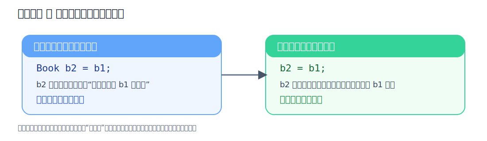
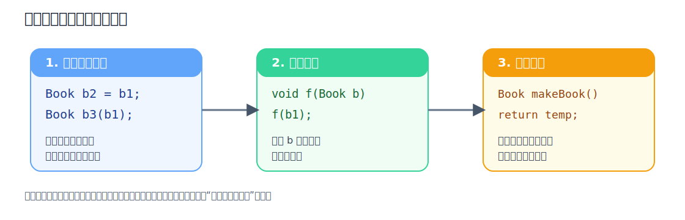
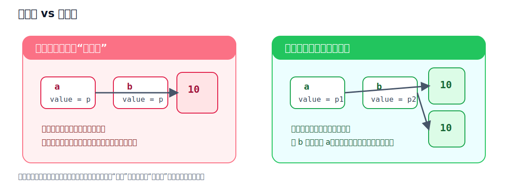

上一章，我们已经弄明白了：

- `this` 指向当前对象
- `const` 成员函数承诺“不修改对象状态”
- 析构函数会在对象生命周期结束时自动收尾

但新的问题马上又出现了。 

如果我把一个对象“复制”给另一个对象，会发生什么？

- `Player p2 = p1;` 和 `p2 = p1;` 是一回事吗？
- 为什么有些类复制起来很安全，有些类一复制就埋雷？
- 如果类里面有指针，复制出来的新对象到底是“共享一份资源”，还是“各自拥有一份副本”？

:::tip
如果说前两章是在学习“对象怎么出生、怎么活动、怎么销毁”，那么这一章就是在学习：对象被“复制”时，系统到底做了什么。
:::

## 一个最容易混淆的问题

先看这两行代码：

```cpp
Player p2 = p1;
p2 = p1;
```

它们看起来都像“把 `p1` 复制给 `p2`”，但其实不是同一件事。

- `Player p2 = p1;`：这是**创建对象的同时**，用 `p1` 来初始化 `p2`。这里走的是**拷贝构造函数**
- `p2 = p1;`：这是 `p2` **已经存在以后**，再把 `p1` 的内容赋值给它。这里走的是**赋值运算符**

这两个动作发生的时机不同，背后调用的函数也不同。




## 什么是拷贝构造函数

拷贝构造函数是一种特殊的构造函数。它的作用是：**用一个已经存在的同类对象，来创建一个新的对象。**

最常见的写法是：

```cpp
ClassName(const ClassName& other)
```

来看例子。

```cpp
#include <iostream>
#include <string>
using namespace std;

class Book {
private:
    string title;
    double price;

public:
    Book(string t, double p) : title(t), price(p) {
        cout << "普通构造函数：创建了 " << title << endl;
    }

    Book(const Book& other) : title(other.title), price(other.price) {
        cout << "拷贝构造函数：从 " << other.title << " 复制出了新对象" << endl;
    }

    void showInfo() const {
        cout << "书名: " << title << "，价格: " << price << endl;
    }
};

int main() {
    Book b1("C++ Primer", 88.0);

    Book b2 = b1;
    Book b3(b1);

    b2.showInfo();
    b3.showInfo();

    return 0;
}
```

你会发现，下面两种写法都会触发拷贝构造函数：

```cpp
Book b2 = b1;
Book b3(b1);
```

虽然第一种看起来像赋值，但它本质上还是“创建对象并初始化”，所以依然属于拷贝构造。

### 拷贝构造函数的标准写法

这一点很重要，而且非常值得你现在就理解。

标准写法：

```cpp
Book(const Book& other)
```

里面有两个关键点。

### 为什么要用引用 `&`

如果你写成：

```cpp
Book(Book other)
```

那就出大问题了。

因为调用拷贝构造函数时，需要把一个对象传给参数 `other`。  
可如果参数本身又是“按值传递”，那为了把对象传进去，就又要先复制一份 `other`。  
而“复制一份对象”这件事，又要调用拷贝构造函数。这样就会无限套娃下去。

所以，拷贝构造函数的参数必须是**引用**，不能按值传递。

### 为什么前面要加 `const`

因为源对象只是“拿来参考”，不应该被修改。

而且加上 `const` 后，拷贝构造函数还能接受 `const` 对象：

```cpp
const Book b1("Effective C++", 99.0);
Book b2(b1);
```

所以，记住最常见、最规范的形式就行：

```cpp
ClassName(const ClassName& other)
```

:::note
以后你见到绝大多数拷贝构造函数，基本都是这个样子。它是最合理、最通用的写法。
:::

## 拷贝构造函数的调用场景

最常见有三类场景。

### 1）用一个对象初始化另一个对象

```cpp
Book b2 = b1;
Book b3(b1);
```

这是最典型的情况。

### 2）按值传参

```cpp
void printBook(Book b) {
    b.showInfo();
}
```

如果你把对象按值传进去，函数参数 `b` 本身就是一个新对象，所以会触发拷贝构造。

更推荐的写法通常是：

```cpp
void printBook(const Book& b) {
    b.showInfo();
}
```

这样更高效，也避免不必要的复制。

### 3）按值返回对象

```cpp
Book makeBook() {
    Book temp("STL", 66.0);
    return temp;
}
```

从语义上说，这里也会涉及对象复制。  
不过现代 C++ 编译器常常会做优化，把一些本来会发生的拷贝直接省掉。你现在先知道“语义上可能触发拷贝构造”就够了。



## 什么都不写，编译器会怎么复制对象

如果你没有自己写拷贝构造函数，也没有自己写赋值运算符，编译器通常会帮你生成默认版本。

这些默认版本做的事情，通常可以理解成：

**逐成员复制**（member-wise copy）

也就是把每个成员变量一个一个复制过去。

比如下面这个类：

```cpp
#include <iostream>
#include <string>
using namespace std;

class Player {
private:
    string name;
    int hp;

public:
    Player(string n, int h) : name(n), hp(h) {}

    void show() const {
        cout << "玩家: " << name << "，HP: " << hp << endl;
    }
};

int main() {
    Player p1("Alice", 100);
    Player p2 = p1;

    p2.show();
    return 0;
}
```

这里默认的复制行为一般没有问题，因为：

- `string` 自己会正确管理内部资源
- `int` 就更简单了，直接复制数值即可

所以不是所有类都必须手写拷贝构造。  
真正麻烦的情况，通常出现在：**类自己管理了原始资源**，尤其是原始指针、动态内存、文件句柄之类的东西。

## 什么是浅拷贝

浅拷贝可以粗略理解成：

**只把表面的成员值原样复制过去，不管这些成员背后是不是共享着同一份资源。**

先看一个带指针的例子。

```cpp
#include <iostream>
using namespace std;

class IntBoxDemo {
private:
    int* value;

public:
    IntBoxDemo(int v) {
        value = new int(v);
    }

    void showAddress() const {
        cout << "value 地址: " << value << "，内容: " << *value << endl;
    }
};

int main() {
    IntBoxDemo a(10);
    IntBoxDemo b = a;

    a.showAddress();
    b.showAddress();

    return 0;
}
```

这里如果走默认复制，`a` 和 `b` 里的 `value` 很可能会变成**同一个地址**。

也就是说：

- `a.value` 指向一块内存
- `b.value` 也指向同一块内存

表面上看，你得到了两个对象。  
实际上，这两个对象在偷偷共用同一份底层资源。

这就叫**浅拷贝**。

它的危险在于：

- 改一个对象，另一个对象可能也跟着变
- 如果类里还有析构函数去 `delete value`，那么两个对象销毁时都想释放同一块内存，就会出大问题




:::caution
浅拷贝的问题不一定会立刻爆炸，所以它很危险。它最麻烦的地方就在于：程序有时看起来能跑，直到某个时刻突然出错。
:::

## 什么是深拷贝

深拷贝的核心思想是：

**复制对象时，不只是复制表面成员值，而是把底层资源也复制出一份新的。**

也就是说，新对象应该拥有自己的独立资源，而不是和旧对象共用同一份。

来看正确写法。

```cpp
#include <iostream>
using namespace std;

class IntBox {
private:
    int* value;

public:
    IntBox(int v) {
        value = new int(v);
    }

    IntBox(const IntBox& other) {
        value = new int(*other.value);
        cout << "拷贝构造：重新开辟了一份独立内存" << endl;
    }

    void set(int v) {
        *value = v;
    }

    void show() const {
        cout << "地址: " << value << "，内容: " << *value << endl;
    }

    ~IntBox() {
        delete value;
    }
};

int main() {
    IntBox a(10);
    IntBox b = a;

    cout << "初始状态：" << endl;
    a.show();
    b.show();

    b.set(99);

    cout << "修改 b 之后：" << endl;
    a.show();
    b.show();

    return 0;
}
```

在这个版本里：

- `a` 和 `b` 仍然是同一个类的对象
- 但 `b` 在复制时，会重新 `new` 一块新的内存
- 新内存里放的值和 `a` 一样
- 之后改 `b`，不会影响 `a`

这才是真正安全的“复制一个对象”。

## 赋值运算符重载

我们已经知道：

```cpp
IntBox b = a;
```

这是创建时复制，走拷贝构造。

那如果对象已经存在呢？

```cpp
IntBox a(10);
IntBox b(20);

b = a;
```

这时 `b` 早就已经创建好了，现在只是把 `a` 的内容赋给 `b`。  
这种情况走的是**赋值运算符**。

在类里，它通常写成这样：

```cpp
ClassName& operator=(const ClassName& other)
```

这是一个运算符重载函数。  
它本质上就是：你在告诉编译器，当两个对象之间写 `=` 时，应该怎么处理。

## 安全的赋值运算符

### 默认赋值运算符也会出问题

如果类里只有普通成员变量，默认赋值通常没什么问题。  
但如果类里管理了动态内存，那么默认赋值也很可能只是把指针地址拷过去，这样仍然会造成资源共享，依旧是浅拷贝问题。

所以，只要类里自己管资源，通常不能只修补拷贝构造，而把赋值运算符放着不管。

### 一个安全的赋值运算符


继续用 `IntBox` 这个例子。

```cpp
#include <iostream>
using namespace std;

class IntBox {
private:
    int* value;

public:
    IntBox(int v) {
        value = new int(v);
    }

    IntBox(const IntBox& other) {
        value = new int(*other.value);
    }

    IntBox& operator=(const IntBox& other) {
        if (this == &other) {
            return *this;
        }

        delete value;
        value = new int(*other.value);

        return *this;
    }

    void set(int v) {
        *value = v;
    }

    void show() const {
        cout << "地址: " << value << "，内容: " << *value << endl;
    }

    ~IntBox() {
        delete value;
    }
};

int main() {
    IntBox a(10);
    IntBox b(20);

    b = a;

    cout << "赋值之后：" << endl;
    a.show();
    b.show();

    b.set(77);

    cout << "修改 b 之后：" << endl;
    a.show();
    b.show();

    return 0;
}
```

这里有三个关键点。

#### 防止自己给自己赋值

```cpp
if (this == &other) {
    return *this;
}
```

如果有人写了：

```cpp
a = a;
```

那么 `this` 和 `other` 指向的其实是同一个对象。  
这时如果你先 `delete value`，再去读 `other.value`，就麻烦了。

所以第一步通常先做**自赋值检查**。

#### 要处理旧资源

`b` 原来已经有自己的内存。  
现在要把它变成 `a` 的副本，就要先处理掉旧资源，再创建新资源。

#### 返回值要写成引用

```cpp
return *this;
```

返回当前对象本身，这样就支持链式赋值：

```cpp
a = b = c;
```

因为 `b = c` 会返回 `b` 自己，然后 `a = (b = c)` 才能继续成立。

## 区分拷贝构造和赋值运算符

这块一定要彻底分清。

### 拷贝构造：对象还没出生

```cpp
IntBox b = a;
IntBox c(a);
```

这里 `b`、`c` 都是在创建的同时，拿 `a` 来初始化。  
它们之前并不存在，所以调用的是拷贝构造函数。

### 赋值运算符：对象已经存在

```cpp
IntBox a(10);
IntBox b(20);

b = a;
```

这里 `b` 早就已经存在了。  
现在只是把 `a` 的内容覆盖给它，所以调用的是赋值运算符。

你可以把它们想象成：

- 拷贝构造：**出生的时候照着另一个对象长出来**
- 赋值运算符：**活着的时候，把自己改造成另一个对象的样子**

## 三法则

传统 C++ 里，有一个非常重要的经验规则，叫**三法则**：

如果一个类需要自己定义以下三者中的一个，那么通常也需要认真考虑另外两个：

- 析构函数
- 拷贝构造函数
- 拷贝赋值运算符

为什么？

因为这三个东西都和“资源所有权”紧密相关。

比如你类里有一个原始指针，自己负责 `new` 和 `delete`：

- 既然你写了析构函数去释放资源
- 那你就要想：复制对象时怎么办
- 也要想：对象之间赋值时怎么办

如果只写其中一个，另外两个很容易出问题。

:::tip
对初学者来说，最实用的记忆方式就是一句话：  
**只要类里自己用原始指针管资源，就要立刻警觉：我是不是需要同时考虑析构、拷贝构造、赋值运算符。**
:::

## 一个综合例子

手写一个简单的动态数组类

```cpp
#include <iostream>
using namespace std;

class IntArray {
private:
    int size;
    int* data;

public:
    IntArray(int s) : size(s) {
        data = new int[size];
        for (int i = 0; i < size; ++i) {
            data[i] = 0;
        }
        cout << "构造：创建了长度为 " << size << " 的数组" << endl;
    }

    IntArray(const IntArray& other) : size(other.size) {
        data = new int[size];
        for (int i = 0; i < size; ++i) {
            data[i] = other.data[i];
        }
        cout << "拷贝构造：复制出一个独立数组" << endl;
    }

    IntArray& operator=(const IntArray& other) {
        if (this == &other) {
            return *this;
        }

        delete[] data;

        size = other.size;
        data = new int[size];
        for (int i = 0; i < size; ++i) {
            data[i] = other.data[i];
        }

        cout << "赋值运算符：完成深拷贝赋值" << endl;
        return *this;
    }

    void set(int index, int value) {
        if (index >= 0 && index < size) {
            data[index] = value;
        }
    }

    int get(int index) const {
        if (index >= 0 && index < size) {
            return data[index];
        }
        return -1;
    }

    void show() const {
        cout << "[ ";
        for (int i = 0; i < size; ++i) {
            cout << data[i] << " ";
        }
        cout << "]" << endl;
    }

    ~IntArray() {
        delete[] data;
        cout << "析构：数组资源已释放" << endl;
    }
};

int main() {
    IntArray a(3);
    a.set(0, 10);
    a.set(1, 20);
    a.set(2, 30);

    IntArray b = a;
    b.set(1, 99);

    cout << "a = ";
    a.show();

    cout << "b = ";
    b.show();

    IntArray c(2);
    c = a;
    c.set(0, 777);

    cout << "a = ";
    a.show();

    cout << "c = ";
    c.show();

    return 0;
}
```

这个例子里：

- 构造函数负责申请数组空间
- 析构函数负责释放数组空间
- 拷贝构造函数负责“创建新对象时”的深拷贝
- 赋值运算符负责“已有对象赋值时”的深拷贝
- 每个对象都拥有自己的独立数组，不会互相踩内存

这就是这一章真正要建立起来的核心直觉：

**复制对象，不一定只是“复制值”这么简单；如果对象背后拥有资源，那么“复制”其实是在复制资源的所有权关系。**

## 初学者最容易踩的坑

**1）把 `A a = b;` 误以为是赋值运算符。**

不是。只要对象 `a` 还在“创建阶段”，这就是拷贝构造。

**2）拷贝构造函数参数写成按值传递。**

```cpp
ClassName(ClassName other); // 错误思路
```

这会导致无限递归式的复制逻辑，必须写成引用。

**3）只写析构函数，不写拷贝构造和赋值运算符。**

这是最危险的组合之一。  
因为你都已经开始自己释放资源了，就必须考虑复制行为是否安全。

**4）赋值运算符里忘了处理自赋值。**

```cpp
a = a;
```

这种情况虽然不常见，但必须防。

**5）把浅拷贝误当成深拷贝。**

“两个对象看起来都能访问数据”，不代表它们拥有的是两份独立资源。

**6）忘了区分 `delete` 和 `delete[]`。**

- 单个对象用 `new` 申请，对应 `delete`
- 数组用 `new[]` 申请，对应 `delete[]`

## 几个小练习

练习一。

定义一个 `Score` 类，内部用 `int*` 保存一个分数。  
实现构造函数、析构函数、拷贝构造函数。  
验证：复制出新对象后，修改副本不会影响原对象。

练习二。

在练习一的基础上，再实现赋值运算符。  
测试三种情况：

- `Score b = a;`
- `b = a;`
- `a = a;`

分别观察哪一步调用了什么逻辑。

练习三。

定义一个简单的 `CharArray` 类，内部有长度和 `char*` 数据。  
实现深拷贝。  
这个练习能帮助你更好地体会：为什么“有原始指针的类”最容易出问题。

练习四。

思考题：如果一个类里只有 `int`、`double`、`string` 这些成员，一般还需不需要手写拷贝构造函数？为什么？

## 本章小结

- **拷贝构造函数用于“创建对象时复制对象”。**
- **赋值运算符用于“对象已存在后再复制内容”。**
- **默认复制通常是逐成员复制。**
- **当类自己管理原始资源时，默认复制常常会导致浅拷贝问题。**
- **浅拷贝可能让多个对象共享同一份底层资源。**
- **深拷贝会重新创建独立资源，让每个对象都真正拥有自己的副本。**
- **如果类需要自己管理资源，通常要同时认真考虑析构函数、拷贝构造函数和赋值运算符，这就是三法则。**

## 参考内容

