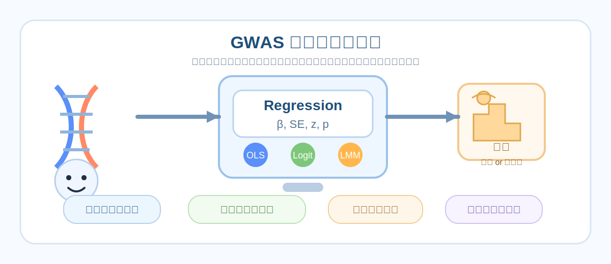
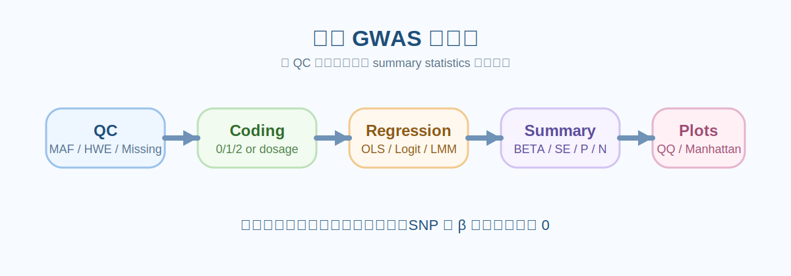
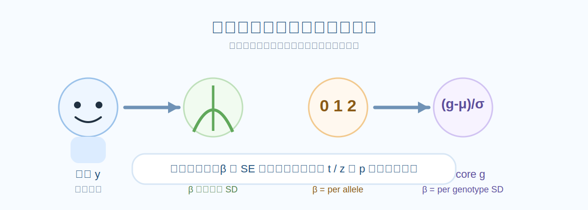

## GWAS 为什么总是在做回归

如果把 GWAS 想成一句话，它其实就是：

**对每个变异位点，问一次 这个位点的基因型变化，是否会系统性地伴随表型变化。**

最自然的数学语言就是回归。
设有 $n$ 个样本、$m$ 个位点。对第 $j$ 个位点，记

- $y \in \mathbb{R}^n$ 为表型向量
- $g_j \in \mathbb{R}^n$ 为第 $j$ 个位点的基因型向量
- $C \in \mathbb{R}^{n \times q}$ 为协变量矩阵，比如年龄、性别、批次、前几个 ancestry PCs
- $\beta_j$ 为我们真正关心的 SNP 效应

那么最经典的 GWAS 单位点模型可以统一写成

$$
\text{phenotype} \sim \text{covariates} + \text{genotype}
$$

也就是

$$
y = \alpha + C\gamma + g_j \beta_j + \varepsilon
$$

或者在二分类表型时写成

$$
\text{logit}\, P(y=1) = \alpha + C\gamma + g_j \beta_j
$$

所以从统计本质上看，GWAS 更像是：

**把回归模型重复跑到全基因组的每一个位点上，然后整理出哪一些位点的 $\beta_j$ 明显不为 0。**

:::tip
很多教程会把 GWAS 讲得很像一个“黑盒流程”，但你真把每一步拆开，会发现核心还是`回归`、`假设检验`、`协变量控制`、`标准误`和`多重校正`。
:::

---

## GWAS 的数据对象

在真正进入模型之前，最好先把 GWAS 里最常见的几个量想清楚。

**1）基因型矩阵**

通常记作 $G \in \mathbb{R}^{n \times m}$，第 $i$ 行是第 $i$ 个个体，第 $j$ 列是第 $j$ 个位点。

最常见的加性编码是
- 0 表示参考等位基因纯合
- 1 表示杂合
- 2 表示效应等位基因纯合

如果是 imputation dosage，则 $g_{ij}$ 不一定是整数，而是 $[0,2]$ 之间的期望等位基因剂量。

**2）表型向量**

- 定量性状，比如身高、血压、表达量，常用线性回归
- 二分类性状，比如病例/对照，常用逻辑回归
- 极端不平衡二分类，往往更适合 Firth 或 logistic mixed model
- 稀有变异常常不做单个位点，而做 `burden` / `SKAT` 一类的区域或基因水平回归

**3）协变量矩阵**

最常见的协变量包括

- age
- sex
- batch
- recruitment center
- genotype array
- ancestry PCs
- 其他已知混杂因素

GWAS 的一个关键思想是：

**我们希望估计的是在控制这些混杂因素以后，基因型本身对表型的额外贡献（即：遗传对表型的贡献）。**

---

## GWAS 的回归

下面这张图先给一个全景图。



| 模型 | 适合的表型 | 典型公式 | 最常见用途 |
|---|---|---|---|
| 线性回归 OLS | 定量性状 | $y=\alpha+C\gamma+g\beta+\varepsilon$ | 最基础的单 SNP GWAS |
| 逻辑回归 | 病例对照 | $logit P(y=1)=\alpha+C\gamma+g\beta$ | 二分类性状 |
| Firth 逻辑回归 | 稀有变异、分离问题 | 惩罚似然逻辑回归 | 小样本或极端不平衡 |
| 线性混合模型 LMM | 定量性状 + 结构/亲缘 | $y=\alpha+C\gamma+g\beta+u+\varepsilon$ | 控制 relatedness 和 population structure |
| 逻辑混合模型 GLMM | 二分类 + 结构/亲缘 | $logit P(y=1)=\alpha+C\gamma+g\beta+u$ | 大样本二分类、相关样本 |
| whole-genome regression | 大型 biobank | 两步 ridge / LOCO + 单位点检验 | REGENIE 这类方法 |
| burden / SKAT / SKAT-O | 稀有变异集合 | 区域级回归或核回归 | 基因或区域层面的 rare variant test |

接下来我们一个个展开。

---

## 基因型编码方式决定在检验什么

很多人一上来就看回归公式，但真正最容易忽略的是：

**同一个位点，换一种编码方式，你检验的问题就已经变了。**

**1）加性模型 additive**

最常见，也是现代 GWAS 默认模型。

$$
g \in \{0,1,2\}
$$

解释是每增加 1 个效应等位基因，表型平均改变 $\beta$。

这是最常见的原因有两个。

- 它参数少，检验功效通常较高。
- 很多真实效应即便不是完美加性，也常常能被加性模型近似抓到。

**2）显性模型 dominant**

把 1 和 2 合并。

$$
g_{\text{dom}} =
\begin{cases}
0, & g=0 \\
1, & g=1 \text{ or } 2
\end{cases}
$$

这时 $\beta$ 问的是：只要带有至少一个效应等位基因，是否就会改变表型。

**3）隐性模型 recessive**

把只有 2 拿出来。

$$
g_{\text{rec}} =
\begin{cases}
0, & g=0 \text{ or } 1 \\
1, & g=2
\end{cases}
$$

这时 $\beta$ 问的是：只有效应等位基因纯合时，表型是否改变。

**4）基因型模型 genotypic 2 df**

用两个 dummy 变量而不是一个加性剂量。

$$
y = \alpha + C\gamma + \beta_1 I(g=1) + \beta_2 I(g=2) + \varepsilon
$$

这时你不再强行假设 0→1→2 是线性的，而是让杂合和纯合有各自效应，最后做一个 2 df 联合检验。

**5）dosage 模型**

如果是 imputed 数据，$g$ 常取期望 alt allele count，比如 0.13、1.72 这种连续值。这时模型仍然是加性回归，但变量不是硬调用的 0/1/2，而是更平滑的剂量值。

:::note
大多数 summary statistics 里的 BETA 或 OR，默认都对应某个特定 effect allele。读结果时一定要先确认 A1 / ALT / effect allele 的定义，否则方向可能看反。
:::

---

## 线性回归

对于定量性状，最常见的单位点模型是

$$
y = \alpha + C\gamma + g\beta + \varepsilon,\qquad \varepsilon \sim N(0,\sigma^2 I)
$$

这里

- $\alpha$ 是截距
- $C\gamma$ 是协变量效应
- $g\beta$ 是 SNP 的固定效应
- $\varepsilon$ 是残差

我们最关心的是零假设

$$
H_0:\beta=0
$$

如果拒绝 $H_0$，就说明在控制协变量以后，这个位点与表型仍然显著相关。

**矩阵写法**

设设计矩阵

$$
X = [\mathbf{1}, C, g] =
\begin{bmatrix}
1 & age_1 & PC1_1 & PC2_1 & g_1 \\
1 & age_2 & PC1_2 & PC2_2 & g_2 \\
1 & age_3 & PC1_3 & PC2_3 & g_3 \\
\vdots & \vdots & \vdots & \vdots & \vdots
\end{bmatrix}
$$

那么 OLS 估计量为

$$
\hat{\theta} = (X^\top X)^{-1} X^\top y
$$

其中 $\hat{\theta}$ 最后一项就是 $\hat{\beta}$。

残差方差估计为

$$
\hat{\sigma}^2 = \frac{(y-X\hat{\theta})^\top(y-X\hat{\theta})}{n-p}
$$

其中 $p$ 是参数个数。

于是 $\hat{\beta}$ 的标准误为

$$
SE(\hat{\beta}) = \sqrt{\hat{\sigma}^2 \left[(X^\top X)^{-1}\right]_{\beta\beta}}
$$

接着就有

$$
t = \frac{\hat{\beta}}{SE(\hat{\beta})}
$$

在自由度 $n-p$ 下计算双侧 $p$ 值。

**最小可读 Python 实现**

```python
import numpy as np
from scipy import stats

def ols_snp(y, g, C=None):
    """
    y: (n,) quantitative phenotype
    g: (n,) genotype dosage / 0,1,2
    C: (n,q) covariates, can be None
    """
    y = np.asarray(y, dtype=float)
    g = np.asarray(g, dtype=float)

    if C is None:
        X = np.column_stack([np.ones(len(y)), g])
    else:
        C = np.asarray(C, dtype=float)
        X = np.column_stack([np.ones(len(y)), C, g])

    XtX_inv = np.linalg.inv(X.T @ X)
    beta_hat_all = XtX_inv @ X.T @ y
    y_hat = X @ beta_hat_all
    resid = y - y_hat

    n, p = X.shape
    sigma2 = (resid @ resid) / (n - p)
    cov_beta = sigma2 * XtX_inv

    beta = beta_hat_all[-1]
    se = np.sqrt(cov_beta[-1, -1])
    t_stat = beta / se
    pval = 2 * stats.t.sf(np.abs(t_stat), df=n - p)

    return {
        "beta": beta,
        "se": se,
        "t": t_stat,
        "p": pval
    }
```

**解释方式**

如果 $g$ 用的是 0/1/2 编码，那么 $\hat{\beta}$ 表示：**每增加 1 个效应等位基因，表型均值平均改变多少单位。**

比如

- 身高单位是 cm，那么 $\beta=0.35$ 表示每个 effect allele 对应平均身高增加 0.35 cm
- 表达量单位是 log2(TPM+1)，那么它就是在这个刻度下的效应

---

## 逻辑回归

### 标准逻辑回归

如果表型是病例/对照，线性回归就不合适了。因为线性回归可能给出小于 0 或大于 1 的概率预测，而且误差分布假设也不匹配。

最常见的模型是逻辑回归：

$$
\log \frac{P(y=1)}{1-P(y=1)} = \alpha + C\gamma + g\beta
$$

也可以写成

$$
P(y=1 \mid C,g) = \frac{1}{1+\exp\left[-(\alpha+C\gamma+g\beta)\right]}
$$

这里的 $\beta$ 不再是表型均值变化，而是 **log-odds 的变化**。

因此

$$
OR = e^\beta
$$

表示每增加 1 个 effect allele，患病 odds 乘上多少倍。

比如

- $\beta = 0.182$，则 $OR \approx 1.20$
- $\beta = -0.223$，则 $OR \approx 0.80$

也就是风险升高 20% 或下降到 80%。

**最常见的检验**

通常输出的是 Wald 统计量

$$
z = \frac{\hat{\beta}}{SE(\hat{\beta})}
$$

再用标准正态分布计算 $p$ 值。

**最小可读 Python 实现**

```python
import numpy as np
import statsmodels.api as sm
from scipy import stats

def logistic_snp(y, g, C=None):
    y = np.asarray(y, dtype=float)
    g = np.asarray(g, dtype=float)

    if C is None:
        X = np.column_stack([g])
    else:
        C = np.asarray(C, dtype=float)
        X = np.column_stack([C, g])

    X = sm.add_constant(X, has_constant="add")
    fit = sm.Logit(y, X).fit(disp=0)

    beta = fit.params[-1]
    se = fit.bse[-1]
    z = beta / se
    pval = 2 * stats.norm.sf(np.abs(z))
    odds_ratio = np.exp(beta)
    ci_low = np.exp(beta - 1.96 * se)
    ci_high = np.exp(beta + 1.96 * se)

    return {
        "beta": beta,
        "se": se,
        "z": z,
        "p": pval,
        "or": odds_ratio,
        "or_ci95": (ci_low, ci_high)
    }
```

:::caution
逻辑回归里最容易踩的坑之一叫 perfect separation。比如某个稀有变异只在病例里出现，从不在对照里出现，此时极大似然估计会发散，标准 logistic regression 很容易不收敛或给出极端估计。
:::

---

### Firth 逻辑回归

Firth 逻辑回归本质上是给逻辑回归的似然加了一个偏差修正型惩罚项，用来缓解小样本偏差和 separation 问题。

惩罚后的目标函数可以写成

$$
\ell_{\text{Firth}}(\theta) = \ell(\theta) + \frac{1}{2}\log |I(\theta)|
$$

其中

- $\ell(\theta)$ 是普通逻辑回归的 log-likelihood
- $I(\theta)$ 是 Fisher information matrix

它的直观理解是：
**普通逻辑回归在样本小、MAC 很低、病例对照极不平衡时，估计会往无穷大方向跑。Firth 会给它加一点“刹车”，让估计回到有限值。**

所以在 GWAS 中，Firth 特别适合这些情形：
- 低 MAC 变异
- 病例对照严重不平衡
- 某个位点出现 complete / quasi separation
- 普通 logistic 不收敛


下面这段代码将展示 Firth 的核心思想。

```python
import numpy as np
from scipy.special import expit

def firth_logistic_core(y, X, max_iter=100, tol=1e-8):
    """
    Firth logistic 核心迭代
    y: (n,)
    X: (n,p) design matrix, should include intercept
    """
    y = np.asarray(y, dtype=float)
    X = np.asarray(X, dtype=float)
    beta = np.zeros(X.shape[1])

    for _ in range(max_iter):
        eta = X @ beta
        p = expit(eta)
        W = p * (1 - p)

        # Fisher information
        XtWX = X.T @ (W[:, None] * X)
        XtWX_inv = np.linalg.inv(XtWX)

        # leverage h_i
        H_diag = np.sum((X @ XtWX_inv) * X, axis=1) * W

        # adjusted score
        a = (0.5 - p) * H_diag
        U_star = X.T @ (y - p + a)

        step = XtWX_inv @ U_star
        beta_new = beta + step

        if np.max(np.abs(beta_new - beta)) < tol:
            beta = beta_new
            break
        beta = beta_new

    return beta
```

---
## 混合模型
### 为什么普通回归不总是够用

如果样本彼此独立、群体结构很弱、协变量控制得也不错，那么普通 OLS / logistic regression 很好用。但真实数据经常不是这样。常见问题有两个。

**1）population stratification**

不同 ancestry 子群体的等位基因频率不同，而表型均值也不同，这会制造虚假的 SNP 关联。

**2）sample relatedness**

样本之间有亲缘关系，比如兄弟姐妹、堂表亲，或者来自同一家系。此时样本不再独立，普通回归的标准误会出问题。

这时就进入了混合模型的世界。

---

### 线性混合模型 LMM

线性混合模型常写成

$$
y = \alpha + C\gamma + g\beta + u + \varepsilon
$$

其中

$$
u \sim N(0,\tau K), \qquad \varepsilon \sim N(0,\sigma^2 I)
$$

这里

- $K$ 是 genetic relationship matrix，简称 GRM 或 kinship matrix
- $u$ 是由全基因组背景和样本相关性带来的随机效应
- $\tau$ 和 $\sigma^2$ 是方差分量

于是表型协方差变成

$$
\text{Var}(y) = \tau K + \sigma^2 I
$$

它的直觉是：**样本之间并不是相互独立，而是“越像亲戚、越像同 ancestry”的个体，残差越相关。**

这样做的好处是可以同时更稳地控制

- relatedness
- cryptic relatedness
- population structure
- 一部分 polygenic background

这也是为什么现代大样本定量性状 GWAS 里，LMM 非常常见。

**一个最简的“已知协方差矩阵”教学版实现**

为了把核心想法讲清楚，我们暂时假设 $V=\tau K+\sigma^2 I$ 已经给定。此时可以对白化后的数据做 GLS：

```python
import numpy as np
from scipy import stats

def gls_snp_with_known_V(y, g, C, V):
    """
    GLS / LMM 核心思想
    假设 V 已知，先白化，再做 OLS
    """
    y = np.asarray(y, float)
    g = np.asarray(g, float)
    C = np.asarray(C, float)

    X = np.column_stack([np.ones(len(y)), C, g])

    # Cholesky whitening: V = L L^T
    L = np.linalg.cholesky(V)
    Linv = np.linalg.inv(L)

    y_t = Linv @ y
    X_t = Linv @ X

    XtX_inv = np.linalg.inv(X_t.T @ X_t)
    beta_all = XtX_inv @ X_t.T @ y_t
    resid = y_t - X_t @ beta_all
    n, p = X_t.shape
    sigma2 = (resid @ resid) / (n - p)

    beta = beta_all[-1]
    se = np.sqrt(sigma2 * XtX_inv[-1, -1])
    t_stat = beta / se
    pval = 2 * stats.t.sf(np.abs(t_stat), df=n - p)

    return {"beta": beta, "se": se, "t": t_stat, "p": pval}
```

上面这段不是完整的 LMM，因为完整 LMM 还要估计 $\tau$ 和 $\sigma^2$。

:::tip
**LMM 的核心，不是神秘地“多了一项随机效应”，而是让误差协方差从 $\sigma^2 I$ 变成 $\tau K + \sigma^2 I$。**
:::

**工业级工具**
- GEMMA
- GCTA / fastGWA
- BOLT-LMM
- FaST-LMM
- EMMAX

其中 BOLT-LMM 特别适合大样本定量性状，GEMMA 非常经典，fastGWA 则在资源效率上很有代表性。



---

### logistic mixed model 与 SAIGE

对于二分类表型，如果你既有

- case-control imbalance
- sample relatedness
- 大样本 biobank

那么普通 logistic regression 就常常不够稳，普通 LMM 又不是专门为 binary trait 设计的。

这时常见做法是 logistic mixed model：

$$
logit P(y=1) = \alpha + C\gamma + g\beta + u,\qquad u \sim N(0,\tau K)
$$

问题在于，它比线性模型更难算，尤其是在几十万样本、上千万变异时。

SAIGE 的思想很重要，因为它解决了一个现实痛点：**二分类表型特别不平衡时，普通渐近正态近似的 p 值会失真，尤其在低频变异处更明显。**

因此 SAIGE 的典型思路是

- 第一步拟合 null logistic mixed model
- 第二步对每个变异做 score test
- 再用 saddlepoint approximation 修正 p 值

从统计直觉上说，SAIGE 不是把 $\beta$ 的估计“变得更漂亮”，而是把极端不平衡情况下的 **p 值校准** 做得更靠谱。

---

## 稀有变异

如果一个基因里有很多 rare variants，那么逐个位点单独检验经常功效很差。因为每个位点太稀有，单独拿出来信号很弱。
于是就有了 **set-based regression**。

**1）burden test**

先把一组变异压缩成一个 burden score

$$
b_i = \sum_{k=1}^{p} w_k g_{ik}
$$

然后做

$$
y = \alpha + C\gamma + b\eta + \varepsilon
$$

或者二分类版本的逻辑回归。它适合的前提是：**同一组变异大致朝同一个方向起作用。**

**2）SKAT**

SKAT 不强迫所有变异同方向、同大小，而是把变异效应当作随机效应，最后检验一个方差分量是否为 0。它更像在问：**这个基因里的变异整体上有没有贡献，不管它们的方向是否一致。**

**3）SKAT-O**

折中 burden 和 SKAT，常常是实战里很常见的选择。

**最简 burden 实现**

```python
import numpy as np
from scipy import stats

def burden_test_linear(y, G_set, weights=None, C=None):
    """
    y: (n,)
    G_set: (n,p_set)
    weights: (p_set,)
    """
    y = np.asarray(y, float)
    G_set = np.asarray(G_set, float)

    if weights is None:
        weights = np.ones(G_set.shape[1])

    burden = G_set @ weights

    return ols_snp(y=y, g=burden, C=C)
```

**最简 SKAT 思想版**

严格的 SKAT p 值通常要用混合卡方分布近似或 Davies / Liu 方法。可以先抓住它的核心统计量：

$$
Q = r^\top K_G r
$$

其中

- $r$ 是在零模型 $y \sim C$ 下的残差
- $K_G = G W W G^\top$ 是由该基因内变异构造的核矩阵

你甚至可以先用 permutation 去近似 $p$ 值。

```python
import numpy as np

def skat_toy_permutation(y, G_set, C, weights=None, n_perm=2000, seed=42):
    rng = np.random.default_rng(seed)
    y = np.asarray(y, float)
    G_set = np.asarray(G_set, float)
    C = np.asarray(C, float)

    if weights is None:
        weights = np.ones(G_set.shape[1])

    # null model residuals
    X0 = np.column_stack([np.ones(len(y)), C])
    beta0 = np.linalg.inv(X0.T @ X0) @ X0.T @ y
    r = y - X0 @ beta0

    GW = G_set * weights
    K = GW @ GW.T
    Q_obs = r.T @ K @ r

    count = 0
    for _ in range(n_perm):
        r_perm = rng.permutation(r)
        Q_perm = r_perm.T @ K @ r_perm
        if Q_perm >= Q_obs:
            count += 1

    pval = (count + 1) / (n_perm + 1)
    return {"Q": Q_obs, "p_perm": pval}
```

:::note
上面这个 permutation 版本只是帮助理解 SKAT 在干什么。真实分析一般不会这么算，因为全基因组上会太慢，而且正式 p 值通常用专门数值方法。
:::

---

## 数据的标准化
### 标准化之前

GWAS 里最容易混淆的不是“该不该标准化”，而是这三种操作经常被混在一起：

**1）中心化 centering**

$$
x_c = x - \bar{x}
$$

只减去均值。

**2）标准化 standardization / z-score**

$$
x_z = \frac{x - \bar{x}}{s_x}
$$

既减均值，又除以标准差。

**3）残差化 residualization**

先把 $x$ 对协变量 $C$ 回归，再取残差

$$
x_{\text{resid}} = x - \hat{x}(C)
$$

这三者的数学效果并不一样。

---

### 表型标准化

设原始模型是

$$
y = \alpha + C\gamma + g\beta + \varepsilon
$$

现在把表型做 z-score：

$$
y^* = \frac{y-\bar{y}}{s_y}
$$

则新模型中的 SNP 效应会变成

$$
\beta^* = \frac{\beta}{s_y}
$$

直觉上就是：**原来 $\beta$ 的单位是“表型原始单位每 allele”，标准化以后就变成“表型标准差单位每 allele”。**

更重要的是：

- $\beta$ 会缩放
- $SE(\beta)$ 也会按同样比例缩放
- $t=\beta/SE$ 不变
- $p$ 值不变
- 截距会变化

所以对线性回归来说，**只标准化 $y$** 通常不会改变显著性，只改变效应量单位。
这也是为什么很多 quantitative trait GWAS 会把表型标准化后再回归，这样不同表型之间效应大小更可比较。

:::tip[一句话理解]
- 不标准化 $y$：$\beta$ 是原始单位效应
- 标准化 $y$：$\beta$ 是每 allele 导致多少个 SD 的表型变化
:::

---

### 基因型标准化

如果把基因型也做 z-score：

$$
g^* = \frac{g-\bar{g}}{s_g}
$$

其中对加性编码 $g \in \{0,1,2\}$ 来说，在 Hardy-Weinberg 平衡近似下

$$
\bar{g} \approx 2p,\qquad s_g \approx \sqrt{2p(1-p)}
$$

这里的 $p$ 是 effect allele frequency。

这时模型变成

$$
y = \alpha^* + C\gamma^* + g^*\beta_g^* + \varepsilon
$$

有

$$
\beta_g^* = \beta \cdot s_g
$$

也就是说，原来是 **每增加 1 个 allele 的效应**，现在变成 **每增加 1 个 genotype SD 的效应**。

因此：

- $\beta$ 的解释发生了变化
- $SE$ 也按同样比例变化
- Wald / t / z 统计量通常不变
- $p$ 值通常不变
- 但 OR 或 BETA 的生物学解释已经不是“per allele”了

所以在 GWAS summary statistics 里，最常见仍然是使用 0/1/2 或 dosage 的原始加性编码，而不是把每个 SNP 单独 z-score 以后再输出结果。因为后者不利于跨研究比较 per-allele effect。

**什么时候会标准化基因型**

- 构建 GRM 时，通常会按等位基因频率中心化/缩放
- ridge / BLUP / whole-genome prediction 里常常会内部标准化
- PCA 里也常做中心化与按位点方差缩放

所以你会发现：

**“GWAS 最终单位点回归结果常不用标准化 genotype 输出，但很多中间矩阵计算会对 genotype 做标准化。”**

---

### 表型和基因型都标准化

若 $y$ 和 $g$ 都 z-score，那么线性模型中的 $\beta$ 可以看成一种标准化效应大小。

在没有协变量时，它和相关系数的关系尤其直接。

在有协变量时，它更接近 **partial standardized effect**，也就是在控制协变量后，基因型每增加 1 个标准差，表型改变多少个标准差。

这对于比较不同表型、不同位点的相对效应大小很有用，但它会牺牲 per-allele 的直观解释。

---

### 对逻辑回归来说，标准化影响更要小心解释

对于逻辑回归

$$
logit P(y=1) = \alpha + C\gamma + g\beta
$$

如果你只把 $g$ 缩放成 $g^*=g/s_g$，那么会有

$$
\beta^* = \beta \cdot s_g
$$

于是

$$
OR^* = e^{\beta^*}
$$

这已经不再是“每增加 1 个 allele 的 OR”，而是“每增加 1 个 genotype SD 的 OR”。所以二分类 GWAS summary statistics 中，最常见做法仍然是输出 **per allele OR**，也就是保留 0/1/2 或 dosage 的原始尺度。

:::caution
- 在线性回归里，标准化主要改变单位和 effect size 的可比性
- 在逻辑回归里，标准化同样不一定改变显著性，但会显著改变 OR 的解释
- 所以做二分类 GWAS 时，更要慎重对待 genotype scaling
:::

---

## 协变量该怎么处理

这一块非常关键，因为很多“显著位点”其实死在协变量没处理好上。

最常见的完整模型是

$$
\text{trait} \sim \text{age} + \text{sex} + \text{batch} + \text{PCs} + \text{SNP}
$$

**1）不要轻易漏掉 ancestry PCs**

因为 population stratification 是 GWAS 假阳性的大户。

**2）对于定量性状，残差化是可以讲清楚的**

在线性回归中，如果你把 \(y\) 和 \(g\) 都先对 \(C\) 残差化，再用残差做一元回归，得到的 SNP 系数和直接在全模型里拟合是一致的。这是 Frisch–Waugh–Lovell 定理。

也就是说：

- 先回归掉协变量，再做 SNP 回归
- 直接把协变量和 SNP 一起放进模型

在线性模型里本质等价。

**3）但二分类表型不要把 logistic 问题偷换成“先残差化 y 再做 OLS”**

这在教学里经常见到，但并不是标准的病例对照 GWAS 处理方式。二分类表型还是应该在 logistic / mixed logistic 的框架里分析。

**4）协变量也可以标准化，但含义要清楚**

- age 标准化后，系数变成每 1 个 age SD 的效应
- sex 通常不要 z-score，二值变量保留 0/1 更直观
- PCs 可以原样放，通常不需要额外解释其单位

---

## 19. 回归结果到底是怎么来的

GWAS 最终输出表通常会有这些列：

- SNP / ID
- CHR
- POS
- A1 / effect allele
- A2 / other allele
- BETA 或 OR
- SE
- STAT
- P
- N
- A1FREQ 或 EAF
- INFO
- TEST

下面把它们逐个对应到回归里。

**1）BETA**

线性回归里就是 $\hat{\beta}$。

逻辑回归里通常也是 $\hat{\beta}$，只是很多软件会额外给出

$$
OR = e^{\hat{\beta}}
$$

**2）SE**

标准误，反映 $\hat{\beta}$ 的不确定性。

**3）STAT**

- 线性模型通常是 \(t\) 或近似 \(z\)
- 逻辑模型通常是 \(z\)
- Score test 则可能输出 score statistic
- LRT 则可能输出 deviance 或 \(\chi^2\)

**4）P**

根据统计量在零假设分布下计算出来。

**5）95% CI**

对线性回归

$$
\hat{\beta} \pm 1.96 \cdot SE
$$

对逻辑回归更常报告 OR 区间

$$
\left[e^{\hat{\beta}-1.96SE},\ e^{\hat{\beta}+1.96SE}\right]
$$

**6）N 为什么有时每个 SNP 不一样**

因为不同 SNP 可能缺失模式不同，某些个体在这个位点没有可靠基因型，所以参与该位点回归的样本数会变化。

---

## 20. Python 里如何把全基因组“扫一遍”

下面给一个教学版的单 SNP scan，对定量性状使用 OLS。注意这是 **教学版**，不是为百万 SNP 优化的生产级代码。

```python
import numpy as np
import pandas as pd

def linear_gwas_scan(y, G, C=None, snp_names=None):
    """
    y: (n,)
    G: (n,m)
    C: (n,q)
    """
    y = np.asarray(y, float)
    G = np.asarray(G, float)

    m = G.shape[1]
    results = []

    if snp_names is None:
        snp_names = [f"SNP_{j}" for j in range(m)]

    for j in range(m):
        g = G[:, j]

        # 简单 missing 过滤
        mask = np.isfinite(y) & np.isfinite(g)
        if C is not None:
            mask &= np.all(np.isfinite(C), axis=1)

        y_j = y[mask]
        g_j = g[mask]
        C_j = None if C is None else C[mask]

        # 跳过方差为 0 的位点
        if np.var(g_j) == 0:
            results.append({
                "SNP": snp_names[j],
                "BETA": np.nan,
                "SE": np.nan,
                "STAT": np.nan,
                "P": np.nan,
                "N": len(y_j)
            })
            continue

        out = ols_snp(y_j, g_j, C_j)
        results.append({
            "SNP": snp_names[j],
            "BETA": out["beta"],
            "SE": out["se"],
            "STAT": out["t"],
            "P": out["p"],
            "N": len(y_j)
        })

    return pd.DataFrame(results)
```

二分类表型也可以类似循环，只不过把 `ols_snp()` 换成 `logistic_snp()`。但要注意，纯 Python 逐位点跑 `statsmodels.Logit` 会很慢，所以真实研究一般不这么做。

---

## 21. 一个更像真实分析的最小 workflow

这里给一个完整的教学版流程，从模拟基因型、计算 PCs、做 GWAS，到整理结果。

```python
import numpy as np
import pandas as pd
from scipy import stats
from sklearn.decomposition import PCA

rng = np.random.default_rng(42)

# ---------------------------
# 1. 模拟 genotype matrix
# ---------------------------
n = 500
m = 200

maf = rng.uniform(0.05, 0.5, size=m)
G = np.column_stack([rng.binomial(2, p, size=n) for p in maf]).astype(float)

# ---------------------------
# 2. 模拟 covariates
# ---------------------------
age = rng.normal(50, 10, size=n)
sex = rng.binomial(1, 0.5, size=n)

# 对 genotype 做中心化后提 PCA
G_std = (G - G.mean(axis=0)) / G.std(axis=0, ddof=1)
pcs = PCA(n_components=5).fit_transform(G_std)

C = np.column_stack([age, sex, pcs])

# ---------------------------
# 3. 模拟 quantitative phenotype
#    让第 17 个 SNP 真的有因果效应
# ---------------------------
causal_j = 17
beta_g = 0.8

y = (
    0.03 * age
    - 0.5 * sex
    + beta_g * G[:, causal_j]
    + rng.normal(0, 1.0, size=n)
)

# ---------------------------
# 4. 跑教学版 GWAS
# ---------------------------
res = linear_gwas_scan(y=y, G=G, C=C)

# ---------------------------
# 5. 加一点注释列
# ---------------------------
res["CHR"] = 1
res["POS"] = np.arange(1, m + 1) * 10000
res["A1FREQ"] = G.mean(axis=0) / 2.0

# 看最显著结果
print(res.sort_values("P").head())
```

这段代码做了几件很接近真实分析逻辑的事：

- 用 0/1/2 模拟 genotype
- 用 genotype 计算 PCs
- 把 age、sex、PCs 都放进协变量
- 对每个 SNP 做线性回归
- 输出 BETA、SE、P、N

当然，真实研究中你不会用这段代码直接跑 UK Biobank，但它非常适合理解“GWAS 从回归角度到底在干什么”。

---

## 22. 如何画 Manhattan 图和 QQ 图

GWAS 的回归结果最终通常会变成 Manhattan 图、QQ 图和 summary statistics 表。

**Manhattan 图**

```python
import numpy as np
import matplotlib.pyplot as plt

def plot_manhattan(df):
    df = df.dropna(subset=["P"]).copy()
    df["minus_log10_p"] = -np.log10(df["P"])

    plt.figure(figsize=(10, 4))
    plt.scatter(df["POS"], df["minus_log10_p"], s=12)
    plt.axhline(-np.log10(5e-8), linestyle="--")
    plt.xlabel("Position")
    plt.ylabel("-log10(P)")
    plt.title("Manhattan Plot")
    plt.tight_layout()
    plt.show()
```

**QQ 图**

```python
import numpy as np
import matplotlib.pyplot as plt

def plot_qq(pvals):
    pvals = np.asarray(pvals)
    pvals = pvals[np.isfinite(pvals)]
    pvals = np.sort(pvals)

    exp = -np.log10((np.arange(1, len(pvals)+1) - 0.5) / len(pvals))
    obs = -np.log10(pvals)

    plt.figure(figsize=(4, 4))
    plt.scatter(exp, obs, s=12)
    lim = max(exp.max(), obs.max())
    plt.plot([0, lim], [0, lim], linestyle="--")
    plt.xlabel("Expected -log10(P)")
    plt.ylabel("Observed -log10(P)")
    plt.title("QQ Plot")
    plt.tight_layout()
    plt.show()
```

---

## 23. 真实工作里，通常不是 Python 直接跑全基因组回归

这一点非常现实，也非常重要。

**教学时**

你可以用 Python 自己写 OLS、Logit、toy LMM，帮助理解。

**真实项目里**

你通常会这样分工：

- PLINK 2 跑单 SNP 线性/逻辑/Firth
- GEMMA / BOLT-LMM / fastGWA 跑 LMM
- SAIGE 跑大样本不平衡二分类
- REGENIE 跑大型 biobank two-step regression
- Python / R 负责整理结果、过滤、注释、作图、下游分析

这不是因为 Python 不行，而是因为

**专业 GWAS 软件已经把数值稳定性、内存管理、并行化、低 MAC 边界情况、缺失值和格式兼容这些工程问题解决了。**

**一个很常见的真实流程**

```bash
plink2 \
  --pfile mydata \
  --pheno pheno.tsv \
  --covar covar.tsv \
  --glm hide-covar cols=+a1freq,+nobs \
  --out gwas_demo
```

然后在 Python 里读结果：

```python
import pandas as pd

glm = pd.read_csv("gwas_demo.trait.glm.linear", sep="\t")
glm = glm[glm["TEST"] == "ADD"]  # 只保留加性模型
glm = glm.sort_values("P")
print(glm.head())
```

这其实也是很多实验室最常见的分工方式：

**回归由专用工具做，解释和展示由 Python/R 做。**

---

## 24. QC 和预处理为什么会直接影响回归

很多人把 QC 当成“回归前的行政流程”，其实不是。QC 会直接决定你的 \(\beta\)、\(SE\)、\(P\) 有没有意义。

**1）MAF / MAC 过滤**

MAC 太低时，单位点 logistic 非常容易不稳，线性模型的标准误也会很大。

**2）HWE 过滤**

明显偏离 HWE 的位点可能提示分型错误或批次问题。

**3）missingness**

样本或位点缺失太高，会让每个位点参与回归的 \(N\) 波动很大，结果也不稳。

**4）imputation INFO**

如果剂量质量很差，拿去回归的其实是高噪声 genotype。

**5）表型变换**

对高度偏态定量表型，常见做法包括

- log transform
- rank-based inverse normal transform

它们会影响 \(\beta\) 的单位解释，但往往能让残差分布更接近模型假设，从而让统计推断更稳。

---

## 25. 线性回归、逻辑回归、LMM、REGENIE，到底怎么选

可以粗略按下面这个思路。

**情形 1：定量性状，小到中等样本，结构不复杂**

- 线性回归就够
- 加上 age、sex、PCs

**情形 2：二分类性状，样本比较平衡，常见变异为主**

- 逻辑回归通常够用

**情形 3：二分类，低频/稀有变异多，或者存在 separation**

- Firth 更稳

**情形 4：样本有 relatedness，或者 population structure 较强**

- 定量性状优先考虑 LMM
- 二分类优先考虑 logistic mixed model / SAIGE 一类

**情形 5：几十万样本的大型 biobank**

- 定量性状常见 BOLT-LMM、fastGWA、REGENIE
- 二分类常见 SAIGE、REGENIE

**情形 6：稀有变异**

- 不要只盯着单 SNP
- 基因或区域层面的 burden / SKAT / SKAT-O 更常见

---

## 26. 一个专门讲“标准化影响”的数值小实验

下面这个小实验非常适合理解为什么标准化会改变 \(\beta\) 的单位，但通常不改变显著性。

```python
import numpy as np
from scipy import stats

rng = np.random.default_rng(7)

n = 300
g = rng.binomial(2, 0.3, size=n)
age = rng.normal(50, 8, size=n)
y = 0.04 * age + 0.6 * g + rng.normal(0, 1, size=n)

C = age[:, None]

# 原始尺度
res_raw = ols_snp(y, g, C)

# 只标准化 y
y_z = (y - y.mean()) / y.std(ddof=1)
res_yz = ols_snp(y_z, g, C)

# 只标准化 g
g_z = (g - g.mean()) / g.std(ddof=1)
res_gz = ols_snp(y, g_z, C)

# y 和 g 都标准化
res_both = ols_snp(y_z, g_z, C)

print("raw   :", res_raw)
print("y_z   :", res_yz)
print("g_z   :", res_gz)
print("both  :", res_both)
```

你会看到一个很稳定的规律：

- `res_raw["p"]`
- `res_yz["p"]`
- `res_gz["p"]`
- `res_both["p"]`

通常几乎一样或数值上极接近。

但 `beta` 的单位会明显不同：

- raw 是每 allele 的原始表型单位
- y_z 是每 allele 的表型 SD 单位
- g_z 是每 genotype SD 的原始表型单位
- both 是每 genotype SD 导致多少个表型 SD

这正是标准化最核心的影响。

---

## 27. 一个经常被问到的问题：先做 PCA 时为什么要标准化 genotype

做 PCA 时，常见做法是先对每个位点中心化，有时还会按位点方差缩放。原因是：

**如果不做适当标准化，MAF 高的位点会因为方差更大而主导主成分。**

加性编码下，位点方差近似为

$$
\text{Var}(g_j) \approx 2p_j(1-p_j)
$$

因此 MAF 不同的位点天然方差不同。

而 PCA 的目标是刻画群体结构，不是让高方差位点压制一切，所以在构建 PCA 或 GRM 时，genotype 的标准化通常是合理且常见的。

这和“单位点 GWAS 输出是否要保留 per-allele 解释”是两回事，千万不要混为一谈。

---

## 28. 结果解释时最容易犯的几个错误

**错误 1：把 BETA 当成 OR**

线性回归里的 BETA 不是 OR。

逻辑回归里的 BETA 也不是 OR，本身是 log-odds ratio，要指数化后才是 OR。

**错误 2：没看 effect allele**

\(\beta>0\) 只是说对 effect allele 而言是正向，不代表对另一条等位基因也是正向。

**错误 3：把标准化后的 \(\beta\) 当成 per-allele effect**

一旦对 genotype 做了 z-score，它就不再是每 allele 解释。

**错误 4：以为加了 PCs 就彻底解决了 relatedness**

PCs 更像是在固定效应层面校正 ancestry 结构，和 LMM 用 GRM 建模样本相关性不是一回事。

**错误 5：binary trait 也用 residualized y 直接做 OLS**

这在严格意义上不是标准病例对照 GWAS。

---

## 29. 一张速查表

| 目标 | 推荐模型 | 结果解释关键词 |
|---|---|---|
| 定量性状，独立样本 | 线性回归 | BETA = 每 allele 改变多少表型单位 |
| 二分类性状，样本较平衡 | 逻辑回归 | OR = 每 allele 的 odds ratio |
| 低 MAC / separation | Firth logistic | 更稳的 OR 和 p 值 |
| 定量性状，有 relatedness | LMM | 控制 kinship / structure |
| 二分类 + 极端不平衡 + relatedness | SAIGE / logistic mixed model | 更稳的 p 值校准 |
| 超大样本 biobank | REGENIE / BOLT-LMM / fastGWA | 可扩展、工程上更实用 |
| 稀有变异集合 | burden / SKAT / SKAT-O | 基因或区域级关联 |

---

## 30. 小结

如果把 GWAS 回归模型这一整套内容压缩成几句话，我会这样总结。

第一，GWAS 的核心不是某个特殊软件，而是：

**对每个位点，在控制协变量以后，检验 \(\beta\) 是否显著偏离 0。**

第二，不同模型回答的问题不同。

- 线性回归回答的是定量表型均值变化
- 逻辑回归回答的是 log-odds / OR 的变化
- Firth 解决的是小样本和 separation
- LMM 解决的是结构和 relatedness
- SAIGE 解决的是不平衡二分类的大样本问题
- REGENIE 解决的是 biobank 时代的计算可扩展性
- burden / SKAT 解决的是稀有变异单 SNP 功效不足的问题

第三，标准化不会凭空制造显著性，但会直接改变 \(\beta\) 的单位解释。

- 标准化 \(y\)，效应变成表型 SD 单位
- 标准化 \(g\)，效应变成 genotype SD 单位
- 两者都标准化，变成 standardized effect
- \(p\) 值在同一个模型下通常基本不变，但解释会变

第四，真实研究中最推荐的思维方式是：

**先用 Python 把回归原理搞懂，再用 PLINK / GEMMA / SAIGE / REGENIE 跑生产级分析，最后再回到 Python / R 做结果整理与展示。**

---

## 31. 参考阅读与建议软件

下面这些名字你在 GWAS 里会高频遇到，建议形成一个脑图。

- PLINK 2：单 SNP 线性、逻辑、Firth 回归
- GEMMA：经典 LMM / Bayesian mixed model
- GCTA / fastGWA：GRM、GREML、MLM GWAS
- BOLT-LMM：大型定量性状 GWAS
- SAIGE：大样本不平衡二分类 GWAS
- REGENIE：two-step whole-genome regression
- SKAT：rare variant set-based association

建议把学习顺序安排成：

1. 先吃透 OLS 和 logistic regression
2. 再理解 genotype coding 和 standardization
3. 然后进入 LMM 和 kinship / GRM
4. 最后看 SAIGE、REGENIE、SKAT 这类工程化方法

这样会顺得多。


## 32. 参考文献与官方文档线索

为了让你后续继续往下深挖，建议至少把下面这些名字认熟。

- PLINK 2.0 Association analysis documentation
- Zhou and Stephens 2012, GEMMA, Genome-wide Efficient Mixed Model Association Studies
- Loh et al. 2015, BOLT-LMM, Efficient Bayesian mixed-model analysis increases association power in large cohorts
- Zhou et al. 2018, SAIGE, Efficiently controlling for case-control imbalance and sample relatedness in large-scale genetic association studies
- REGENIE official documentation
- Wu et al. 2011, SKAT, Rare-Variant Association Testing for Sequencing Data with the Sequence Kernel Association Test
- Yang et al. 2011, GCTA
- Yang et al. 2014, Advantages and pitfalls in the application of mixed-model association methods

把这几篇和这几份文档真正吃透，GWAS 回归模型这一块就会非常稳。
