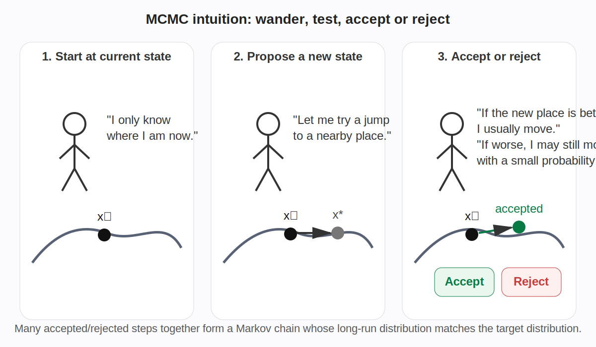
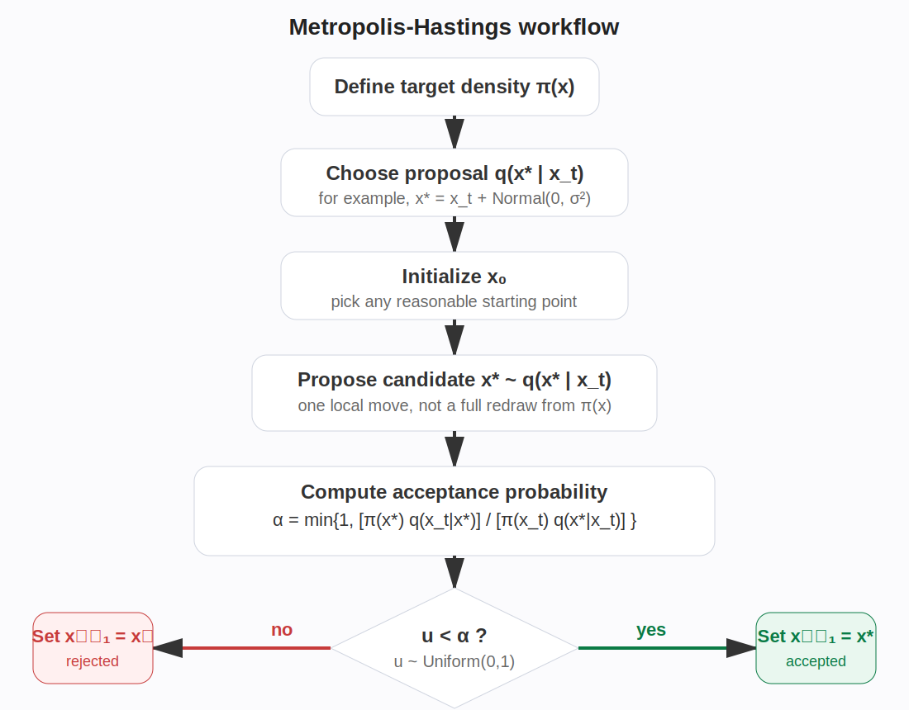

## 1. MCMC 是什么


MCMC 是 **Markov Chain Monte Carlo** 的缩写。

它最核心的想法是：

**构造一条马尔可夫链，让这条链在运行足够久之后，它访问各个位置的频率恰好符合我们想要的目标分布；然后再用这些样本去近似积分、期望和后验分布。**

很多时候我们想研究一个复杂分布 \(\pi(\theta)\)，但会遇到两个问题：

1. 不能直接从这个分布抽样。
2. 即使知道它的形式，也常常只知道“差一个归一化常数”的形式。

在贝叶斯统计中，这个目标分布通常是后验分布：

$$
p(\theta \mid y) \propto p(y \mid \theta) p(\theta)
$$

其中分母 $p(y)$ 往往很难精确计算，但很多时候我们并不需要它。

---

## 2. MCMC 在解决什么问题

很多统计问题的本质，其实是要计算某个期望值

$$
\mathbb{E}[f(\theta) \mid y] = \int f(\theta) \, p(\theta \mid y) \, d\theta
$$

如果这个积分不好直接算，而我们又能从后验分布里拿到样本

$\theta^{(1)}, \theta^{(2)}, \dots, \theta^{(N)}$，那么就可以用 Monte Carlo 近似：

$$
\mathbb{E}[f(\theta) \mid y] \approx \frac{1}{N} \sum_{s=1}^{N} f\bigl(\theta^{(s)}\bigr)
$$

所以 MCMC 的根本目的不是找一个“最优解”，而是为了：

- 近似复杂分布
- 近似高维积分
- 估计参数的后验均值、方差、可信区间
- 做后验预测

---

## 3. M 和 C 分别是什么意思

1) **Markov Chain**

马尔可夫链指的是：

**下一步到哪里，只依赖当前状态，而不依赖更久远的历史。**

数学上写成：

$$
P(X_{t+1} \mid X_t, X_{t-1}, \dots, X_0) = P(X_{t+1} \mid X_t)
$$

2) **Monte Carlo**

Monte Carlo 指的是：

**通过随机采样来逼近积分、概率和期望。**

:::tip
MCMC就是构造一条马尔可夫链，让它的长期分布恰好等于你想研究的目标分布，然后用这条链产生的样本做 Monte Carlo 近似。
:::

---

## 4. MCMC 的整个流程

下面以最经典的 **Metropolis-Hastings** 算法为例。



1) **确定目标分布**

设目标分布为 $\pi(x)$。

在贝叶斯问题中，通常是：

$$
\pi(\theta) = p(\theta \mid y) \propto p(y \mid \theta) p(\theta)
$$

注意，这里只要知道“正比于”就够了，不需要精确归一化常数。

2) **选择初始值**

选一个起点：

$$
x^{(0)}
$$

它可以不是很准确，只要不是特别离谱即可。

3) **设计提议分布 proposal**

从当前状态 $x^{(t)}$ 出发，提出一个候选点 $x^*$。

最常见的是随机游走型 proposal：

$$
x^* = x^{(t)} + \varepsilon, \qquad \varepsilon \sim N(0, \sigma^2)
$$

这里的 $\sigma$ 是步长控制参数。

- $\sigma$ 太小，链走得慢，样本相关性高。
- $\sigma$ 太大，候选点跳太远，拒绝率很高。

4) **计算接受概率**

Metropolis-Hastings 的接受概率为：

$$
\alpha\bigl(x^{(t)}, x^*\bigr)
= \min \left(1,
\frac{\pi(x^*) q(x^{(t)} \mid x^*)}{\pi(x^{(t)}) q(x^* \mid x^{(t)})}
\right)
$$

其中 \(q(\cdot \mid \cdot)\) 是 proposal 分布。

如果 proposal 是对称的，例如正态随机游走，那么：

$$
q(x^* \mid x) = q(x \mid x^*)
$$

于是公式简化为：

$$
\alpha = \min\left(1, \frac{\pi(x^*)}{\pi(x^{(t)})}\right)
$$

5) **接受或拒绝**

生成一个随机数：

$$
u \sim \mathrm{Uniform}(0,1)
$$

若

$$
u < \alpha
$$

则接受：

$$
x^{(t+1)} = x^*
$$

否则拒绝：

$$
x^{(t+1)} = x^{(t)}
$$

这里有一个特别重要的点：

**拒绝不是把这一轮作废，而是表示这一时刻链仍然停留在旧位置。**

6) **重复很多次**

重复执行“提议 → 计算接受率 → 接受或拒绝”，得到一串样本：

$$
x^{(0)}, x^{(1)}, x^{(2)}, \dots, x^{(T)}
$$

7) **去掉 burn-in**

开始阶段可能受初值影响较大，所以常常丢弃前面一部分样本，称为 burn-in。

8) **用样本做统计推断**

例如估计期望：

$$
\mathbb{E}_\pi[f(X)] \approx \frac{1}{N} \sum_{s=1}^{N} f\bigl(x^{(s)}\bigr)
$$

---


## 5. 为什么 MCMC 是对的

MCMC 之所以有效，不是因为“看起来像”，而是因为它背后有严格的数学基础。

1) **平稳分布**

我们想设计一条链，使它的平稳分布恰好是目标分布 $\pi$。

2) **详细平衡条件**

Metropolis-Hastings 的接受概率被专门设计成满足详细平衡：

$$
\pi(x) K(x, dx') = \pi(x') K(x', dx)
$$

这里 $K$ 是转移核。

一旦详细平衡成立，$\pi$ 就是这条链的平稳分布。

3) **遍历性**

如果这条链还能满足一定条件，例如：

- 不会被困死在某个小区域
- 没有死板周期
- 可以反复访问重要区域

那么根据遍历定理，有：

$$
\frac{1}{T} \sum_{t=1}^{T} f(X_t) \to \mathbb{E}_{\pi}[f(X)]
$$

也就是说，**时间平均会收敛到分布平均**。

---

## 6. MCMC 的常见算法

1) **Metropolis**

当 proposal 分布对称时，Metropolis-Hastings 会退化为更简单的 Metropolis 算法。

2) **Metropolis-Hastings**

最通用的经典 MCMC 框架之一，适合教学和理解核心原理。

3) **Gibbs Sampling**

如果每个条件分布都容易采样，那么可以轮流从条件分布中抽样：

$$
\theta_1^{(t+1)} \sim p(\theta_1 \mid \theta_2^{(t)}, \dots)
$$

$$
\theta_2^{(t+1)} \sim p(\theta_2 \mid \theta_1^{(t+1)}, \dots)
$$

Gibbs Sampling 本质上也是 MCMC，只不过它的每一步接受率恒为 1。

4) **HMC / NUTS**

更适合高维连续参数模型，会利用梯度信息来提高采样效率。Stan 和 PyMC 中非常常见。


---

## 7. MCMC 的主要用途

1) **贝叶斯统计**

这是最经典的用途。复杂后验分布常常没有解析解，就要靠 MCMC 来采样。

2) **高维积分**

许多高维积分无法直接算，但可以转换成随机采样后的样本平均。

3) **隐变量模型**

混合模型、层次模型、缺失数据模型等都经常用到 MCMC。

4) **统计物理**

例如 Ising 模型、Boltzmann 分布等问题。

5) **生物信息学与遗传统计**

例如系统发育推断、群体遗传参数估计、贝叶斯精细定位、BayesR、SBayesS 等模型中都常见 MCMC。

:::caution
1 MCMC 不是优化

它的目标不是找最大值，而是逼近整个目标分布。

2 MCMC 样本不是独立的

相邻样本往往高度相关，所以总样本量不等于有效样本量。

3 拒绝不是失败

拒绝后保留当前状态，本身就是链的一部分。

4 thinning 不是必须的

很多人习惯每隔几步取一个样本，但 thinning 更多是为了减少存储，而不总是提高统计效率。

5 burn-in 不是越多越好

只要初始偏差基本消失即可，更重要的是检查混合情况和收敛性。
:::

---


## Metropolis-Hastings 示例

下面给出一个最适合入门的例子。

**模型设定**

设观测数据满足：

$$
y_i \sim N(\theta, 1)
$$

先验为：

$$
\theta \sim N(0, 5^2)
$$

观测值取：

$$
y = [1.2, 0.9, 1.4]
$$

因此后验分布为：

$$
p(\theta \mid y) \propto p(y \mid \theta) p(\theta)
$$

虽然这个例子其实有解析解，但非常适合拿来演示 MCMC，并用解析解做对照。

**核心代码**

```python
import numpy as np

y = np.array([1.2, 0.9, 1.4])

def log_posterior(theta):
    # 先验 theta ~ N(0, 25)
    log_prior = -0.5 * (theta / 5.0) ** 2

    # 似然 y_i ~ N(theta, 1)
    log_lik = -0.5 * np.sum((y - theta) ** 2)

    # 只需要差一个常数的后验对数
    return log_prior + log_lik


def metropolis_hastings(n_samples=6000, init=0.0, proposal_sd=0.8, seed=42):
    rng = np.random.default_rng(seed)
    theta = init
    samples = []
    accepted = 0

    for _ in range(n_samples):
        # 1. 提议一个新点
        theta_star = theta + rng.normal(0, proposal_sd)

        # 2. 计算对数接受率
        log_alpha = log_posterior(theta_star) - log_posterior(theta)

        # 3. 接受或拒绝
        if np.log(rng.uniform()) < min(0.0, log_alpha):
            theta = theta_star
            accepted += 1

        # 4. 保存当前状态
        samples.append(theta)

    return np.array(samples), accepted / n_samples
```

---

## Gibbs Sampling 示例

另一个经典示例是二维相关正态分布。

目标分布设为：

$$
\begin{pmatrix}
X \\
Y
\end{pmatrix}
\sim N\left(
\begin{pmatrix}0 \\ 0\end{pmatrix},
\begin{pmatrix}
1 & \rho \\
\rho & 1
\end{pmatrix}
\right)
$$

它的条件分布为：

$$
X \mid Y=y \sim N(\rho y, 1-\rho^2)
$$

$$
Y \mid X=x \sim N(\rho x, 1-\rho^2)
$$

因此可以轮流采样：
```python
def gibbs_bivariate_normal(rho=0.85, n_samples=5000, init=(0.0, 0.0), seed=42):
    rng = np.random.default_rng(seed)
    x, y = init
    samples = np.zeros((n_samples, 2))
    cond_sd = np.sqrt(1 - rho**2)

    for t in range(n_samples):
        x = rng.normal(loc=rho * y, scale=cond_sd)
        y = rng.normal(loc=rho * x, scale=cond_sd)
        samples[t] = [x, y]

    return samples
```

Gibbs Sampling 很适合讲清楚一个事实：

**只要条件分布容易采样，就可以通过交替更新各个变量来构造出目标联合分布的样本。**

---

## 一个完整的 MCMC 工作流

实际建模时，通常会按下面顺序来做：

1. 写出似然函数和先验分布
2. 明确目标后验分布
3. 选择合适的 MCMC 算法
4. 设定初值和 proposal 参数
5. 跑多条链
6. 检查 trace plot、R-hat、ESS、自相关
7. 去掉 burn-in
8. 总结后验均值、可信区间和概率事件
9. 进行后验预测检验
10. 根据混合情况调整 proposal 或更换算法

---

## 小结

MCMC 的本质不是直接从目标分布独立抽样，而是：

**构造一条长期分布等于目标分布的马尔可夫链，然后用链上的样本做 Monte Carlo 估计。**

它特别适合解决：

- 复杂后验分布无法直接采样
- 高维积分难以直接求解
- 需要完整后验而不是单点估计