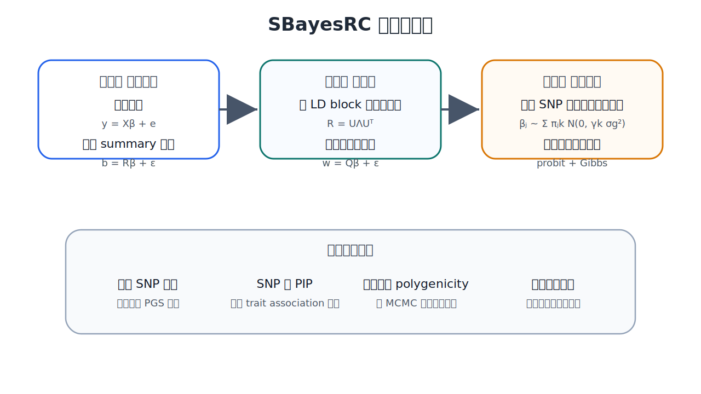
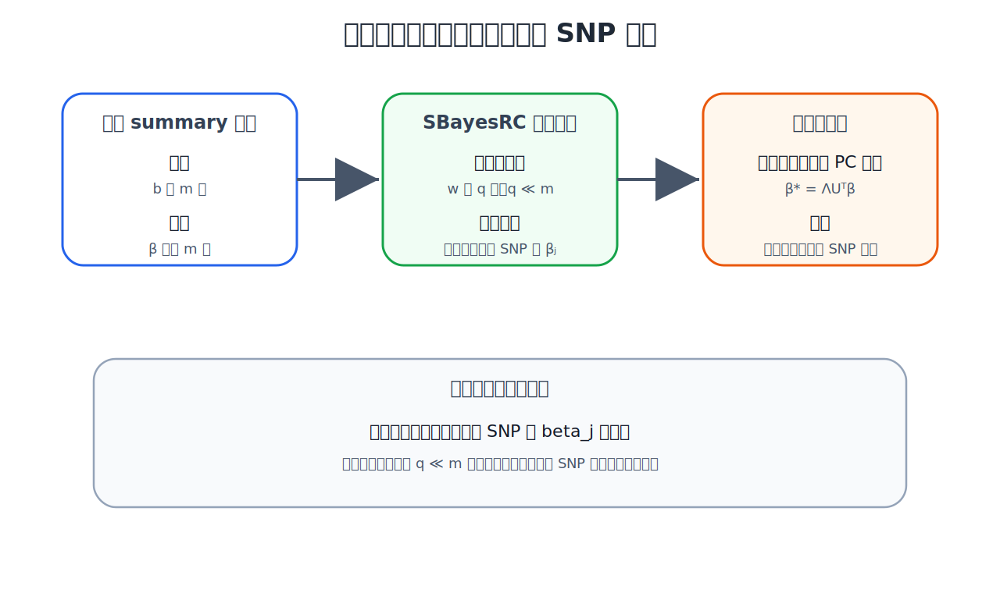
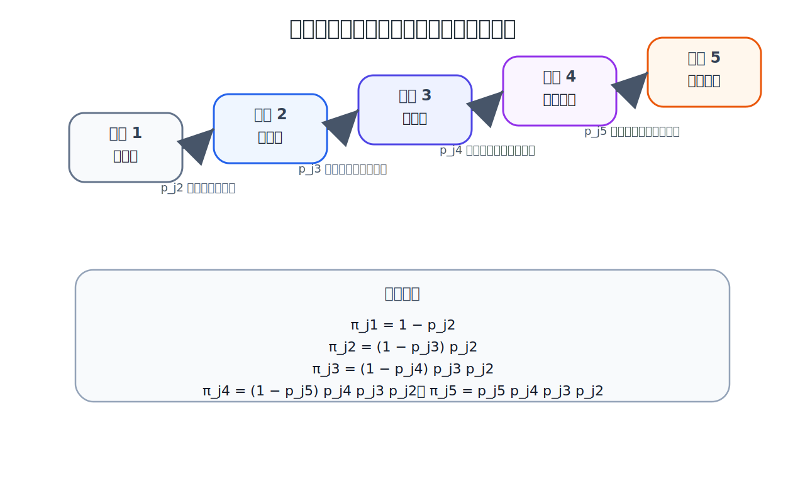
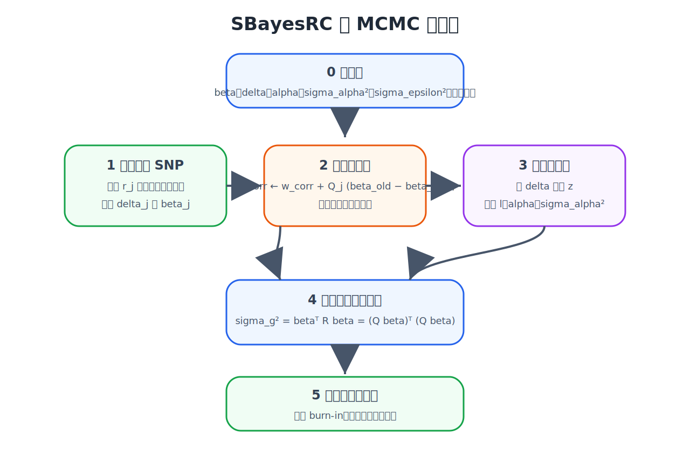

## (1) SBayesRC的直观解释

可以把它理解成三层结构。

1) 是把个体层面的多 SNP 线性模型，改写成只依赖 GWAS summary statistics 和 LD 的模型。

2) 是把这个 summary-data 模型做成低秩形式，让它能在全基因组几百万个 SNP 上跑得动，而且对 GWAS 与 LD 参考面板之间的 LD 不匹配更稳健。

3) 是在 SNP 效应的先验里引入功能注释，让注释既能影响某个 SNP 是不是非零效应，也能影响它更可能落在哪个效应大小区间里。最后再用 Gibbs 采样，把 SNP 效应、混合成分归属、注释效应、残差方差和遗传方差一起学出来。



:::tip
一眼记住 SBayesRC 的核心思想。

1) **原始假设**
SBayesR 只回答一个问题：所有 SNP 的效应大小服从怎样的混合分布。

SBayesRC 多回答一个问题：不同功能注释上的 SNP，更可能落入哪个效应大小分布。
:::


SBayesRC 的出发点，仍然是标准的加性线性模型。设有 N 个个体、m 个 SNP。把表型和每个 SNP 基因型都做中心化，且把基因型标准化到均值为 0、方差为 1。则个体层面的模型写成

$$
\mathbf y = \mathbf X \boldsymbol{\beta} + \mathbf e
$$

$$
\mathbf e \sim N\left(\mathbf 0,\mathbf I \sigma_e^2\right)
$$

这里的含义非常直接。矩阵 $X$ 的每一列是一个 SNP 的标准化基因型，向量 $\beta$ 是每个 SNP 的联合效应，也就是在把所有 SNP 同时放进模型后对应的真实效应，$e$ 是未被 SNP 解释的剩余部分。

:::caution
SBayesRC 再往前多加几条假设。

1) GWAS 给出的边际效应估计是可信的，至少在大样本下，可以看作对真实多 SNP 模型的一种带 LD 污染的观测。

2) GWAS 样本和 LD 参考样本虽然不必完全相同，但祖源要尽量匹配，否则 LD 矩阵会错，模型鲁棒性会下降。

3) 全基因组 LD 可以近似按 quasi-independent LD block 分块处理，也就是块内相关、块间近似独立。

4) SNP 效应不是来自单一正态分布，而更像来自若干个不同尺度的正态分布再加一个零效应分量，也就是稀疏混合正态先验。

5) 功能注释并不是直接决定某个 SNP 的效应数值，而是影响这个 SNP 更可能属于哪个“效应桶”。
:::

:::tip
这里最关键的一个认知是，注释不直接改写观测模型，而是进入先验模型。

观测层回答的是：GWAS summary 是怎样由真实 SNP 联合效应生成的。

先验层回答的是：不同功能注释上的 SNP，其真实效应更可能落入哪一类分布。
:::

2) **从个体层模型推到 summary-data 模型**

先定义 GWAS 中每个 SNP 的边际效应估计。对于标准化基因型，边际效应向量可以写成

$$
\mathbf b = \frac{1}{N}\mathbf X^\top \mathbf y
$$

把个体模型代进去，就得到

$$
\mathbf b = \frac{1}{N}\mathbf X^\top \mathbf X \boldsymbol{\beta} + \frac{1}{N}\mathbf X^\top \mathbf e
$$

再定义 LD 相关矩阵

$$
\mathbf R = \frac{1}{N}\mathbf X^\top \mathbf X
$$

以及噪声项

$$
\boldsymbol{\varepsilon} = \frac{1}{N}\mathbf X^\top \mathbf e
$$

于是就得到 SBayesRC 的 summary-data 基本方程

$$
\boxed {\mathbf b = \mathbf R \boldsymbol{\beta} + \boldsymbol{\varepsilon}}
$$

并且

$$
\mathrm{Var}\left(\boldsymbol{\varepsilon}\right) = \frac{\sigma_e^2}{N}\mathbf R
$$

这个式子是整个方法的根。它在说，GWAS 的边际效应不是直接等于真实效应，而是等于 LD 矩阵把真实联合效应“卷”了一遍，再加上一个相关噪声。也正因为这里噪声的协方差正比于 R，所以如果直接在这个模型上做全基因组 MCMC，计算会很重，而且对 LD 误差会敏感。

如果 GWAS 提供的是 0/1/2 编码基因型上的边际效应估计，也就是常见的 $b^*$ 和标准误 $se$，那么在 SBayesRC 里会先把它们转换到标准化基因型尺度:

$$
b_j = s_j b_j^{\ast}, \quad s_j = \sqrt{\frac{\sigma_y^2}{N_j \mathrm{se}_j^2 + \left(b_j^{\ast}\right)^2}}
$$


如果先把表型方差标准化为 1，那么就变成

$$
s_j = \left(N_j \mathrm{se}_j^2 + \left(b_j^{\ast}\right)^2\right)^{-1/2}
$$

这一步的意义是，把不同 SNP 的 GWAS 边际效应都放到同一个、和理论推导匹配的尺度上。最后在输出联合效应时，再按同样的比例缩放回原始表型尺度。

3) **为什么要做低秩变换**

如果直接用

$$
\boxed {\mathbf b = \mathbf R \boldsymbol{\beta} + \boldsymbol{\varepsilon}}
$$

最大的麻烦是，$\epsilon$ 的协方差不是对角阵，而是和 $R$ 成比例。也就是说，误差项彼此相关。对几百万 SNP 来说，这既不稳，也不快。

SBayesRC 的关键工程突破，就是把每个 LD block 的 $R$ 做特征分解。对于某个 block，

$$
\mathbf R = \mathbf U \boldsymbol{\Lambda} \mathbf U^\top
$$

这里 $U$ 是特征向量矩阵，$\Lambda$ 是特征值对角矩阵。然后对 summary-data 模型左乘一个白化变换

$$
\boldsymbol{\Lambda}^{-1/2}\mathbf U^\top
$$

于是得到新的模型

$$
\mathbf w = \mathbf Q \boldsymbol{\beta} + \boldsymbol{\epsilon}
$$

其中

$$
\mathbf w = \boldsymbol{\Lambda}^{-1/2}\mathbf U^\top \mathbf b, \quad \mathbf Q = \boldsymbol{\Lambda}^{1/2}\mathbf U^\top
$$

从方差传播就能看出，噪声项从之前的 $\mathrm{Var}\left(\boldsymbol{\varepsilon}\right) = \frac{\sigma_e^2}{N}\mathbf R$ 变成了独立形式

$$
\mathrm{Var}\left(\boldsymbol{\epsilon}\right) = \frac{\sigma_\epsilon^2}{N}\mathbf I
$$

主文有时把上式里的 $N$ 吸收到 $\sigma_ \epsilon$ 的定义里，因此也会写成单位阵乘以 $\sigma_ \epsilon$ 方差。两种写法只是记号归一化不同，算法结构完全一样。

这个变换最漂亮的地方在于，它只压缩了观测空间，没有压缩 SNP 参数空间。原来在一个 block 内要拟合 m 维的 $b$，现在只需要拟合 q 维的 $w$，其中 q 远小于 m，但要估计的仍然是 m 个 SNP 联合效应 $\beta$。



GCTB 里真正做的时候，并不会保留全部特征向量，而是只取累计解释至少 $\rho$ 比例 LD 方差的前 q 个主成分。论文默认用了

$$
\rho = 99.5\%
$$

这就使得

$$
q \ll m
$$

同时又不会丢掉太多 LD 信息。

:::tip
低秩模型压缩的是“数据维度”，不是“SNP 参数维度”。

这句话非常重要，因为它直接解释了为什么功能注释还能继续作用在每个 SNP 上。
:::

4) **低秩为什么不会破坏功能注释学习**

这部分很多人第一次看会迷糊，因为会本能地觉得，既然已经把 block 内的数据压成 q 维了，那功能注释是不是也被压坏了。

答案是否定的。原因很简单，注释不是加在 $w$ 上，而是加在 $\beta$ 的先验上。低秩变换之后，模型仍然是在估计每个 SNP 的 $\beta_j$。只不过似然项从原来的

$$
\mathbf b \mid \boldsymbol{\beta}
$$

变成了

$$
\mathbf w \mid \boldsymbol{\beta}
$$

也就是说，观测层换了，参数层没换。于是功能注释仍然能一对一对应到每个 SNP 的 $\beta_j$ 上。

补充材料专门强调了一个对照。如果进一步把参数空间也压缩成主成分效应，比如定义

$$
\boldsymbol{\beta}^{\ast} = \boldsymbol{\Lambda}\mathbf U^\top \boldsymbol{\beta}
$$

然后去拟合

$$
\mathbf b = \mathbf U \boldsymbol{\beta}^{\ast} + \boldsymbol{\varepsilon}
$$

那就不行了。因为这时 $\beta^ \star$ 的每个元素都不再对应某个具体 SNP，而是许多 SNP 联合效应的线性组合。此时功能注释就失去了明确对象，注释学习也失去了解释性。

所以，SBayesRC 低秩化之所以成立，不只是因为它更快，更因为它保住了 SNP 级别参数这一层。

---

## (2) SBayesRC的混合先验

在 SBayesR 里，每个 SNP 的效应都来自同一个全局混合分布。而在 SBayesRC 里，每个 SNP 的混合权重变成了 SNP 特异的，会随功能注释而变。

**核心先验**

$$
\beta_j \sim \sum_{k=1}^{5}\pi_{jk} N\left(0,\gamma_k \sigma_g^2\right)
$$

这里有五个混合成分。第一个成分是零效应，后四个成分是不同方差大小的正态分布。论文默认的缩放因子是

$$
\gamma = \left[0,0.001,0.01,0.1,1\right]^\top \%
$$

也就是等价于

$$
\gamma = \left[0,10^{-5},10^{-4},10^{-3},10^{-2}\right]^\top
$$

这样设计的直觉非常强。它不是说效应大小连续地无边无际，而是先粗分成几个桶。某个 SNP 要么是零效应，要么是很小效应，要么是中等效应，要么是更大效应。每个桶的方差尺度按总遗传方差 $\sigma_g^2$ 的固定比例来定。

这里的重点不在 $\gamma$ 本身，而在每个 SNP 的桶概率 $\pi_{jk}$ 不一样。它由功能注释来决定。

## (3) SBayesRC的注释

1) **注释如何进入混合先验**

令 $A$ 表示注释矩阵，维度是 m 乘以 c，也就是 m 个 SNP、c 个注释。对于 SNP $j$ 和混合成分 $k$，文章给出的模型是

$$
f\left(\pi_{jk}\right) = \mu_k + \sum_{l=1}^{c} A_{jl}\alpha_{kl}
$$

这里的含义可以逐项理解。

$\mu_k$ 是第 $k$ 个混合成分在全基因组里的基线倾向。

$A_{jl}$ 是 SNP $j$ 在第 $l$ 个注释上的取值。二元注释就取 0 或 1，连续注释则先标准化到均值 0、方差 1。

$\alpha_{kl}$ 则是“第 $l$ 个注释把 SNP 推向第 $k$ 个效应桶的强度”。

所以一个很重要的认识是，SBayesRC 不是让功能注释直接改写 $\beta_j$ 的数值，而是先改写 $\beta_j$  属于哪类分布的概率，再通过这个分布去约束 $\beta_j$。

:::note
为什么这比“先算注释富集，再拿来二次加权”更强。

因为这里不是两步法，而是一个统一层级模型。注释参数 $\alpha$ 和 SNP 效应 $\beta$ 是一起从数据里学出来的，彼此的估计不确定性也被一起传播了。
:::

2) **为什么不能直接对 $\pi_{jk}$ 采样**

直接对每个 SNP 的

$$
\pi_{j1},\pi_{j2},\pi_{j3},\pi_{j4},\pi_{j5}
$$

采样会有一个明显问题，就是它们必须满足

$$
\sum_{k=1}^{5}\pi_{jk}=1
$$

也就是说，同一个 SNP 的五个概率不是独立变量。这样一来，MCMC 更新就会很别扭。你每更新一个，另外几个都要跟着联动，Gibbs 采样不方便，Metropolis 调参也会麻烦。

所以 SBayesRC 做了一个很巧妙的重参数化。先定义混合成分指示变量

$$
\delta_j = k \quad \text{with probability } \pi_{jk}
$$

然后不直接建模 $\pi_{jk}$，而是建模一个“逐级爬梯子”的条件概率

$$
p_{jk} = \Pr\left(\delta_j \ge k \mid \delta_j \ge k-1\right),\qquad k \ge 2
$$

它的意思是，SNP 已经跨过前一个门槛以后，还有多大概率继续往更大效应的桶里爬。

于是五个混合权重可以写成

$$
\pi_{j1} = 1 - p_{j2}
$$

$$
\pi_{j2} = \left(1-p_{j3}\right)p_{j2}
$$

$$
\pi_{j3} = \left(1-p_{j4}\right)p_{j3}p_{j2}
$$

$$
\pi_{j4} = \left(1-p_{j5}\right)p_{j4}p_{j3}p_{j2}
$$

$$
\pi_{j5} = p_{j5}p_{j4}p_{j3}p_{j2}
$$

这样一改以后，真正被注释模型驱动的是彼此独立得多的 $p_{jk}$，而不是受和为 1 约束的 $\pi_{jk}$。



从直觉上看，$p_{j2}$ 决定的是这个 SNP 会不会非零。$p_{j3}$ 决定的是，在已经非零的前提下，它是留在“小效应”还是继续向上。$p_{j4}$ 和 $p_{j5}$ 依次决定它会不会继续进入更大的效应桶。

3) **probit 模型为什么能让注释参数做 Gibbs 采样**

为了让 $p_{jk}$ 能用 Gibbs 采样，SBayesRC 选的是 probit 链接。把它写成最标准的形式就是

$$
\Phi^{-1}\left(p_{jk}\right)=\mu_k+\sum_{c=1}^{C}A_{jc}\alpha_{kc}
$$

等价地，也可以写成

$$
p_{jk}=\Phi\left(\mu_k+\sum_{c=1}^{C}A_{jc}\alpha_{kc}\right)
$$

这里 $\Phi$ 是标准正态分布函数。

之所以这一步特别重要，是因为 probit 模型可以用 Albert-Chib 的潜变量技巧，立刻把二项变量更新问题改写成正态线性模型更新问题。

先引入一个伯努利指示变量

$$
z_{jk} \sim \mathrm{Bernoulli}\left(p_{jk}\right)
$$

再引入潜变量

$$
l_{jk} = \mu_k + \sum_{c=1}^{C}A_{jc}\alpha_{kc} + \eta_{jk}
$$

$$
\eta_{jk}\sim N\left(0,1\right)
$$

并定义

$$
z_{jk}=1 \iff l_{jk}>0
$$

这样一来，原来不好直接采样的离散概率模型，就转成了一个带截断正态潜变量的高斯模型。于是

$$
l_{jk}\mid z_{jk}=1,\mu_k,\boldsymbol{\alpha}_k \sim TN\left(\mu_k+\mathbf A_j^\top \boldsymbol{\alpha}_k,1;0,\infty\right)
$$

$$
l_{jk}\mid z_{jk}=0,\mu_k,\boldsymbol{\alpha}_k \sim TN\left(\mu_k+\mathbf A_j^\top \boldsymbol{\alpha}_k,1;-\infty,0\right)
$$

这个时候，对每个混合层级 $k$，所有注释效应 $\alpha_{kc}$ 的更新就都退化成标准的单变量高斯后验。

4) **注释效应 $\alpha_{kc}$ 的全条件分布**

在引入潜变量 $l_{jk}$ 以后，$\alpha_{kc}$ 的更新就和普通 Bayesian 线性回归几乎一样。文中的全条件分布是

$$
\alpha_{kc}\mid \mathbf l_k,\alpha_{k,-c},\sigma_{\alpha_k}^2 \sim N\left(\frac{r_{kc}}{C_{kc}},\frac{1}{C_{kc}}\right)
$$

其中

$$
r_{kc}=\mathbf A_c^\top\left(\mathbf l_k-\sum_{c'\ne c}\mathbf A_{c'}\alpha_{kc'}\right)
$$

$$
C_{kc}=\mathbf A_c^\top\mathbf A_c+\frac{1}{\sigma_{\alpha_k}^2}
$$

它的含义很直观。$r_{kc}$ 是“当前潜变量残差”和注释列 $A_c$ 的相关程度，谁更能解释当前这层的潜变量，谁的 $\alpha_{kc}$ 就会更偏离 0。$C_{kc}$ 则相当于后验精度，等于数据精度加先验精度。

SBayesRC 对注释效应使用的是正态先验

$$
\alpha_{kl}\sim N\left(0,\sigma_{\alpha_k}^2\right)
$$

再对这个方差放一个逆卡方先验

$$
\sigma_{\alpha_k}^2 \sim \chi^{-2}\left(\nu_\alpha,\tau_\alpha^2\right)
$$

论文设置的是

$$
\nu_\alpha=4,\qquad \tau_\alpha^2=1
$$

于是其全条件分布仍然是逆卡方

$$
\sigma_{\alpha_k}^2 \mid \boldsymbol{\alpha}_k \sim \chi^{-2}\left(\tilde{\nu}_\alpha,\tilde{\tau}_\alpha^2\right)
$$

其中

$$
\tilde{\nu}_\alpha = C+\nu_\alpha
$$

$$
\tilde{\tau}_\alpha^2 = \frac{\boldsymbol{\alpha}_k^\top \boldsymbol{\alpha}_k + \nu_\alpha \tau_\alpha^2}{\tilde{\nu}_\alpha}
$$

所以在这一层，Gibbs 采样几乎是纯闭式的。

---

## (4) MCMC过程参数的更新

1) **SNP 效应 $\beta_j$ 的更新**

回到低秩观测模型

$$
\mathbf w=\mathbf Q\boldsymbol{\beta}+\boldsymbol{\epsilon}
$$

假设当前 SNP $j$ 落在第 $k$ 个混合成分，也就是

$$
\delta_j = k
$$

那么 $\beta_j$ 的先验就是

$$
\beta_j \sim N\left(0,\gamma_k \sigma_g^2\right)
$$

把这个先验和低秩似然合在一起，就能得到 $\beta_j$ 的全条件分布是单变量正态。论文把它写成“均值是一个局部 BLUP，方差由当前噪声方差和当前混合成分共同决定”的形式。常见写法是

$$
\beta_j\mid \mathbf w,\boldsymbol{\beta}_{-j},\delta_j=k,\sigma_g^2,\sigma_\epsilon^2 \sim N\left(\frac{r_j}{C_j},\frac{\sigma_\epsilon^2}{C_j}\right)
$$

其中

$$
r_j=\mathbf Q_j^\top\left(\mathbf w-\sum_{j'\ne j}\mathbf Q_{j'}\beta_{j'}\right)
$$

$$
C_j=1+\frac{\sigma_\epsilon^2}{\gamma_k \sigma_g^2}
$$

:::tip
如果你在别的推导里看到分母还多一个 $N$，那只是因为有人把

$$
\mathrm{Var}\left(\boldsymbol{\epsilon}\right)=\frac{\sigma_\epsilon^2}{N}\mathbf I
$$

里的 $N$ 单独保留了，没有吸收到 $\sigma_ \epsilon$ 的定义里。本质上仍然是同一个单变量高斯更新。
:::

这一步的直觉也很清楚。$r_j$ 是在把其他 SNP 当前效应扣掉以后，剩下还能被 SNP $j$ 解释的那部分信号。
$C_j$ 则是在平衡数据证据和先验收缩。如果当前混合成分的方差 $\gamma_k \sigma_g^2$ 很小，那么 $\beta_j$ 就会被更强地往 0 收缩。

2) **$\delta_j$ 这个混合成员指标是怎样更新的**

有了当前的 $\beta_{j}$ 以及每个成分的先验权重 $\pi_{jk}$ 以后，$\delta_j$ 的后验概率就是五个候选分量竞争的结果

$$
\Pr\left(\delta_j=k\mid \mathbf w,\boldsymbol{\beta},\sigma_g^2,\sigma_\epsilon^2\right)\propto \pi_{jk}\,f\left(\mathbf w\mid \delta_j=k,\boldsymbol{\beta},\sigma_g^2,\sigma_\epsilon^2\right)
$$

再对

$$
k=1,2,3,4,5
$$

归一化即可。

:::caution
直观上看，如果某个 SNP 所带的功能注释让它更容易是 `coding` 或 `conserved`，$\alpha$ 会把对应的 $p_{jk}$ 推高，从而把 $\pi_{jk}$ 往更大效应的桶里推；但它到底能不能真的进入更大效应桶，还要看当前 low-rank 似然是不是支持。
这就是“注释提供先验倾向，数据给出最终裁决”。
:::

---

## (5) 遗传方差、遗传力和功能富集的估计

在每次 MCMC 迭代里，只要当前有一组 SNP 效应样本 $\beta$，就可以直接算总遗传方差。文章给出的推导是

$$
\sigma_g^2 = \boldsymbol{\beta}^\top \mathbf R \boldsymbol{\beta}
$$

又因为

$$
\mathbf R=\mathbf Q^\top \mathbf Q
$$

所以也可写成

$$
\sigma_g^2 = \boldsymbol{\beta}^\top \mathbf Q^\top \mathbf Q \boldsymbol{\beta}
$$

如果定义

$$
\hat{\mathbf w}=\mathbf Q\boldsymbol{\beta}
$$

那么

$$
\sigma_g^2=\hat{\mathbf w}^\top \hat{\mathbf w}
$$

在假定表型方差为 1 的标准化情形下，就有

$$
h_{\mathrm{SNP}}^2=\sigma_g^2
$$

也就是说，SBayesRC 的 SNP 遗传力不是额外另开一套模型估出来的，而是直接从当前 $\beta$ 样本诱导出来的。

对于二元注释 $c$，文章把该注释内 SNP 解释的总方差写成

$$
\sigma_c^2=\sum_{j\in c}\beta_j^2
$$

然后定义 per-SNP heritability enrichment 为

$$
\theta_c=\frac{\sigma_c^2/m_c}{\sigma_g^2/m}
$$

其中 m_c 是该注释里 SNP 的数量，m 是全基因组总 SNP 数。

对于连续注释，文中采用的是回归斜率定义

$$
E\left[\beta_j^2\right]=\mu_c+A_{jc}\omega_c
$$

于是

$$
\theta_c=1+\omega_c
$$

这些量都是在每次 MCMC 迭代里计算一次，最后用后验均值做估计。

---

## (6) MCMC 流程

到这里，其实整套算法已经拼完整了。把它压成一句一句就是下面这个顺序。

:::tip
先把 GWAS 边际效应缩放到标准化基因型尺度。

再对每个 LD block 的 LD 矩阵做特征分解，构造低秩模型里的 $w$ 和 $Q$。

初始化 $\beta$、$\delta$、$\alpha$、$\sigma_ \alpha^2$、$\sigma _\epsilon^2$ 等参数。

随后开始主循环。对每个 SNP，先根据当前残差计算局部右端项 $r_j$，再计算该 SNP 在五个混合成分下的后验概率，采样 $\delta_j$，然后按对应成分的方差采样 $\beta_j$，并用 right-hand-side updating 修正工作向量。

所有 SNP 扫完以后，对于每个混合层级 $k$，先根据当前 $\delta_j$ 构造 $z_{jk}$，再采样潜变量 $l_{jk}$，然后逐个注释更新 $\alpha_{kc}$，再更新 $\sigma_{\alpha_k}^2$。

接着根据当前 $\beta$ 重新计算遗传方差 $\sigma_g^2$，并更新残差方差 $\sigma_{\epsilon}^2$。

重复上面这些步骤直到链结束，丢弃 burn-in，剩余样本做后验平均，得到 joint SNP effects、PIP、遗传力和注释富集等输出。
:::




:::note
SBayesRC 不是简单地在 GWAS 结果后面乘一个注释权重，而是在问两个更深的问题。

第一个问题是，在给定 LD 的情况下，这个 SNP 的真实联合效应到底有多大。

第二个问题是，在给定功能注释的情况下，这个 SNP 先验上更应该被当成零效应、小效应，还是更大效应。

而这两个问题不是分开回答，而是互相牵制、一起回答。
:::

## (7) SBayesRC 和 SBayesR 的本质差别

SBayesR 也有混合正态先验，但它默认所有 SNP 共用一套全局混合权重，也就是所有 SNP 的“进桶概率”都一样。

SBayesRC 把这个地方改成了 SNP 特异的。不同 SNP 因为注释不同，会拥有不同的 $\pi_{jk}$。于是它不仅能学习“总体上有多少 SNP 是大效应”，还能学习“哪些注释上的 SNP 更容易是大效应”。

再往工程上说，SBayesRC 还把 SBayesR 的 summary-data 模型进一步升级成了低秩形式，这也是它能稳定分析全基因组高密度 SNP 的关键。

## (8) 小结

SBayesRC 的数学本质可以概括成下面这句话。

它把

$$
\boxed {\mathbf b = \mathbf R\boldsymbol{\beta}+\boldsymbol{\varepsilon}}
$$

这个 summary-data 观测模型，先通过特征分解变成更稳健的低秩模型

$$
\boxed {\mathbf w=\mathbf Q\boldsymbol{\beta}+\boldsymbol{\epsilon}}
$$

再给每个 SNP 的 $\beta_j$ 放一个由功能注释驱动的混合正态先验

$$
\boxed {\beta_j\sim \sum_{k=1}^{5}\pi_{jk}N\left(0,\gamma_k \sigma_g^2\right)}
$$

最终通过 Gibbs 采样，把 $\beta$、$\delta$、$\alpha$、$\sigma_g^2$ 和 $\sigma_{\epsilon}^2$ 一起估计出来。


## (9) SBayesRC 的 python 实现
```python
import numpy as np


def sigmoid(x):
    return 1.0 / (1.0 + np.exp(-x))


def build_pi_from_annotations(A, alpha_seq):
    """
    根据 annotation 构造每个 SNP 的 5 组 mixture 概率 pi_jk

    A: (m, c)
       m 个 SNP, c 个 annotations

    alpha_seq: (c+1, 4)
       对应论文里的顺序条件概率 p_{j2}, p_{j3}, p_{j4}, p_{j5}
       第一行是截距，后面每行对应一个 annotation 的系数

    返回:
    pi: (m, 5)
        每个 SNP 属于 5 个 mixture component 的概率
    """
    A1 = np.column_stack([np.ones(A.shape[0]), A])  # 加截距
    eta = A1 @ alpha_seq                            # (m, 4)
    p = np.clip(sigmoid(eta), 1e-6, 1 - 1e-6)      # 教学简化: 用 sigmoid

    # 顺序条件概率 -> 最终 5 成分概率
    # component 0: 零效应
    # component 1..4: 非零不同方差层
    pi = np.zeros((A.shape[0], 5))
    pi[:, 0] = 1 - p[:, 0]
    pi[:, 1] = p[:, 0] * (1 - p[:, 1])
    pi[:, 2] = p[:, 0] * p[:, 1] * (1 - p[:, 2])
    pi[:, 3] = p[:, 0] * p[:, 1] * p[:, 2] * (1 - p[:, 3])
    pi[:, 4] = p[:, 0] * p[:, 1] * p[:, 2] * p[:, 3]

    # 数值稳定一下
    pi /= pi.sum(axis=1, keepdims=True)
    return pi


def low_rank_transform(R, b, rho=0.995):
    """
      low-rank 变换:
      R = U diag(lam) U'
      w = lam^{-1/2} U' b
      Q = lam^{1/2} U'

    只保留累计解释 rho 比例方差的主成分
    """
    evals, evecs = np.linalg.eigh(R)
    idx = np.argsort(evals)[::-1]
    evals = np.clip(evals[idx], 1e-12, None)
    evecs = evecs[:, idx]

    cum = np.cumsum(evals) / np.sum(evals)
    q = np.searchsorted(cum, rho) + 1

    U = evecs[:, :q]
    lam = evals[:q]

    Q = (np.sqrt(lam)[:, None] * U.T)   # q x m
    w = (U.T @ b) / np.sqrt(lam)        # q

    return w, Q, q


def invgamma_sample(shape, scale, rng):
    """
    采样 Inv-Gamma(shape, scale)
    """
    return 1.0 / rng.gamma(shape, 1.0 / scale)


def run_toy_sbayesrc(
    b,
    R,
    A,
    n,
    alpha_seq,
    n_iter=800,
    burn_in=300,
    rho=0.995,
    seed=1,
):
    """
    SBayesRC-like Gibbs sampler

    参数
    ----
    b : (m,)
        GWAS marginal effects
    R : (m, m)
        LD correlation matrix
    A : (m, c)
        annotation matrix
    n : int
        GWAS sample size
    alpha_seq : (c+1, 4)
        annotation -> mixture probability 的固定系数
    """
    rng = np.random.default_rng(seed)

    m = len(b)

    # 论文里的 5 个 mixture 方差比例:
    # [0, 0.001, 0.01, 0.1, 1]% = [0, 1e-5, 1e-4, 1e-3, 1e-2]
    gamma = np.array([0.0, 1e-5, 1e-4, 1e-3, 1e-2])

    # 低秩变换
    w, Q, q = low_rank_transform(R, b, rho=rho)

    # 由 annotation 生成每个 SNP 的先验 mixture 概率
    pi = build_pi_from_annotations(A, alpha_seq)

    # 初始化
    beta = np.zeros(m)
    z = np.zeros(m, dtype=int)   # 每个 SNP 属于哪一个 mixture component
    sigma_g2 = 0.05
    sigma_e2 = 1.0

    resid = w.copy()             # resid = w - Q @ beta
    qq = np.sum(Q * Q, axis=0)   # 每个 SNP 列向量 q_j 的平方范数

    beta_sum = np.zeros(m)
    pip_sum = np.zeros(m)

    # 超参数（教学版随便给得温和一些）
    a_e, b_e = 2.0, 1.0
    a_g, b_g = 2.0, 1e-3

    for it in range(n_iter):
        noise_var = sigma_e2 / n

        # 逐个 SNP 做 Gibbs 更新
        for j in range(m):
            qj = Q[:, j]

            # 先把旧 beta_j 加回残差
            if beta[j] != 0:
                resid += qj * beta[j]

            s = qj @ resid

            logw = np.empty(5)
            post_mean = np.zeros(5)
            post_var = np.zeros(5)

            # k = 0: 零效应分量
            logw[0] = np.log(pi[j, 0] + 1e-300)

            # k = 1..4: 非零分量
            for k in range(1, 5):
                tau2 = gamma[k] * sigma_g2

                # 单坐标正态-正态共轭更新
                v = 1.0 / (qq[j] / noise_var + 1.0 / tau2)
                m_k = v * (s / noise_var)

                # 积分掉 beta_j 后的 marginal weight
                logw[k] = (
                    np.log(pi[j, k] + 1e-300)
                    + 0.5 * (np.log(v) - np.log(tau2) + (m_k * m_k) / v)
                )

                post_mean[k] = m_k
                post_var[k] = v

            # 采样 mixture membership z_j
            logw -= np.max(logw)
            ww = np.exp(logw)
            ww /= ww.sum()
            z[j] = rng.choice(5, p=ww)

            # 再采样 beta_j
            if z[j] == 0:
                beta[j] = 0.0
            else:
                beta[j] = rng.normal(post_mean[z[j]], np.sqrt(post_var[z[j]]))

            # 把新 beta_j 从残差中减掉
            if beta[j] != 0:
                resid -= qj * beta[j]

        # 更新 sigma_e^2
        # whitened residual: resid ~ N(0, sigma_e2 / n * I)
        rss = resid @ resid
        sigma_e2 = invgamma_sample(
            a_e + q / 2.0,
            b_e + 0.5 * n * rss,
            rng,
        )

        # 更新 sigma_g^2
        active = z > 0
        if np.any(active):
            scaled_ss = np.sum(beta[active] ** 2 / gamma[z[active]])
            sigma_g2 = invgamma_sample(
                a_g + active.sum() / 2.0,
                b_g + 0.5 * scaled_ss,
                rng,
            )
        else:
            sigma_g2 = invgamma_sample(a_g, b_g, rng)

        # 存后验均值
        if it >= burn_in:
            beta_sum += beta
            pip_sum += active.astype(float)

    n_keep = n_iter - burn_in
    return {
        "beta_mean": beta_sum / n_keep,
        "pip": pip_sum / n_keep,
        "sigma_e2": sigma_e2,
        "sigma_g2": sigma_g2,
        "pi_prior": pi,
    }


# =========================================================
# 下面构造一个“可跑通、可教学”的小例子
# =========================================================
if __name__ == "__main__":
    rng = np.random.default_rng(123)

    m = 40          # 40 个 SNP，适合教学
    n = 80000       # GWAS sample size
    c = 2           # 两个 annotations

    # 1) 先造一个小 LD 块，这里用 AR(1) 相关结构
    rho_ld = 0.6
    idx = np.arange(m)
    R = rho_ld ** np.abs(idx[:, None] - idx[None, :])

    # 2) 构造 annotation
    # A[:,0] 是二值注释，例如“是否在功能区”
    # A[:,1] 是连续注释，例如某个 conservation score
    A = np.column_stack([
        rng.binomial(1, 0.25, size=m),
        rng.normal(size=m),
    ])
    A[:, 1] = (A[:, 1] - A[:, 1].mean()) / A[:, 1].std()

    # 3) 为了模拟数据，先设一个“真实”的 annotation -> mixture 关系
    #    行: [截距, annotation1, annotation2]
    #    列: p2, p3, p4, p5 的线性预测值
    alpha_true = np.array([
        [-2.8, -1.4, -1.6, -1.8],  # intercept
        [ 2.0,  1.5,  1.1,  0.8],  # binary annotation 让 SNP 更容易进入较大效应成分
        [ 0.8,  0.5,  0.3,  0.2],  # quantitative annotation 也有一点加成
    ])

    pi_true = build_pi_from_annotations(A, alpha_true)

    # 5 个方差层
    gamma = np.array([0.0, 1e-5, 1e-4, 1e-3, 1e-2])

    sigma_g2_true = 0.15
    sigma_e2_true = 1.0

    # 4) 按真实 mixture 先验抽样真实 z 和 beta
    z_true = np.array([rng.choice(5, p=pi_true[j]) for j in range(m)])

    beta_true = np.zeros(m)
    for j in range(m):
        if z_true[j] > 0:
            beta_true[j] = rng.normal(
                0.0,
                np.sqrt(gamma[z_true[j]] * sigma_g2_true),
            )

    # 5) 根据 summary model 生成 GWAS marginal effect b
    #    b = R beta + eps, eps ~ N(0, R * sigma_e2 / n)
    L = np.linalg.cholesky(R + 1e-10 * np.eye(m))
    eps = L @ rng.normal(size=m) * np.sqrt(sigma_e2_true / n)
    b = R @ beta_true + eps

    # 6) SBayesRC 拟合
    fit = run_toy_sbayesrc(
        b=b,
        R=R,
        A=A,
        n=n,
        alpha_seq=alpha_true,   # 教学简化：这里先假设 annotation 参数已知
        n_iter=800,
        burn_in=300,
        rho=0.995,
        seed=42,
    )

    beta_hat = fit["beta_mean"]
    pip = fit["pip"]

    # 7) 看看前几个 SNP
    top = np.argsort(-pip)[:10]

    print("Top SNPs by posterior inclusion probability")
    print("idx\tPIP\tbeta_true\tbeta_hat\tannot1")
    for j in top:
        print(
            f"{j}\t{pip[j]:.3f}\t{beta_true[j]:.4f}\t{beta_hat[j]:.4f}\t{int(A[j,0])}"
        )

    print("\nposterior sigma_g2 =", fit["sigma_g2"])
    print("posterior sigma_e2 =", fit["sigma_e2"])
    print("corr(beta_true, beta_hat) =", np.corrcoef(beta_true, beta_hat)[0, 1])

```
