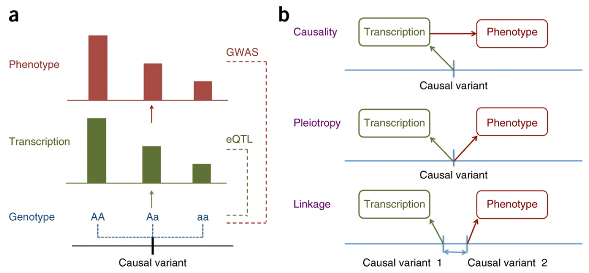

`SMR & HEIDI`由`Jian Yang`团队在2016年开发，可以说是非常经典的一个**整合GWAS和omics QTL数据**的算法了，
读博开始做人类遗传学了，频繁用到这个方法，所以正好就详细解析一下这个方法的原理。

## SMR & HEIDI 到底在检验什么
**SMR**：对每个基因（或探针/probe），拿它最强的 cis-eQTL SNP 当“工具变量” (Instrument variant, IV) $z$，
把基因表达当“暴露/中介” $x$，把性状当“结局”$y$，
用汇总统计量做一个“单 SNP 的两样本 MR”，检验$x$与$y$是否存在pleiotropic association。

**HEIDI**：SMR 显著并不保证“同一因果变异”。
如果区域里有两个不同的因果变异（一个影响表达、一个影响性状）但彼此处于 LD，SMR 也可能显著。
HEIDI 就是用同一区域多 SNP 去看“由不同 SNP 算出来的比值效应”是否出现异质性：
有异质性更像 linkage（两因果变异）；无异质性更像共享因子（同一因果变异）。

:::tip
pleiotropic可以理解为，同一变异同时影响表达和性状的多效性，虽然SMR无法区分pleiotropic和causality，但pleiotropic比linkage更具生物学意义。

:::


## 原始假设

1. **SMR（本质是单 SNP 两样本 MR）假设**
- **工具变量相关性（relevance）**：top cis-eQTL 必须强相关表达，否则比值估计不稳定、弱工具变量偏差严重；
论文直接用 top cis-eQTL $P < 5 \times 10^{-8}$ 来保证强度，并在 HEIDI 阶段也排除弱 eQTL SNP。
- **样本与效应可比**：GWAS 与 eQTL 来自同一祖源/人群分布相近，$\hat b_{zx}$ 才能视作无偏估计；
这是两样本 MR 的基本前提，文章明确依赖“来自同一人群”的前提来讨论无偏性。
- **两样本独立**：若 GWAS 与 eQTL 样本独立，则 $Cov(\hat b_{zy}, \hat b_{zx}) = 0$

## 符号与已知量

对某个基因（或探针）附近的 SNP $i$:
- eQTL summary：$\hat b_{zx,i}$ (SNP对表达的边际效应) 及其标准误 $se_{zx,i}$；
- GWAS summary：$\hat b_{zy,i}$ (SNP对性状的边际效应) 及其标准误 $se_{zy,i}$；

## SMR推导
1. **线性结构**

由经典的加性效应模型可写：
$$
x = b_{zx}z + \epsilon _x
$$
$$
y = b_{xy}z + \epsilon _y
$$
这里 $z$ 是 SNP（通常编码为 0/1/2 或标准化后），$x$是表达，$y$是性状。
MR的直觉是：用遗传变异 $z$ 当“自然随机化”，避免非遗传混杂。

2. **关键恒等式: $b_{zy} = b_{zx}b_{xy}$**

对$y$关于$z$做回归，回归系数是
$$
b_{zy} = \frac {Cov(z, y)} {Var(z)}
$$
代入 $y = b_{xy}x + \epsilon _y$:
$$
Cov(z,y) = Cov(z, b_{xy}x + \epsilon _y) = b_{xy}Cov(z,x) + Cov(z, \epsilon _y)
$$

如果工具变量满足“与误差独立”（IV 的核心条件之一），$Cov(z, \epsilon _y) = 0$。又因为
$$
b_{zx} = \frac {Cov(z,x)} {Var(z)} \Rightarrow Cov(z,x) = b_{zx}Var(z)
$$

所以
$$
b_{zy} = \frac {b_{xy}b_{zx}Var(z)} {Var(z)} = b_{xy}b_{zx}
$$

因此
$$
b_{xy} = \frac {b_{zy}} {b_{zx}}
$$

这就是单 SNP MR 的 **Wald ratio / 2SLS 等价形式**。文章中记为
$$
\hat b_{xy} = \frac {\hat b_{zy}} {\hat b_{zx}}
\tag{SMR-1}
$$

3. **SMR 的方差推导（Delta method）与检验统计量**

令
$$
\hat b_{xy} = g(\hat b_{zy}, \hat b_{zx}) = \frac {\hat b_{zy}} {\hat b_{zx}}
$$

对$g(a,b) = a/b$求偏导：
$$
\frac {\partial g} {\partial a} = \frac {1} {b},  \frac {\partial g} {\partial b} = - \frac {a}{b^2}
$$

Delta method 给出近似方差：
$$
Var(\hat b_{xy}) \approx (\frac {1} {b_{zx}})^2 Var(\hat b_{zy}) + (\frac {b_{zy}} {b_{zx}^2})^2 Var(\hat b_{zx}) - 2(\frac {1} {b_{zx}}) (\frac {b_{zy}} {b_{zx}^2}) Cov(\hat b_{zy}, \hat b_{zx})
$$
这就是文章里给出的 Delta method 形式（并指出若两套样本独立，协方差项为 0）。

在两样本（GWAS 与 eQTL 独立）常用设定下，
$$
Cov(\hat b_{zy}, \hat b_{zx}) = 0,
$$

于是
$$
Var(\hat b_{xy}) \approx \frac {Var(\hat b_{zy})} {b_{zx}^2} + \frac {b_{zy}^2 Var(\hat b_{zx})} {b_{zx}^4} = \frac {se_{zy}^2} {b_{zx}^2} + \frac {b_{zy}^2 se_{zx}^2} {b_{zx}^4}
\tag{SMR-2}
$$

$$
\hat se_{xy} \approx \frac {\sqrt {se_{zy}^2 b_{zx}^2 + b_{zy}^2 se_{zx}^2}} {b_{zx}^2}
$$

:::tip
比值的不确定性来自两部分—— 分子 GWAS ($\hat b_{zy}$) 的噪声，以及分母 eQTL ($\hat b_{zx}$) 的噪声；
分母越小/越不稳定（弱工具变量），方差会爆炸，这就是为什么 SMR 强制用强 cis-eQTL。
:::

4. **SMR 的检验统计量 ($\chi _1^2$)**

SMR 用
$$
T_{SMR} = \frac {\hat b_{xy}^2} {Var(\hat b_{xy})} \sim \chi _1^2
$$

来检验 $H_0 : b_{xy} = 0$

把上面方差代入并化成只用$z$-score的形式
$$
T_{SMR} = \frac {z_{zy}^2 z_{zx}^2} {z_{zy}^2 + z_{zx}^2}
$$

而又，$z_{SMR} = \frac {\hat b_{xy}} {\hat se_{xy}}$，代入$\hat b_{xy}$和$\hat se_{xy}$
$$
z_{SMR} = \frac {\hat b_{xy}} {\hat se_{xy}} = \frac {b_{zy} b_{zx}} {\sqrt {se_{zy}^2 b_{zx}^2 + b_{zy}^2 se_{zx}^2}}
\tag{SMR-3}
$$
除$se_{zy}se_{zx}$
$$
z_{SMR} = \frac {z_{zy}^2 z_{zx}^2} {z_{zy}^2 + z_{zx}^2}
\tag{SMR-4}
$$

#### SMR的python实现
用简单的代码来实现 SMR 这个过程
```python
import numpy as np
from scipy import stats

def smr_delta(b_zy, se_zy, b_zx, se_zx, cov_zy_zx=0.0):
    b_zy = float(b_zy); se_zy = float(se_zy)
    b_zx = float(b_zx); se_zx = float(se_zx)
    cov_zy_zx = float(cov_zy_zx)

    if b_zx == 0:
        raise ValueError("b_zx is zero -> ratio undefined (weak/invalid instrument).")

    # (SMR-1)
    b_xy = b_zy / b_zx

    # (SMR-2)
    var_xy = (se_zy**2) / (b_zx**2) + (b_zy**2) * (se_zx**2) / (b_zx**4) - 2.0 * (1.0/b_zx) * (b_zy/(b_zx**2)) * cov_zy_zx
    if var_xy <= 0:
        raise ValueError(f"Non-positive variance computed: {var_xy}. Check inputs / cov term.")

    se_xy = np.sqrt(var_xy)

    # (SMR-3)
    z_smr = b_xy / se_xy
    T_smr = z_smr**2
    p_smr = stats.chi2.sf(T_smr, df=1)

    return {
        "b_xy_hat": b_xy,
        "se_xy_hat": se_xy,
        "z_smr": z_smr,
        "T_smr": T_smr,
        "p_smr": p_smr,
        "z_zx": b_zx / se_zx,
        "z_zy": b_zy / se_zy,
    }
```

如果数据中只有$z$-score，也是可以做SMR检验的
```python
import numpy as np
from scipy import stats

def smr_from_z(z_zy, z_zx):
    z_zy = float(z_zy); z_zx = float(z_zx)
    denom = z_zy**2 + z_zx**2
    if denom == 0:
        raise ValueError("Both z scores are zero -> T undefined.")

    # (SMR-4)
    T_smr = (z_zy**2 * z_zx**2) / denom
    z_smr = np.sign(z_zy * z_zx) * np.sqrt(T_smr)
    p_smr = stats.chi2.sf(T_smr, df=1)

    return {"z_smr": z_smr, "T_smr": T_smr, "p_smr": p_smr}
```

## HEIDI检验

为什么“共享同一因果变异”时比值不随 SNP 变?

:::tip
如果表达 $x$ 和性状 $y$ 真的是被同一个因果变异驱动（无论是因果中介还是垂直多效性），
那么用任何一个与该因果变异处于 LD 的 SNP 来算 $b_{xy}(i) = b_{zy}(i) / b_{zx}(i)$ 都应该得到同一个值。
:::

1. **“相等”的原因**

设真正的因果变异是 $z_0$，任意旁边 SNP 是 $z_i$。假设
$$
x = b_{zx,0}z_0 + \epsilon _x
$$
$$
y = b_{zy,0}z_0 + \epsilon _y
$$

（共享因果变异：同一个 $z_0$ 同时影响 $x$ 与 $y$）。

对 SNP $i$, 边际效应
$$
b_{zx, i} = \frac {C0v(z_i, x)}{Var(z_i)} = \frac {b_{zx,0} Cov(z_i, z_0)} {Var(z_i)}
$$

同理
$$
b_{zy, i} = \frac {C0v(z_i, x)}{Var(z_i)} = \frac {b_{zy,0} Cov(z_i, z_0)} {Var(z_i)}
$$

于是比值
$$
b_{xy}(i) = \frac {b_{zy, i}} {b_{zx, i}} = \frac {b_{zy, 0}} {b_{zx, 0}} = b_{xy}
$$

2. **HEIDI 把“是否都相等”变成一个可检验的异质性检验**

取 top cis-eQTL 作为基准（记为 top），对每个纳入的 SNP $i$ 定义
$$
d_i = \hat b_{xy}(i) - \hat b_{xy}(top)
$$

在共享因果变异（无异质性）假设下
$$
H_0 : d_i = 0 \forall i
$$

并进一步把$\hat d = (\hat d_1, ..., \hat d_m)$视为多元正态，关键在于它的协方差矩阵来自于 LD 引起的相关性。

:::note
为什么要用 LD：因为这些$d_i$不是独立的

同一区域 SNP 之间有 LD，所以
- GWAS 的 $\hat b_{zy,i}$ 与 $\hat b_{zy, j}$ 会相关
- eQTL 的 $\hat b_{zx,i}$ 与 $\hat b_{zx, j}$ 会相关

从而比值 $\hat b_{xy}(i)$ 之间也相关。
:::

3. **构造 HEIDI 的二次型统计量**
把每个 $d_i$ 标准化：
$$
zd_i = \frac {\hat d_i} {\sqrt{Var(\hat d_i)}}
$$

在 $H_0$ 下，$z_d$ 服从均值为 0、相关矩阵为 $R$ 的多元正态。然后 HEIDI 统计量是一个二次型：
$$
T_{HEIDI} = z_{d}^{\top} I z_d = \sum_{i=1}^m z_{d_i}^2
$$

因为 $z_d$ 的分量相关 ($R \neq I$), 这个二次型的精确分布不再是简单的 $\chi_m^2$, 
文章用 Satterthwaite 或 saddlepoint 等方法近似其分布来得到 $P_{HEIDI}$

:::tip
HEIDI的两条非常核心过滤:
- 去掉与 top cis-eQTL 几乎完全共线的 SNP：$r^2 > 0.9$ （这种 SNP 对异质性没信息量）。
- 去掉弱工具变量：只保留 eQTL 证据足够强的 SNP（文章中用 $P_{eQTL} > 1.6 \times 10^{-3}$ 的阈值来排除。
:::

#### HEIDI的python实现

Satterthwaite 近似，这个过程比较复杂一点
```python
import numpy as np
from scipy import stats

def _p_from_z(z):
    return 2.0 * stats.norm.sf(np.abs(z))

def heidi_test(
    b_zy, se_zy, b_zx, se_zx, R_ld,
    top_index=None,
    r2_exclude_high=0.90,
    p_eqtl_keep_max=1.6e-3,
    pvalue_method="satterthwaite"
):

    b_zy = np.asarray(b_zy, dtype=float)
    se_zy = np.asarray(se_zy, dtype=float)
    b_zx = np.asarray(b_zx, dtype=float)
    se_zx = np.asarray(se_zx, dtype=float)
    R_ld = np.asarray(R_ld, dtype=float)

    m_all = len(b_zy)
    if not (len(se_zy)==len(b_zx)==len(se_zx)==m_all and R_ld.shape==(m_all,m_all)):
        raise ValueError("Input lengths / R_ld shape mismatch.")
    
    # pick top
    z_zx = b_zx / se_zx
    if top_index is None:
        top_index = int(np.argmax(np.abs(z_zx)))
    t = top_index

    # eQTL strength filter (paper-style)
    p_eqtl = _p_from_z(z_zx)

    # LD filter with top: exclude r^2 > 0.9 (uninformative / collinear)
    r2_with_top = R_ld[:, t]**2

    keep = np.ones(m_all, dtype=bool)
    keep[t] = False
    keep &= (r2_with_top < r2_exclude_high)
    keep &= (p_eqtl <= p_eqtl_keep_max)

    idx = np.where(keep)[0]
    if len(idx) < 3:
        return {
            "ok": False,
            "reason": "Too few SNPs after HEIDI filters (need >=3 is a common practical minimum).",
            "top_index": t,
            "kept_indices": idx
        }

    # (H-1) ratios for all SNPs
    if np.any(b_zx == 0):
        raise ValueError("Some b_zx are zero -> ratio undefined.")
    b_xy = b_zy / b_zx

    # Build Cov(b_zy) and Cov(b_zx) via LD approximation
    Cov_zy = R_ld * (se_zy[:, None] * se_zy[None, :])
    Cov_zx = R_ld * (se_zx[:, None] * se_zx[None, :])

    # (H-3) Cov of ratio effects b_xy
    denom1 = (b_zx[:, None] * b_zx[None, :])
    denom2 = (b_zx[:, None]**2 * b_zx[None, :]**2)
    Cov_xy = Cov_zy / denom1 + (b_zy[:, None] * b_zy[None, :]) * Cov_zx / denom2

    # Focus on kept SNPs (idx) versus top (t)
    # (H-2) d vector
    d = b_xy[idx] - b_xy[t]

    # (H-4) Cov(d)
    # Cov(d_i, d_j) = Cov_xy[i,j] - Cov_xy[i,t] - Cov_xy[t,j] + Cov_xy[t,t]
    Cov_d = Cov_xy[np.ix_(idx, idx)] \
            - Cov_xy[np.ix_(idx, [t])] \
            - Cov_xy[np.ix_([t], idx)] \
            + Cov_xy[t, t]

    Var_d = np.diag(Cov_d).copy()
    if np.any(Var_d <= 0):
        return {
            "ok": False,
            "reason": "Non-positive Var(d) encountered; LD/SE inputs may be inconsistent.",
            "top_index": t,
            "kept_indices": idx
        }

    # (H-5) z_d
    z_d = d / np.sqrt(Var_d)

    # correlation matrix R of z_d
    Dinv_sqrt = np.diag(1.0 / np.sqrt(Var_d))
    R = Dinv_sqrt @ Cov_d @ Dinv_sqrt

    # (H-6) Q statistic
    Q = float(z_d @ z_d)
    m = len(z_d)

    # eigenvalues for mixture distribution (numerical guard)
    lamb = np.linalg.eigvalsh((R + R.T) / 2.0)
    lamb = np.clip(lamb, 0.0, None)

    if pvalue_method.lower() != "satterthwaite":
        raise ValueError("Python version here provides Satterthwaite only. Use R code for Davies exact method.")

    # Satterthwaite moment-matching
    mean = np.sum(lamb)
    var = 2.0 * np.sum(lamb**2)
    if var <= 0:
        return {
            "ok": False,
            "reason": "Degenerate variance for mixture; check LD matrix.",
            "top_index": t,
            "kept_indices": idx
        }

    c = var / (2.0 * mean)
    nu = 2.0 * (mean**2) / var
    p_heidi = stats.chi2.sf(Q / c, df=nu)

    return {
        "ok": True,
        "top_index": t,
        "kept_indices": idx,
        "Q_heidi": Q,
        "df_satterthwaite": nu,
        "scale_satterthwaite": c,
        "p_heidi": float(p_heidi),
        "z_d": z_d,
        "R_zd": R,
        "eigenvalues_R": lamb,
    }
```