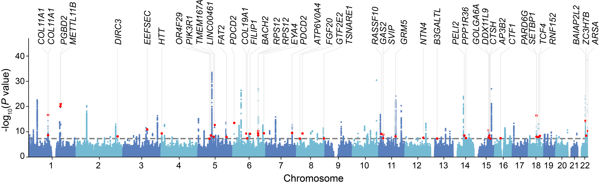
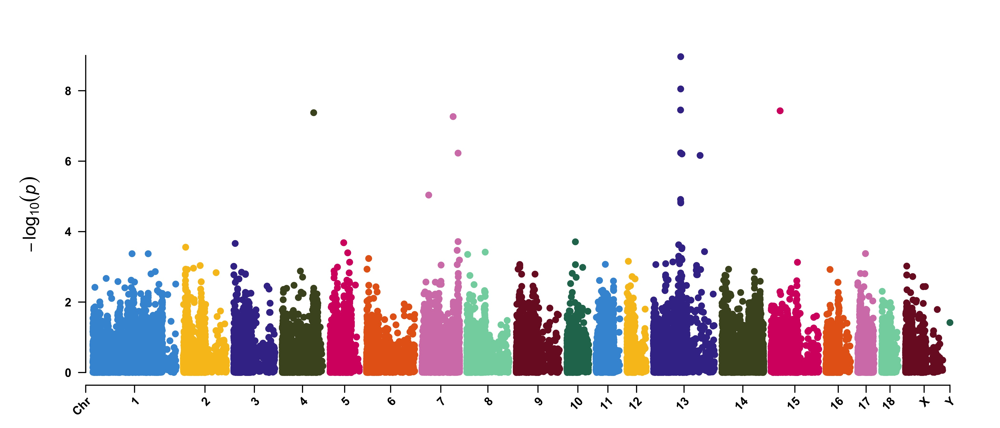
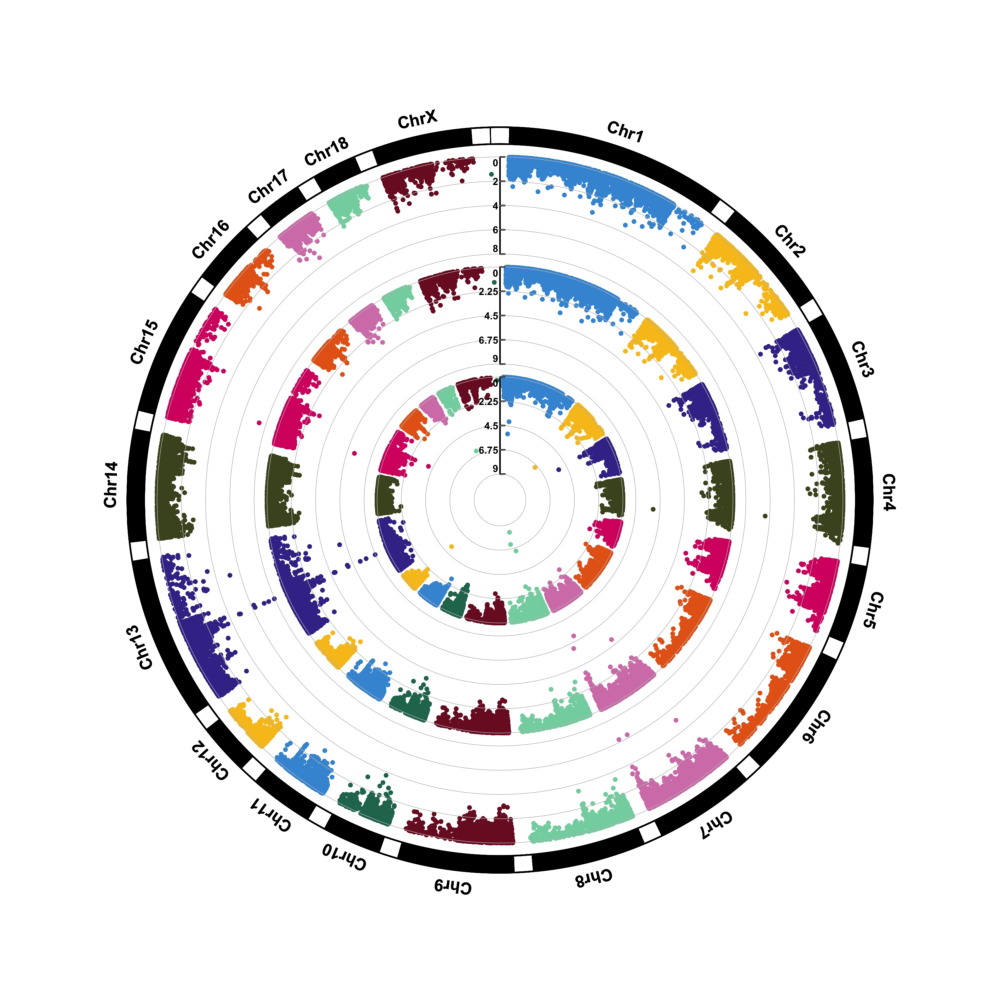
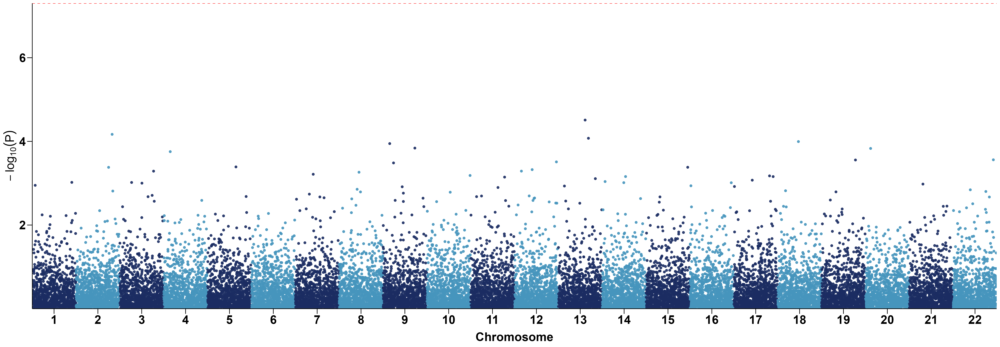

基因组分析中，不管是GWAS还是选择信号分析，对于结果的展示都离不开曼哈顿图 (`gwaslab`, `CMplot`, `qqman`太low就不介绍了)，很多时候，绘制一个比较满意的曼哈顿图还是比较令人头疼的，这里提供几个比较常用的曼哈顿图绘制的包，以及最后的一个自定义的使用`ggplot`绘制的脚本。

## gwaslab

:::tip
[gwaslab](https://cloufield.github.io/gwaslab/Visualization/) 这个包是由`Yunye He`大佬写的用于分析人类性状GWAS分析结果的python包，可视化只是他其中的一个功能，
但是这个包的绘制结果是真的很好看。
:::

下图是一个简单示例，可以看到，不仅是能绘制图，更能将我们感兴趣的`SNP`对应的`gene`标出来。



软件安装
```shell
pip install -U gwaslab
```
如果害怕pip安装会对自己环境有影响，可以conda单独创建个环境，然后安装
```shell
conda create -n gwaslab -c conda-forge python=3.12

conda activate gwaslab

pip install -U gwaslab
```
:::note
当然除了pip作者还提供了docker，但是需要注意，`windows`系统对应的版本安装起来有`bug`，所以目前只能在`linux`中安装使用，
也还好啦，给电脑安装个`wsl`就行了。
:::

首先是读取文件了，这里就需要指定自己的GWAS summary对应的参考基因组版本了，
软件是内置了`19, 38`两个版本的

```python 
import gwaslab as gl
import pandas as pd
import matplotlib.pyplot as plt

gwas = gl.Sumstats("ARHL_MVP_AJHG_BBJ_reformatMETAL_addchr.gz", 
                   snpid="SNP", 
                   chrom="CHR",
                   pos="POS",
                   ea="A1",
                   nea="A2",
                   eaf="freq",
                   beta="beta",
                   se="SE",
                   p="p",
                   n="N",
                   build="19")
```

读取完文件之后，就可以画图了，这里只是一个简单示例，可以指定一个`snplist`用于标注

```python
df = pd.read_csv("novel_snp_ARHL.txt", sep="\t")
anno_list = df["SNP"].tolist()

gwas.plot_mqq(mode="m", skip=0, sig_line_color="red", 
              fontsize=12, marker_size=(5,5),
              anno="GENENAME", anno_style="expand", 
              anno_set=anno_list, anno_fontsize=12, 
              repel_force=0.01, arm_scale=1,
              xtight=True, ylim=(0,38), chrpad=0.01, xpad=0.05,
              # cut=40, cut_line_color="white",
              fig_args={"figsize": (18, 5), "dpi": 500},
              save="mqq_plot.png", save_args={"dpi": 500},
              check=False, verbose=False)
```

## CMplot: Rectangular-Manhattan

:::tip
[CMplot](https://github.com/YinLiLin/CMplot) 相信大家就不会陌生了，`Lilin Yin`开发的一个专门绘制GWAS或选择信号等分析结果的一个包
:::



CMplot的示例数据如下，header不重要，顺序一致即可
```r
> data(pig60K)   #calculated p-values by MLM
> data(cattle50K)   #calculated SNP effects by rrblup
> head(pig60K)

          SNP Chromosome Position    trait1     trait2     trait3
1 ALGA0000009          1    52297 0.7738187 0.51194318 0.51194318
2 ALGA0000014          1    79763 0.7738187 0.51194318 0.51194318
3 ALGA0000021          1   209568 0.7583016 0.98405289 0.98405289
4 ALGA0000022          1   292758 0.7200305 0.48887140 0.48887140
5 ALGA0000046          1   747831 0.9736840 0.22096836 0.22096836
6 ALGA0000047          1   761957 0.9174565 0.05753712 0.05753712
```

Plot rectangular-Manhattan
```r
CMplot(pig60K,type="p", plot.type="m", LOG10=TRUE, 
    threshold=NULL,file="jpg",file.name=NULL,dpi=300,
    file.output=TRUE,verbose=TRUE,width=14,height=6,chr.labels.angle=45)
```

## CMplot: Circular-Manhattan 



```r
CMplot(pig60K,type="p",plot.type="c",
    chr.labels=paste("Chr",c(1:18,"X","Y"),sep=""), r=0.4,cir.axis=TRUE, 
    outward=FALSE,cir.axis.col="black", 
    cir.chr.h=1.3,chr.den.col="black",file="jpg",
    file.name=NULL,dpi=300,file.output=TRUE,verbose=TRUE,width=10,height=10)
# to remove the grid line in circles, add parameter cir.axis.grid=FALSE
# file.name: specify the output file name, the default is corresponding column name
```

## ggplot2



```r
library(data.table)
library(ggplot2)
library(dplyr)

dt = fread(infile)[, c("CHR", "BP", "P")]
chr_lengths <- dt %>%
  group_by(CHR) %>%
  summarise(chr_len = max(BP))

data <- dt %>%
  arrange(CHR, BP) %>%
  mutate(chr_cumsum = cumsum(c(0, head(chr_lengths$chr_len, -1)))[CHR]) %>%
  mutate(BPcum = BP + chr_cumsum)

axis_set <- data %>%
  group_by(CHR) %>%
  summarise(center = (max(BPcum) + min(BPcum)) / 2)

p = ggplot(data, aes(x=BPcum, y=-log10(P), color=factor(CHR))) +
  geom_point(alpha=0.9) +
  geom_hline(yintercept=-log10(5e-8), color="red", linetype="dashed") +
  scale_color_manual(values=rep(c("#1B2C62", "#4695BC"), 22)) + 
  scale_x_continuous(label=axis_set$CHR, 
  	                 breaks=axis_set$center, 
                     expand=c(0, 0)) +
  scale_y_continuous(expand=c(0, 0)) + 
  labs(x="Chromosome", y=expression(-log[10](P))) +
  theme_classic() +
  theme(legend.position="none",
  	axis.text = element_text(size=20, color="black"),
        axis.title = element_text(size=20, margin=margin(t=10), color="black"),
        axis.line = element_line(color="black"), 
        axis.ticks = element_line(color="black"),
        axis.ticks.length = unit(0.3, "cm"))
ggsave("my.png", p, height = 8, width = 23, dpi=300)
```