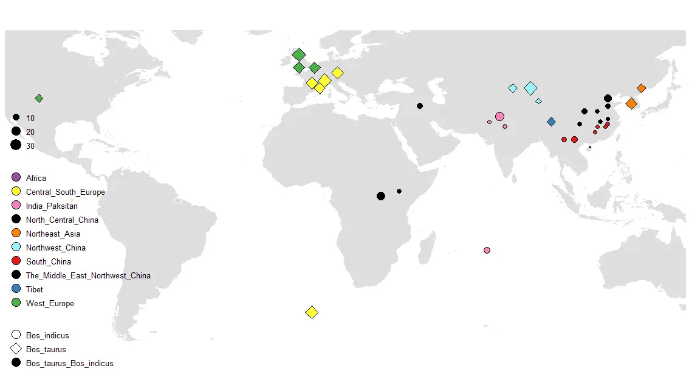

:::note
代码来自文章，稍作修改\
Gu, S.; Qi, T.; Rohr, J. R.; Liu, X. Meta-Analysis Reveals Less Sensitivity of Non-Native Animals than Natives to Extreme Weather Worldwide. Nat Ecol Evol 2023. https://doi.org/10.1038/s41559-023-02235.
:::



## 数据格式

前两列是经纬度，第三列是品种或亚型，第四列是每个品种的数量分布
```shell
Longitude	Latitude	diqu	subspe	num
-104	39	West_Europe	Bos_taurus	10
-3	56	West_Europe	Bos_taurus	30
-3	51	West_Europe	Bos_taurus	20
2	-44	Central_South_Europe	Bos_taurus	26
2	45	Central_South_Europe	Bos_taurus	22
3	51	West_Europe	Bos_taurus	20
5	43	Central_South_Europe	Bos_taurus	20
7	45	Central_South_Europe	Bos_taurus	8
7	46	Central_South_Europe	Bos_taurus	30
12	49	Central_South_Europe	Bos_taurus	23
29	1	Africa	Bos_taurus_Bos_indicus	17
36	3	Africa	Bos_taurus_Bos_indicus	5
44	36	The_Middle_East_Northwest_China	Bos_taurus_Bos_indicus	8
70	-20	India_Paksitan	Bos_indicus	10
71	30	India_Paksitan	Bos_indicus	4
75	32	India_Paksitan	Bos_indicus	20
77	28	India_Paksitan	Bos_indicus	5
80	43	Northwest_China	Bos_taurus	11
87	43	Northwest_China	Bos_taurus	30
90	38	Northwest_China	Bos_taurus	5
```

## 画图
```r
library(ggplot2)
library(ggthemes)

mymap <- read.table("经纬度.txt", sep = "\t", header =T)
world <- map_data("world")

my_fill = c("Africa"="#984EA3","India_Paksitan"="#F781BF","South_China"="#E41A1C",
            "Central_South_Europe"="#FFFF33","Northeast_Asia"="#FF7F00",
            "Northwest_China"="#98F5FF","Tibet"="#377EB8","West_Europe"="#4DAF4A",
            "North_Central_China"="#000000","The_Middle_East_Northwest_China"="#000000")
my_shape = c("Bos_taurus"=23,"Bos_indicus"=21,"Bos_taurus_Bos_indicus"=19)


p1 <- ggplot(world, aes(long, lat)) +
  geom_map(map=world, aes(map_id=region), fill="#DEDEDE", color=NA) +
  xlim(-105, 135)+ ylim(-50, 60)+
  coord_quickmap()  

p2 <- p1 + geom_point(data=mymap, color='black',
                      aes(x = Longitude, y = Latitude, 
                          size=num, shape=subspe, fill=diqu))+
  scale_fill_manual(values = my_fill)+
  scale_shape_manual(values = my_shape)+
  theme_map()+
  theme(legend.position=c(0,-0.1),legend.justification=c(0,0), # 图例位置
        legend.background=element_blank(), # 去除图例背景
        legend.title=element_blank(),  # 去除图例标题
        legend.text = element_text(size=10), # 图例文本大小
        legend.key=element_rect(color=NA, fill=NA))+ # 去除图例形状周围的背景
  
  # 修改图例形状、大小
  guides(fill=guide_legend(override.aes=list(size=5,shape=21)),
         shape = guide_legend(override.aes = list(size=5, sahpe=my_shape)))

p2
```