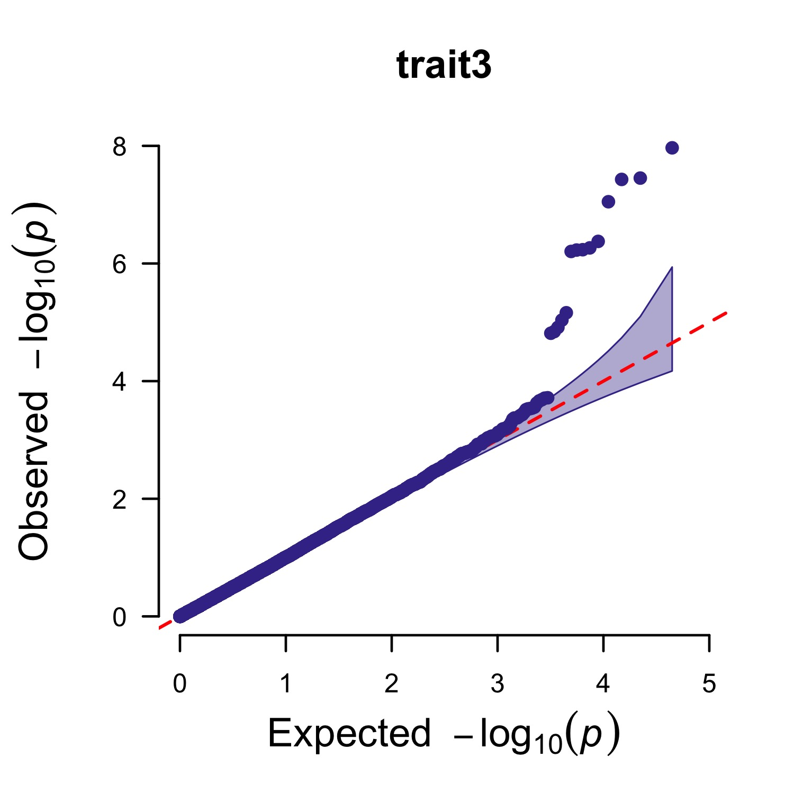
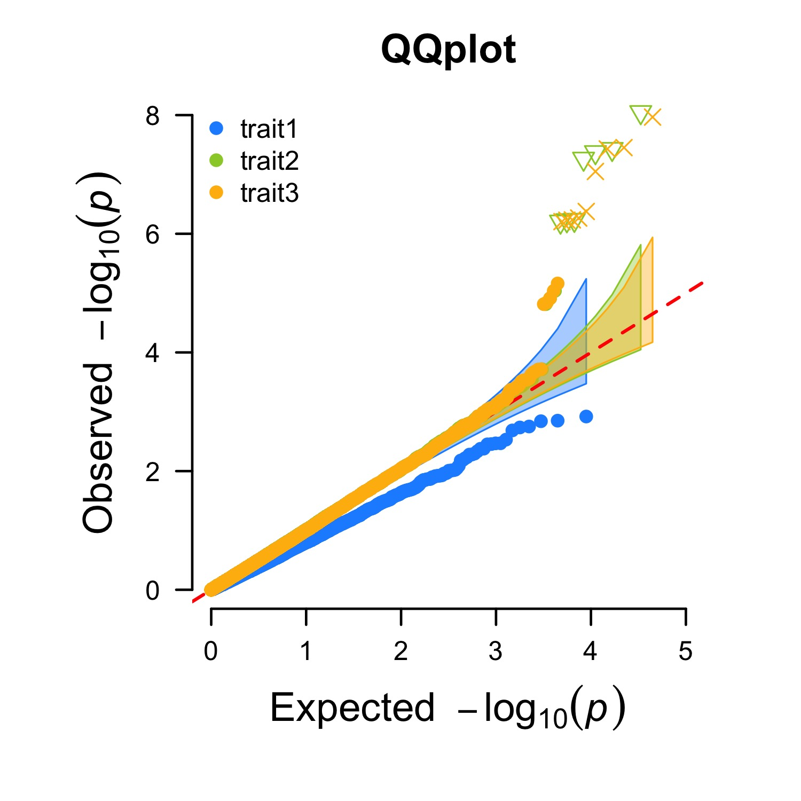
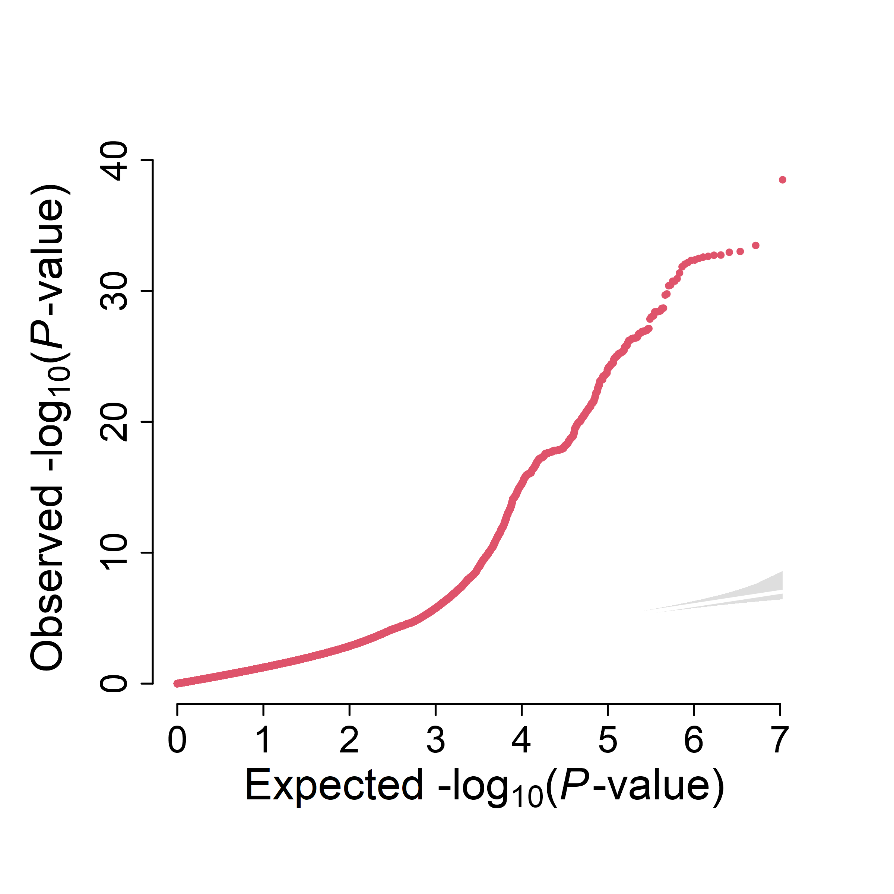
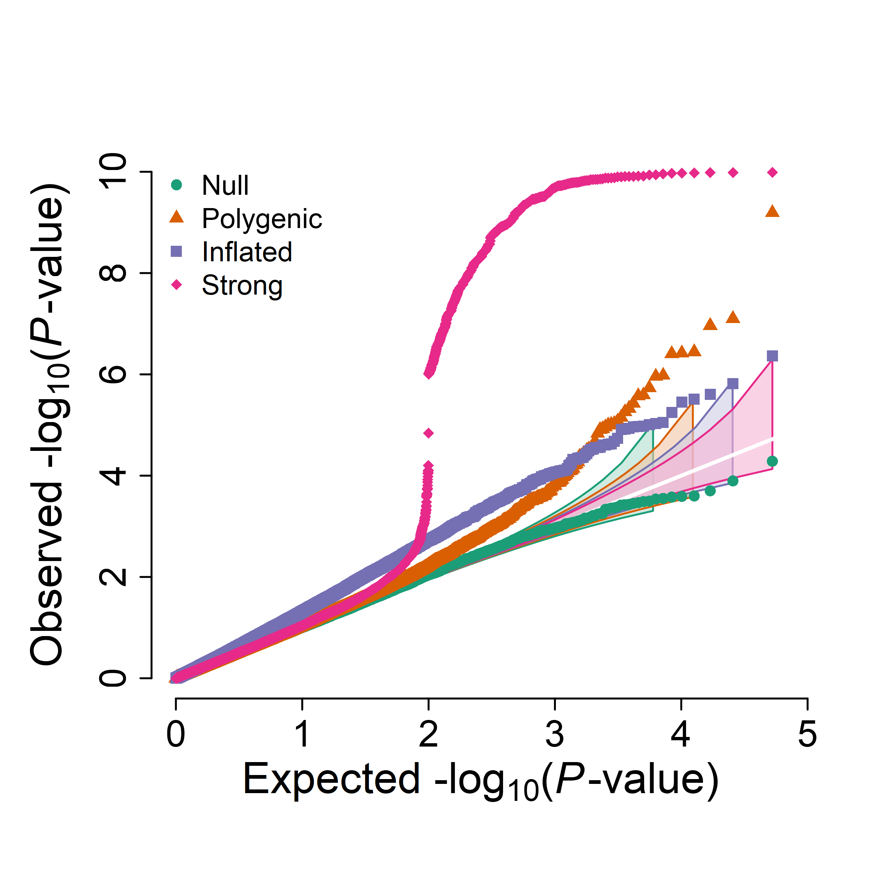

各种qq图的画法,简单示例

## CMplot: Single trait
:::tip
More detail please see [CMplot](https://github.com/YinLiLin/CMplot)
:::

```r
CMplot(pig60K,plot.type="q",box=FALSE,file="jpg",file.name=NULL,dpi=300,
    conf.int=TRUE,conf.int.col=NULL,threshold.col="red",threshold.lty=2,
    file.output=TRUE,verbose=TRUE,width=5,height=5)
```


## CMplot: Multi traits

```r
CMplot(pig60K,plot.type="q",col=c("dodgerblue1", "olivedrab3", "darkgoldenrod1"),multraits=TRUE,
        threshold=1e-6,ylab.pos=2,signal.pch=c(19,6,4),signal.cex=1.2,signal.col="red",
        conf.int=TRUE,box=FALSE,axis.cex=1,file="jpg",file.name=NULL,dpi=300,file.output=TRUE,
        verbose=TRUE,ylim=c(0,8),width=5,height=5)
```


## Custom Script: single trait

```r
qqplot = function(pval, ylim=0, lab=1.4, axis=1.2){
    par(mgp=c(5,1,0))
    p1 <- pval 
    p2 <- sort(p1)
    n  <- length(p2)
    k  <- c(1:n)
    alpha <- 0.05
    lower <- qbeta(alpha/2, k, n+1-k)
    upper <- qbeta((1-alpha/2), k, n+1-k)
    expect <- (k-0.05)/n 
    biggest <- ceiling(max(-log10(p2), -log10(expect)))
    xlim <- max (-log10(expect)+0.1);
    if (ylim==0) ylim=biggest;
    plot(-log10(expect), -log10(p2), xlim=c(0, xlim), ylim=c(0, ylim),
        ylab=expression(paste("Observed ", "-", log[10], "(", italic(P), "-value)", sep="")),
        xlab=expression(paste("Expected ", "-", log[10], "(", italic(P), "-value)", sep="")),
        type="n", mgp=c(2,0.5,0), tcl=-0.3, bty="n", cex.lab=lab, cex.axis=axis)
    polygon(c(-log10(expect), rev(-log10(expect))), c(-log10(upper), rev(-log10(lower))),
            col=adjustcolor("grey", alpha.f=0.5), border=NA)
    abline(0,1,col="white", lwd=2)
    points(-log10(expect), -log10(p2), pch=20, cex=0.6, col=2)
}
```


## Custom Script: multi trait

```r
qqplot_multi <- function(pval_list, ylim=0, lab=1.4, axis=1.2, p_floor=1e-300, cols=NULL, pch=20, cex=0.6, 
legend=TRUE, legend_pos="topleft", legend_cex=0.9, show_ci=TRUE, ci_scale=1, ci_alpha=0.6, ci_border=TRUE, diag_col="white", ...) {
    if (!is.list(pval_list)) pval_list=as.list(as.data.frame(pval_list))
    trait = names(pval_list)
    if(is.null(trait) || any(trait == "")){
        trait=paste0("Trait", seq_along(pval_list))
        names(pval_list)=trait
    }

    m = length(pval_list)
    if(m < 1) stop("pval_list must contain at least one trait ! ! !")
    
    recycle1m = function(x, nm, name){
        if (length(x) == 1) return(rep(x, nm))
        if (length(x) == nm) return(x)
        stop(name, " length must be 1 or ", nm, ".")
    }
    
    ci_scale = recycle1m(ci_scale , m, "ci_xfrac")
    ci_scale[ci_scale <= 0] = 0.01
    ci_scale[ci_scale > 1]  = 1

    if(is.null(cols)){
        if ("hcl.colors" %in% getNamespaceExports("grDevices")){
            cols = grDevices::hcl.colors(m, palette="Dark 3")
        } else {
            cols = grDevices::rainbow(m)
        }
    }
    cols = recycle1m(cols, m, "cols")
    pch  = recycle1m(pch, m, "pch")
    
    lighten_col = function(col, amount=0.65, alpha=ci_alpha) {
        rgb  = grDevices::col2rgb(col) / 255
        rgb2 = rgb + (1-rgb) * amount
        grDevices::rgb(rgb2[1,], rgb2[2,], rgb2[3,], alpha=alpha)
    }

    dat=vector("list", m)
    for(i in seq_len(m)){
        p = pval_list[[i]]
        p = p[is.finite(p) & !is.na(p)]
        p = p[p <= 1 & p >= 0]
        if (length(p) == 0) stop("Trait '", trait[i], "' has no valid P in [0,1].")
        p[p == 0] = p_floor

        p2 = sort(p)
        n  = length(p2)
        k  = seq_len(n)
        alpha = 0.05
        lower = qbeta(alpha/2, k, n+1-k)
        upper = qbeta(1 - alpha/2, k, n+1-k)
        expect = (k-0.05) / n 
        expect[expect <= 0] = min(expect[expect > 0])

        dat[[i]] = list(x=-log10(expect), y=-log10(p2), y_low=-log10(upper), y_high=-log10(lower), n=n)
    }

    xlim = max(vapply(dat, function(d) max(d$x, na.rm=TRUE), numeric(1))) + 0.1
    ymax = max(vapply(dat, function(d) max(d$y, d$y_high, na.rm=TRUE), numeric(1)))
    if (ylim==0) ylim=ceiling(ymax)

    par(mgp=c(5,1,0))
    plot(NA, xlim=c(0, xlim), ylim=c(0, ylim),
    ylab=expression(paste("Observed", " -", log[10], "(", italic(P), "-value", ")", sep="")),
    xlab=expression(paste("Expected", " -", log[10], "(", italic(P), "-value", ")", sep="")),
    type="n", mgp=c(2,0.5,0), tcl=-0.3, bty="n", cex.lab=lab, cex.axis=axis, ...)

    if (show_ci){
        for(i in seq_len(m)){
            d = dat[[i]]
            o = order(d$x)
            x = d$x[o]
            ylow  = d$y_low[o]
            yhigh = d$y_high[o]
            x_ci  = x * ci_scale[i]
            ylow  = ylow * ci_scale[i]
            yhigh = yhigh * ci_scale[i]

            ci_col = lighten_col(cols[i])
            if (ci_border) {
                border=cols[i]
            } else {
                border=NA
            }
            polygon(c(x_ci, rev(x_ci)), c(ylow, rev(yhigh)), col=ci_col, border=border)
        }
    }
    abline(0, 1, col=diag_col, lwd=2)

    for(i in seq_len(m)){
        d = dat[[i]]
        points(d$x, d$y, pch=pch[i], cex=cex, col=cols[i])
    }

    if (legend){
        legend(legend_pos, legend=trait, col=cols, pch=pch, pt.cex=cex, bty="n", cex=legend_cex)
    }
    invisible(dat)
}
```

example for multi trait 
```r
set.seed(20260108)

N <- 50000

# 1) 纯零假设（均匀分布）
p_null <- runif(N)

# 2) “多基因/少量真实信号”：97% null + 3% 偏小p
p_poly <- runif(N)
sig_poly <- rbinom(N, 1, 0.03) == 1
p_poly[sig_poly] <- rbeta(sum(sig_poly), shape1 = 0.4, shape2 = 1)  # shape1<1 会产生更多小p

# 3) “膨胀”：|Z|整体偏大（sd>1），p会更偏小但不一定有真实峰
z_inf <- rnorm(N, mean = 0, sd = 1.2)
p_infl <- 2 * pnorm(-abs(z_inf))

# 4) “强信号”：1% 极强关联（生成极小p），并故意加入几个0
p_strong <- runif(N)
idx_strong <- sample.int(N, size = round(0.01 * N))
p_strong[idx_strong] <- 10^(-runif(length(idx_strong), min = 6, max = 10)) # 1e-6 到 1e-30
# p_strong[sample.int(N, 5)] <- 0  # 故意放几个0，测试防 Inf

pvals_list <- list(
  Null      = p_null,
  Polygenic = p_poly,
  Inflated  = p_infl,
  Strong    = p_strong
)
```

绘图
```r
png("qqplot_multi.png", width=2400, height=2400, res=500, type="cairo")
qqplot_multi(
  pvals_list,
  cols = c("#1b9e77", "#d95f02", "#7570b3", "#e7298a"),
  pch  = c(16, 17, 15, 18),
  cex  = c(0.8, 0.8, 0.8, 0.8),
  ci_scale = seq(0.8, 1.0, length.out = 4),
  ci_alpha=0.6)
dev.off()
```
